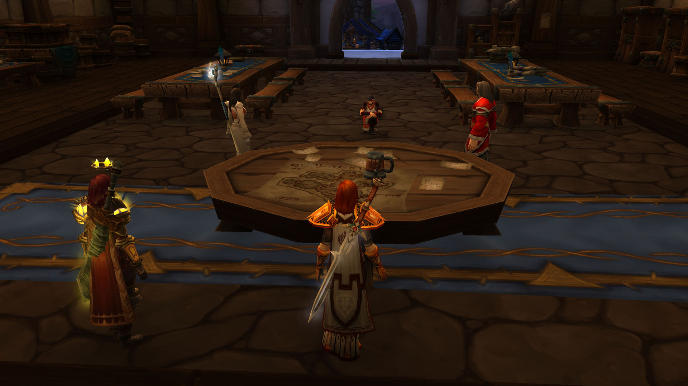
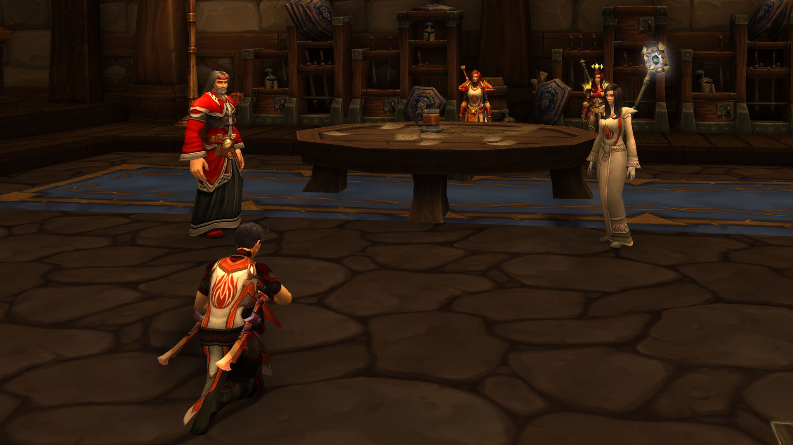
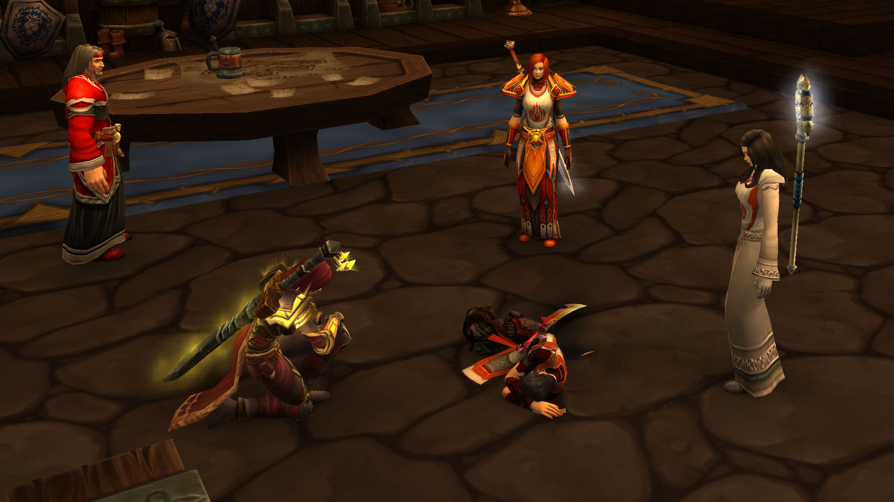

# 第六幕 审判

## 莉莉的审判

骑士评议会审判莉莉。

<figure><figcaption>
莉莉最后的审判
</figcaption></figure>

记录开始于 06/27/2021 的 21:28:53。

莉莉丶丹玛斯跪了下来。

\[法瑞雅]: 这是骑士评议会，陪审团，以及……骑士团的叛徒。

\[莉莉丶丹玛斯]: 叛徒。

\[莉莉丶丹玛斯]: 是说我吗？

\[法瑞雅]: 莉莉丶丹玛斯，你盗窃圣杯，对我下毒，绑架圣女。

朱丝缇雅 对莉莉怒目而视

\[法瑞雅]: 你认罪吗？

\[莉莉丶丹玛斯]: 我认罪

\[莉莉丶丹玛斯]: 是我做的

朱斯提尼阿诺 神色复杂地看着莉莉丶丹玛斯，踌躇着摩挲着自己的手指

法瑞雅 叹气，没有想到莉莉也不申辩。

\[莉莉丶丹玛斯]: 那又怎么了？

\[莉莉丶丹玛斯]: 比起你做的那些 我感觉我没有错！

\[法瑞雅]: 我做的那些？

\[莉莉丶丹玛斯]: 对啊 南方人的走狗

朱丝缇雅 不屑的”哼“了一声

\[法瑞雅]: 我所做的一切都是为了骑士团的利益，我不需要向你解释什么。

朱斯提尼阿诺 安静地看着对峙的双方，一言不发，他打算了解完所有的事情的原委后再做出自己的意见

\[莉莉丶丹玛斯]: 是，你已经丢失了洛丹伦的荣耀

法瑞雅 回想起洛丹伦，看向远方。

<figure><figcaption>
莉莉审判的过程
</figcaption></figure>

\[莉莉丶丹玛斯]: 所以我所做的一切也没有错

\[法瑞雅]: 总有一天我们会回到洛丹伦，但这并不能抵消你的所作所为。

\[莉莉丶丹玛斯]: 希望吧

\[法瑞雅]: 盗窃、下毒和绑架，都是骑士们不耻的行为。

\[莉莉丶丹玛斯]: 骑士和我有什么关系，，

\[莉莉丶丹玛斯]: 你似乎忘记了我的职业

\[朱斯提尼阿诺]: 我希望在圣光的注视下能有一个公正而得体的结果\*眯起眼睛\*

弗蕾雅丶卡特 眼角余光瞥一眼法瑞雅，再看向莉莉

\[法瑞雅]: 三位陪审团的骑士，既然莉莉已经认罪，你们认为她该当何种惩罚？

朱丝缇雅 仔细地审视着莉莉

弗蕾雅丶卡特 陷入思考

\[朱丝缇雅]: 我认为\*清了清嗓子\*莉莉的事情要分为两部分审判，一部分是他对圣杯的使用和初衷，另一分是他的背叛

\[朱斯提尼阿诺]: 绞刑

\[法瑞雅]: 她对圣杯的使用是为了什么？

朱斯提尼阿诺 的发言简单而果决

法瑞雅 听到了朱斯提尼阿诺的发言。

\[法瑞雅]: 那么已经有一位陪审团成员作出了决定。

朱斯提尼阿诺 的表情十分平静，他只是神情复杂地看着莉莉丶丹玛斯

\[朱丝缇雅]: 我认为应该判处终身监禁

朱丝缇雅 叹了口气说道

\[弗蕾雅丶卡特]: 监禁，在地牢里和蚊虫老鼠度过余生

朱斯提尼阿诺 摇了摇头

\[法瑞雅]: 那么骑士评议会的陪审团已经做出了决定。

\[朱斯提尼阿诺]: 监禁的机会是留给失败者的，而她并不是

\[法瑞雅]: 终身监禁。

\[朱丝缇雅]: 绞刑太过严厉

朱斯提尼阿诺 微微闭上眼睛，缓缓叹了口气

\[法瑞雅]: 我本来会说放逐，但是那就太轻松了。

\[弗蕾雅丶卡特]: 或许某一天我们需要棋子的时候，她可以重见阳光

\[法瑞雅]: 监狱的生活或许才能让你悔过。

\[朱斯提尼阿诺]: 她并不是一个天灾走狗或者是其他什么东西，回归圣光是最好的选择，温特小姐

法瑞雅 想起和莉莉一起度过的时光，无不叹息。

朱丝缇雅 对弗蕾雅丶卡特的一件表示赞许

\[朱丝缇雅]: 但是.....

\[朱丝缇雅]: 你能确定绞刑会让她重归圣光吗？

朱斯提尼阿诺 不容置疑地点了点头

\[朱丝缇雅]: 呼....

\[法瑞雅]: 无论如何，陪审团已经作出了判决。

\[朱斯提尼阿诺]: 终身监禁...对于我们来说，不如马革裹尸..或是..自我了断

\[法瑞雅]: 把她押下去吧。

\[朱丝缇雅]: 遵命

朱斯提尼阿诺 将“自我了断”说得很大声

莉莉丶丹玛斯 抬起来头 看着法瑞

朱丝缇雅 步向了莉莉

\[朱丝缇雅]: 走吧

## 莉莉的死亡

莉莉自尽了。

莉莉丶丹玛斯 嘴角流出了鲜血！

莉莉丶丹玛斯在你面前躺下。

\[弗蕾雅丶卡特]: ！

朱丝缇雅 还没有注意到异常

法瑞雅 惊讶。

\[弗蕾雅丶卡特]: 这是，服毒？

弗蕾雅丶卡特在莉莉丶丹玛斯面前跪下。

朱丝缇雅 在众人的惊讶的神色中注意到了莉莉

\[朱丝缇雅]: 啊....

弗蕾雅丶卡特 开始检查莉莉的情况

朱斯提尼阿诺 看着莉莉丶丹玛斯缓缓倒下，嘴角露出一丝满意的微笑

<figure><figcaption>
莉莉的死亡
</figcaption></figure>

你在莉莉丶丹玛斯面前跪下。

法瑞雅: 愿你安息，曾经的姐妹。&#x20;

\[朱斯提尼阿诺]: 她无愧于她自己，以及对洛丹伦的誓言&#x20;

\[朱丝缇雅]: 法瑞大团长，她的尸体怎么办&#x20;

法瑞雅: 埋到暴风城墓地里吧，但是不能埋在骑士团的墓地之中，因为她毕竟背叛了我们。&#x20;

\[朱丝缇雅]: 遵命&#x20;

\[朱斯提尼阿诺]: 求圣光拯救她脱离罪恶和苦难，并赐她平安的居所以及永恒的福气&#x20;

\[朱斯提尼阿诺]: 求仁慈的光拯救她，照耀她前往彼界的道路，使她不必走过阴暗的峡谷&#x20;

朱丝缇雅 沉痛的哀悼着&#x20;

\[朱丝缇雅]: {鼓掌}&#x20;

\[朱丝缇雅]: 有个叛徒自尽了

【完】
