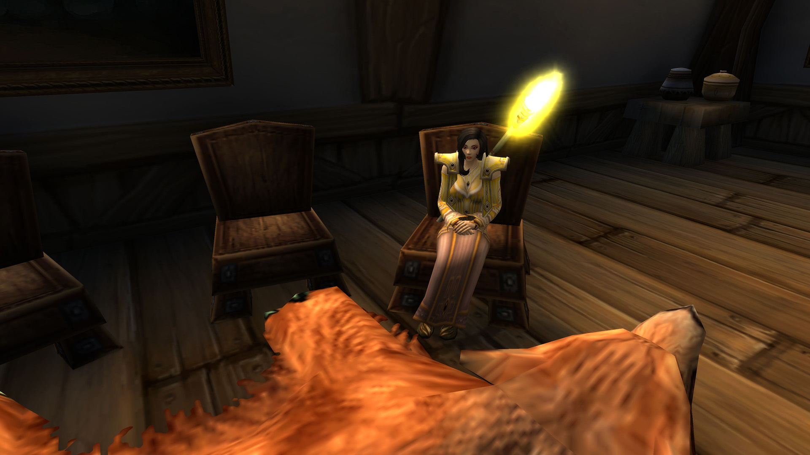
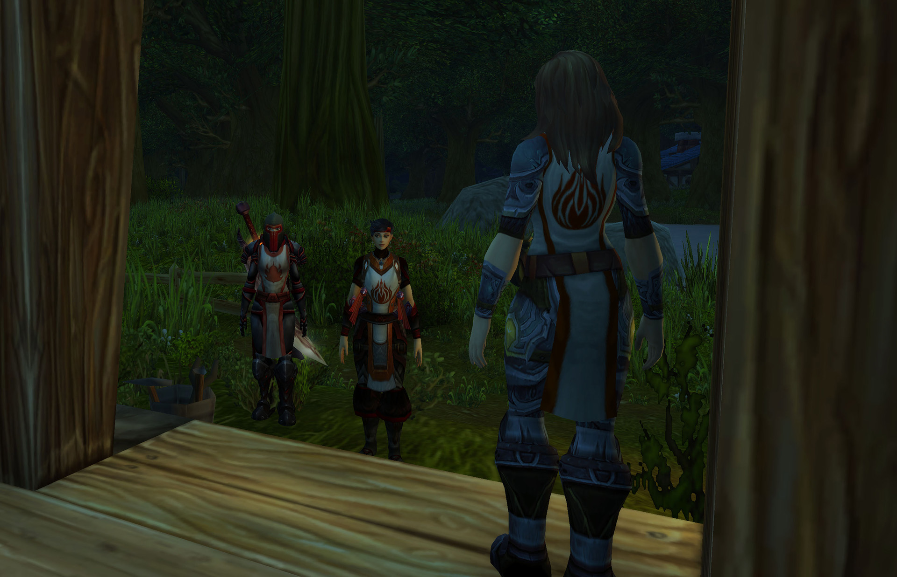
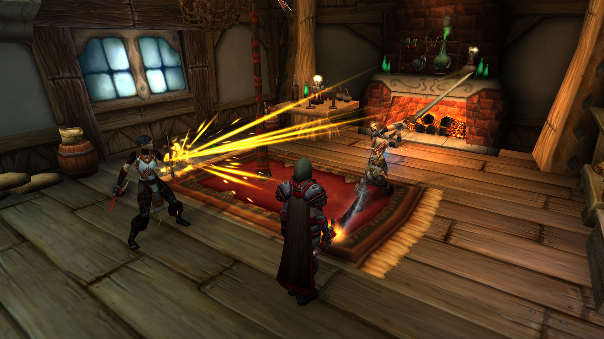
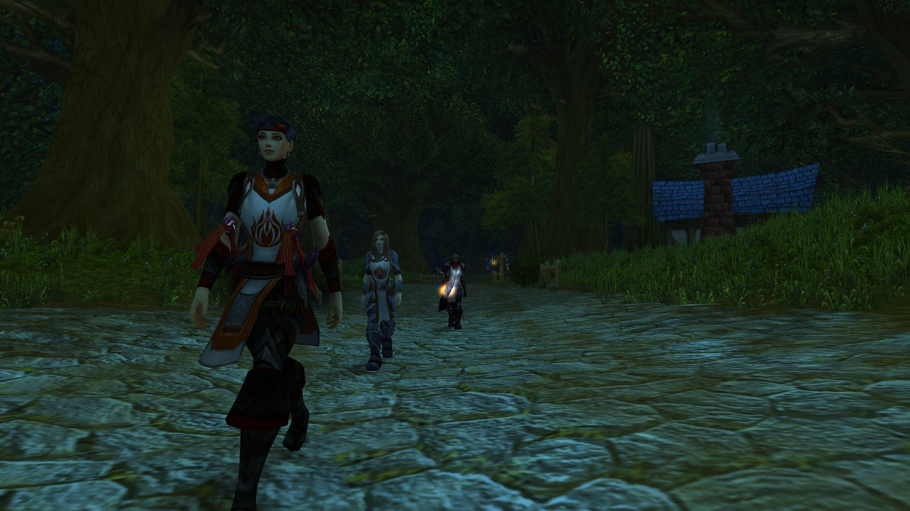
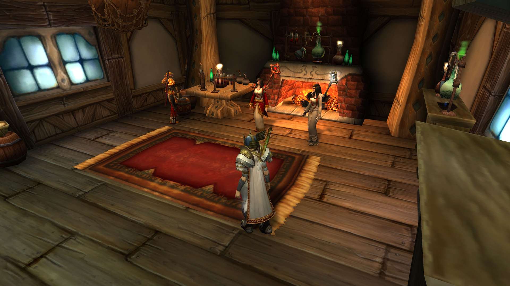
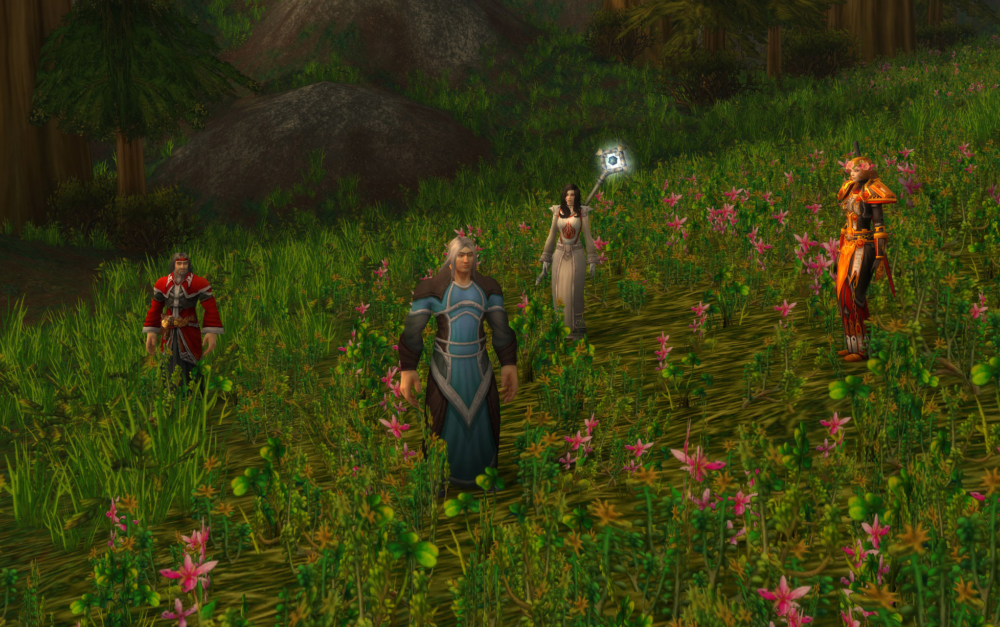
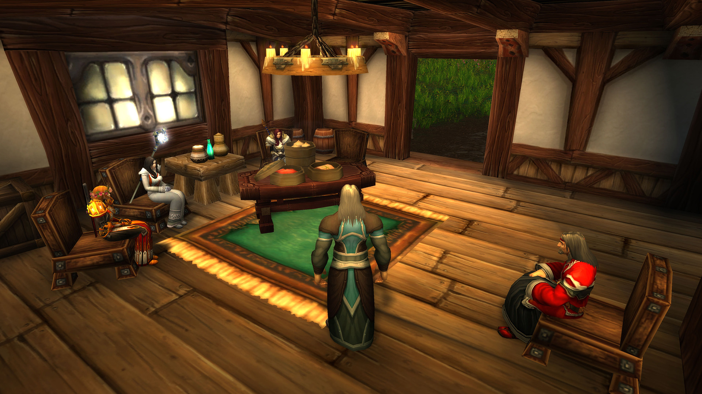

# 第三幕 渔夫之主

## 继任圣女

凯特琳丶安妮顶替佐伊成为了圣女。

记录开始于 05/30/2021 的 11:44:39。

\[阿拉里斯·雪莉]: 凯特琳，你来了，正是时候。

凯特琳丶安妮 对阿拉里斯打了个招呼

\[阿拉里斯·雪莉]: 骑士团危在旦夕。团长中毒，圣女又有事不能继续寻找圣杯。

\[凯特琳丶安妮]: 我明白

\[阿拉里斯·雪莉]: 我们需要一个新的圣杯骑士。

凯特琳丶安妮点了点头。

阿拉里斯·雪莉 指了最右边的位置。

\[凯特琳丶安妮]: \*看了看四周\*所以，需要我做什么

\[阿拉里斯·雪莉]: 这是骑士之座，坐上它的人会成为圣杯骑士。

\[阿拉里斯·雪莉]: 但是如果他或者她内心没有真正的正义，就会招致厄运。

\[凯特琳丶安妮]: 但这是有代价的，对吗\*戏谑的问道\*

\[凯特琳丶安妮]: 好吧，我知道了

\[阿拉里斯·雪莉]: 是的，英雄总要付出代价。

凯特琳丶安妮 交给阿拉里斯一封信

\[阿拉里斯·雪莉]: 你是一个正义之人吗？

\[凯特琳丶安妮]: 我想圣光会证明我的正义

\[凯特琳丶安妮]: 这封信，如果我死了你再拆开看

\[凯特琳丶安妮]: 现在，我要坐上去了

\[阿拉里斯·雪莉]: 好的，你有足够的勇气。

凯特琳丶安妮 感觉和普通的椅子没什么不同

\[凯特琳丶安妮]: 嗯....

\[凯特琳丶安妮]: 有点硬

\[阿拉里斯·雪莉]: 圣光与你同行。

\[凯特琳丶安妮]: 为了圣光

## 圣女被绑架

凯特琳丶安妮顶替佐伊成为了圣女。

\[莉莉丶丹玛斯]: 你过来了

\[莉莉丶丹玛斯]: 走吧 跟我来

\[莉莉丶丹玛斯]: 一会动手小心点

\[莉莉丶丹玛斯]: 别弄出太大的动静

莉莉丶丹玛斯 骑上了坐骑

\[莉莉丶丹玛斯]: 小心点

莉莉丶丹玛斯 下了坐骑

\[莉莉丶丹玛斯]: 我先进去

\[莉莉丶丹玛斯]: 你小心点

\[凯特琳丶安妮]: 你们好——?

\[莉莉丶丹玛斯]: 凯特琳丶安妮

\[莉莉丶丹玛斯]: 怎么说那

\[莉莉丶丹玛斯]: 我不希望伤害到你

\[莉莉丶丹玛斯]: 所以跟我们走吧

凯特琳丶安妮 向莉莉丶丹玛斯表示疑惑

\[凯特琳丶安妮]: 什么跟你们走?

\[莉莉丶丹玛斯]: 对

\[莉莉丶丹玛斯]: 你以谋害大团长之名被逮捕了

\[凯特琳丶安妮]: 什么?!

\[凯特琳丶安妮]: 我?！

\[莉莉丶丹玛斯]: 希望你不要反抗

\[凯特琳丶安妮]: 你在开什么玩笑!

\[莉莉丶丹玛斯]: 我也很遗憾

\[莉莉丶丹玛斯]: 但是这是事实

凯特琳丶安妮 望着莉莉丶丹玛斯，眯了眯眼睛

\[凯特琳丶安妮]: 我懂了——毒是你下的，对不对?

\[莉莉丶丹玛斯]: 你知道太多了

莉莉丶丹玛斯 堵住了门口

凯特琳丶安妮 猛地缩回屋子里——死死地关上大门，随手抄起自己的双手剑

\[莉莉丶丹玛斯]: 动手

凯特琳丶安妮在莉莉丶丹玛斯面前躺下。

\[凯特琳丶安妮]: \*咳嗽\*呸，奸细。

\[莉莉丶丹玛斯]: 带上她 咱们走

把凯特琳丶安妮扶了起来。绑起凯特琳丶安妮的双手。

\[莉莉丶丹玛斯]: 走吧 凯特琳丶安妮。

凯特琳丶安妮 吐了一口鲜血

\[莉莉丶丹玛斯]: 我真的不想伤害你

\[莉莉丶丹玛斯]: 今晚上我们要通过三角路口，，

\[莉莉丶丹玛斯]: 不能让南方人发现我们

\[凯特琳丶安妮]: 事已至此，不必多说了。

莉莉丶丹玛斯 给了朱丝缇雅一拳&#x20;

\[凯特琳丶安妮]: \*咳嗽\*咳咳——

\[莉莉丶丹玛斯]: 你不要挑战我的耐心，

\[莉莉丶丹玛斯]: 走吧 带着她

\[凯特琳丶安妮]: 你还有耐心么，恩?

\[莉莉丶丹玛斯]: 造成这的一切 都不是我的错

\[凯特琳丶安妮]: 住口！你这个厚颜无耻之徒！

\[莉莉丶丹玛斯]: 你们已经忘记了 忘记了仇恨

\[莉莉丶丹玛斯]: 实话告诉你把

\[莉莉丶丹玛斯]: 法瑞的毒就是我下的

\[莉莉丶丹玛斯]: 她已经被腐化了

\[莉莉丶丹玛斯]: 她已经被南方人给腐化了

\[莉莉丶丹玛斯]: 忘记咱们曾经的仇恨

\[莉莉丶丹玛斯]: 被那些贵族。。也对 她以前也是贵族

\[凯特琳丶安妮]: \*垂下眼皮·念着祷文\*

\[莉莉丶丹玛斯]: 我只想救赎我的家乡

\[莉莉丶丹玛斯]: 杀死那些亡灵

\[莉莉丶丹玛斯]: 走吧 还有很长一段路要赶

莉莉丶丹玛斯 走向了树后

\[莉莉丶丹玛斯]: 我在这里藏了几匹马

\[莉莉丶丹玛斯]: 你带着她，

\[莉莉丶丹玛斯]: 咱们走

\[莉莉丶丹玛斯]: 回家

凯特琳丶安妮 装作不经意的样子，撕裂了一寸战袍的边角

## 失踪的圣女

记录开始于 05/30/2021 的 20:35:36。

\[阿拉里斯·雪莉]: 我们今晚要去渔夫之主的晚宴。

\[阿拉里斯·雪莉]: 但是……我发现圣女凯特琳丶安妮不在。

\[阿拉里斯·雪莉]: 所以我们先去她家里找她。

\[朱丝缇雅]: 凯特琳？是新圣女马？

\[斯诺蕾]: 好的。

朱丝缇雅 叹了口气

\[阿拉里斯·雪莉]: 是的，她接受了感召，坐上了骑士之座。

\[阿拉里斯·雪莉]: 非常勇敢。

\[朱丝缇雅]: 好的

朱斯提尼阿诺 不屑地撇撇嘴

\[阿拉里斯·雪莉]: 因为坐上骑士之座的人，如果不是心怀正义，那么很可能遭受厄运。

\[阿拉里斯·雪莉]: 有的骑士会说，法瑞团长被下毒，可能是整个骑士团没有保护圣杯所遭受的厄运。但我相信命运在我们的手中，而不在虚无缥缈的传说中。

\[朱丝缇雅]: 赞同

朱丝缇雅大声喝彩。真棒！

\[阿拉里斯·雪莉]: 朱斯提尼阿诺，你上周审问血色十字军奸细，有问出什么吗？

迪娜薇姿满怀敬意地向你致礼。

\[阿拉里斯·雪莉]: 我们去凯特琳丶安妮家里找她。

\[朱斯提尼阿诺]: “如果有一头羊掉入水中，我会认为是它脚滑，而不是因为地面太潮湿”

\[朱斯提尼阿诺]: 没有，我不知道

\[朱丝缇雅]: 你在说冷笑话吗

\[阿拉里斯·雪莉]: 那么这次渔夫之主的晚宴，可要打醒精神。

朱丝缇雅 看着朱斯提尼阿诺问道

\[朱斯提尼阿诺]: 你让一只狼来裁决羊群的命运，那又会是什么样呢

\[朱斯提尼阿诺]: 这也是我的回答

\[阿拉里斯·雪莉]: 门开着。

\[阿拉里斯·雪莉]: 我有种不好的预感。

\[朱丝缇雅]: 在欢迎咱们？

\[朱斯提尼阿诺]: 我不知道还有人会住在这么偏僻的地方

\[阿拉里斯·雪莉]: 凯特琳！

朱丝缇雅 觉得朱斯提尼阿诺的观点太偏激了

\[斯诺蕾]: 人不在

\[朱丝缇雅]: 有意思

\[朱丝缇雅]: 出门了？

你看到其中有打斗痕迹。

\[迪娜薇姿]: 这里

\[迪娜薇姿]: 有打斗的痕迹

地上有抓扯的痕迹，在地板的边角，柜子前面，你发现了一个很小的用手抠出来的L字。

朱丝缇雅跪了下来。

家具和餐具都散落在地面，玻璃碎片，纸屑，甚至有一小块被扯下的红布。

有人在这场打斗中受伤了。

朱斯提尼阿诺 不愿意在狭小的空间出现任何可能的偷袭，只是站在门口往屋子里望去

\[斯诺蕾]: 这里也有打斗痕迹

\[朱丝缇雅]: L....血色十字军？

\[阿拉里斯·雪莉]: 红色的L字。

\[朱斯提尼阿诺]: 嗯...

\[阿拉里斯·雪莉]: 很可能跟上周在骑士评议会里出现的血色叛徒有关。

朱斯提尼阿诺 陷入沉默

\[迪娜薇姿]: 有人受伤了

\[迪娜薇姿]: 有血迹

\[朱丝缇雅]: 会是谁呢？

\[迪娜薇姿]: 这里有块碎布，像是撕扯下来的

\[迪娜薇姿]: 红色的

\[阿拉里斯·雪莉]: 无论如何，凯特琳都不在。

朱斯提尼阿诺 随意地靠在门柱上，歪着头看着杂乱的房间

\[朱丝缇雅]: 那咱们现在？

\[阿拉里斯·雪莉]: 我们仍然要去赴宴。

\[阿拉里斯·雪莉]: 渔夫之主可能是唯一知道圣杯下落的人。

朱丝缇雅 看看了尚有温度的壁炉

\[朱丝缇雅]: 那咱们出发？

\[阿拉里斯·雪莉]: 我们走吧。

\[朱丝缇雅]: 我给凯特琳留个讯息

\[朱丝缇雅]: 让她随后跟上

\[阿拉里斯·雪莉]: 这该不会又是厄运的征兆吧。

\[朱丝缇雅]: 我已经留下讯息了

\[朱丝缇雅]: 如果凯特琳没事她会看到的

\[阿拉里斯·雪莉]: 记得老学者上次说的。

\[阿拉里斯·雪莉]: 在晚宴上问问题是不礼貌的。

## 渔夫之主

渔夫之主说他被圣杯诅咒了，只有问出正确的问题，才能解开他的诅咒。

\[朱斯提尼阿诺]: 当然，我当然会救你

\[渔夫之主]: 你们足够勇敢，能承担这份责任吗？

\[渔夫之主]: 我守护着圣杯，圣杯却诅咒了我。

朱斯提尼阿诺 表情变得慈祥和蔼起来，他安抚着眼前的这个男人

\[渔夫之主]: 你们不知道，我一直活在恐惧之中。

弗蕾雅丶卡特 选择干饭

\[朱丝缇雅]: 这个圣杯是给谁准备的呢？

渔夫之主 两眼放光。

渔夫之主 仿佛看到了救赎的希望。

\[渔夫之主]: 为那熟悉的套路，熟悉的人。

\[朱丝缇雅]: 熟悉的人...

\[渔夫之主]: 你问对了。

\[渔夫之主]: 那我将不得不说出我所知道的一切。

\[朱丝缇雅]: 好极了

\[渔夫之主]: 提尔之手的血色十字军都变成了亡灵，但有的人，心中还有希望。

\[渔夫之主]: 他们希望圣杯能够净化亡灵，但他们不知道，圣杯的作用。

\[渔夫之主]: 圣杯只是一个用来鉴别正义之人正义与否的圣物，并没有净化的功能。

朱斯提尼阿诺 尽管心中有所准备，但听到提尔之手那些同僚们的结局，不禁叹了一口气

\[渔夫之主]: 他们绑走了凯特琳，骑士团的圣女。圣杯和圣女都在提尔之手。

朱丝缇雅 眉头紧蹙

\[朱丝缇雅]: 绑走？

朱丝缇雅 心下一沉

\[渔夫之主]: 是的，她不是自愿去提尔之手的。

\[朱斯提尼阿诺]: 提尔之手，我们最后的家园和港湾...

\[弗蕾雅丶卡特]: 看来我们要去解救圣女？

朱斯提尼阿诺对着你叹了口气

\[渔夫之主]: 你们要决定的，是救圣女还是救团长。

\[渔夫之主]: 或许两个人都会得救。

\[渔夫之主]: 圣杯里的圣水能解圣杯的毒。

朱丝缇雅 看向了同胞们

\[朱斯提尼阿诺]: 这种困难时刻，\*环视了一圈\*让我选，我只会选择图尔加斯女士

\[弗蕾雅丶卡特]: 我全都要

\[弗蕾雅丶卡特]: 救一人放弃一人的选择不符合我的准则

\[朱丝缇雅]: 我选圣女

\[渔夫之主]: 那就准备好面对提尔之手的幕后指使吧。

\[渔夫之主]: 你们或许不会吃惊。

\[朱斯提尼阿诺]: 我一向对“圣女”这种说法保留怀疑态度，在圣光面前我只会选择我熟悉的人

朱丝缇雅 对朱斯提尼阿诺的愚蠢想法摇了摇头

\[渔夫之主]: 我的诅咒！也解除了。

\[渔夫之主]: 或许你们才是被诅咒的人！

渔夫之主 仰天大笑。

\[朱丝缇雅]: 那我们要怎么得到救赎

\[朱斯提尼阿诺]: 坚定对圣光的信仰，先生

渔夫之主 消失了。

\[弗蕾雅丶卡特]: 哈？

\[朱丝缇雅]: 他！

\[朱丝缇雅]: 应该把他打晕的

弗蕾雅丶卡特 追了出去

迪娜薇姿对朱丝缇雅点了点头。

\[朱斯提尼阿诺]: 所以，你们相信么?你们相信一个在荒郊野岭的疯子的胡言乱语么?

\[朱丝缇雅]: 那就要看被抓住的那个人怎么说了

\[迪娜薇姿]: 现在，怎么办

\[朱斯提尼阿诺]: 提尔之手曾是洛丹伦最后的庇护所

\[弗蕾雅丶卡特]: 两个人都救，我不会放弃任何一个人的

\[朱斯提尼阿诺]: 我们曾被拦截在旷野中，那里的情况我不熟悉

朱丝缇雅 回到了座位上

\[朱丝缇雅]: 咱们需要选定一条道路

朱斯提尼阿诺 沉默不语，他的内心中稍稍起了一丝期待

\[弗蕾雅丶卡特]: 一条？

\[朱斯提尼阿诺]: 我从来都没有去过那一带，你们有认识路的话，我不介意跟着去

\[朱丝缇雅]: 我建议我们先找到圣杯

\[朱丝缇雅]: 而圣杯也在圣女那里

\[朱斯提尼阿诺]: 我同意

朱丝缇雅 看了看迪娜薇姿

\[朱丝缇雅]: 你呢？

\[弗蕾雅丶卡特]: 那边是银色北伐军的领地，我去那边很容易

\[朱丝缇雅]: 那...如果大家都同意可以跟着卡特

\[迪娜薇姿]: 我也同意。

朱丝缇雅对弗蕾雅丶卡特露出了微笑。

\[斯诺蕾]: 可以

\[弗蕾雅丶卡特]: 但是，我不确定能不能这么多人。

朱丝缇雅点了点头。

弗蕾雅丶卡特 想起了一些不好的回忆

渔夫之主 消失得无影无踪，就像从没存在过。

\[朱斯提尼阿诺]: 听说新阿瓦隆有一个港口，我可以直接在那里上岸。

\[朱丝缇雅]: 那么...\*看了看夜色\*

\[朱丝缇雅]: 水路似乎不太安全

\[弗蕾雅丶卡特]: 听那个渔夫之主所说，提尔之手里还有很多亡灵化的血色十字军

\[弗蕾雅丶卡特]: 由圣骑士去是最稳妥的选择

朱斯提尼阿诺 一想到那些接纳亡灵的懦夫们，微微扶了扶自己的脑袋

朱丝缇雅对朱斯提尼阿诺点了点头。

\[朱斯提尼阿诺]: 那是谎言

\[弗蕾雅丶卡特]: 去了就知道是不是谎言了

\[朱斯提尼阿诺]: 血色十字军绝不会成为他们一生最痛恨的存在

\[弗蕾雅丶卡特]: 那，血色先锋军——\*声音越来越小\*

\[朱斯提尼阿诺]: 他们为了故乡舍弃了一切去远征那个寒冷之地
