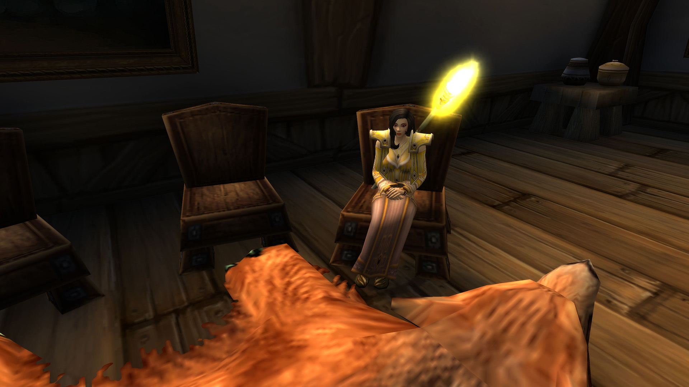

# 第三幕 渔夫之主

## 继任圣女

凯特琳丶安妮顶替佐伊成为了圣女。

记录开始于 05/30/2021 的 11:44:39。

\[阿拉里斯·雪莉\]: 凯特琳，你来了，正是时候。

凯特琳丶安妮 对阿拉里斯打了个招呼

\[阿拉里斯·雪莉\]: 骑士团危在旦夕。团长中毒，圣女又有事不能继续寻找圣杯。

\[凯特琳丶安妮\]: 我明白

\[阿拉里斯·雪莉\]: 我们需要一个新的圣杯骑士。

凯特琳丶安妮点了点头。

阿拉里斯·雪莉 指了最右边的位置。

\[凯特琳丶安妮\]: \*看了看四周\*所以，需要我做什么

\[阿拉里斯·雪莉\]: 这是骑士之座，坐上它的人会成为圣杯骑士。

\[阿拉里斯·雪莉\]: 但是如果他或者她内心没有真正的正义，就会招致厄运。

\[凯特琳丶安妮\]: 但这是有代价的，对吗\*戏谑的问道\*

\[凯特琳丶安妮\]: 好吧，我知道了

\[阿拉里斯·雪莉\]: 是的，英雄总要付出代价。

凯特琳丶安妮 交给阿拉里斯一封信

\[阿拉里斯·雪莉\]: 你是一个正义之人吗？

\[凯特琳丶安妮\]: 我想圣光会证明我的正义

\[凯特琳丶安妮\]: 这封信，如果我死了你再拆开看

\[凯特琳丶安妮\]: 现在，我要坐上去了

\[阿拉里斯·雪莉\]: 好的，你有足够的勇气。

凯特琳丶安妮 感觉和普通的椅子没什么不同

\[凯特琳丶安妮\]: 嗯....

\[凯特琳丶安妮\]: 有点硬

\[阿拉里斯·雪莉\]: 圣光与你同行。

\[凯特琳丶安妮\]: 为了圣光

## 圣女被绑架

凯特琳丶安妮顶替佐伊成为了圣女。

\[莉莉丶丹玛斯\]: 你过来了

\[莉莉丶丹玛斯\]: 走吧 跟我来

\[莉莉丶丹玛斯\]: 一会动手小心点

\[莉莉丶丹玛斯\]: 别弄出太大的动静

莉莉丶丹玛斯 骑上了坐骑

\[莉莉丶丹玛斯\]: 小心点

莉莉丶丹玛斯 下了坐骑

\[莉莉丶丹玛斯\]: 我先进去

\[莉莉丶丹玛斯\]: 你小心点

\[凯特琳丶安妮\]: 你们好——?

\[莉莉丶丹玛斯\]: 凯特琳丶安妮

\[莉莉丶丹玛斯\]: 怎么说那

\[莉莉丶丹玛斯\]: 我不希望伤害到你

\[莉莉丶丹玛斯\]: 所以跟我们走吧

凯特琳丶安妮 向莉莉丶丹玛斯表示疑惑

\[凯特琳丶安妮\]: 什么跟你们走?

\[莉莉丶丹玛斯\]: 对

\[莉莉丶丹玛斯\]: 你以谋害大团长之名被逮捕了

\[凯特琳丶安妮\]: 什么?!

\[凯特琳丶安妮\]: 我?！

\[莉莉丶丹玛斯\]: 希望你不要反抗

\[凯特琳丶安妮\]: 你在开什么玩笑!

\[莉莉丶丹玛斯\]: 我也很遗憾

\[莉莉丶丹玛斯\]: 但是这是事实

凯特琳丶安妮 望着莉莉丶丹玛斯，眯了眯眼睛

\[凯特琳丶安妮\]: 我懂了——毒是你下的，对不对?

\[莉莉丶丹玛斯\]: 你知道太多了

莉莉丶丹玛斯 堵住了门口

凯特琳丶安妮 猛地缩回屋子里——死死地关上大门，随手抄起自己的双手剑

\[莉莉丶丹玛斯\]: 动手

凯特琳丶安妮在莉莉丶丹玛斯面前躺下。

\[凯特琳丶安妮\]: \*咳嗽\*呸，奸细。

\[莉莉丶丹玛斯\]: 带上她 咱们走

把凯特琳丶安妮扶了起来。绑起凯特琳丶安妮的双手。

\[莉莉丶丹玛斯\]: 走吧 凯特琳丶安妮。

凯特琳丶安妮 吐了一口鲜血

\[莉莉丶丹玛斯\]: 我真的不想伤害你

\[莉莉丶丹玛斯\]: 今晚上我们要通过三角路口，，

\[莉莉丶丹玛斯\]: 不能让南方人发现我们

\[凯特琳丶安妮\]: 事已至此，不必多说了。

莉莉丶丹玛斯 给了朱丝缇雅一拳 

\[凯特琳丶安妮\]: \*咳嗽\*咳咳——

\[莉莉丶丹玛斯\]: 你不要挑战我的耐心，

\[莉莉丶丹玛斯\]: 走吧 带着她

\[凯特琳丶安妮\]: 你还有耐心么，恩?

\[莉莉丶丹玛斯\]: 造成这的一切 都不是我的错

\[凯特琳丶安妮\]: 住口！你这个厚颜无耻之徒！

\[莉莉丶丹玛斯\]: 你们已经忘记了 忘记了仇恨

\[莉莉丶丹玛斯\]: 实话告诉你把

\[莉莉丶丹玛斯\]: 法瑞的毒就是我下的

\[莉莉丶丹玛斯\]: 她已经被腐化了

\[莉莉丶丹玛斯\]: 她已经被南方人给腐化了

\[莉莉丶丹玛斯\]: 忘记咱们曾经的仇恨

\[莉莉丶丹玛斯\]: 被那些贵族。。也对 她以前也是贵族

\[凯特琳丶安妮\]: \*垂下眼皮·念着祷文\*

\[莉莉丶丹玛斯\]: 我只想救赎我的家乡

\[莉莉丶丹玛斯\]: 杀死那些亡灵

\[莉莉丶丹玛斯\]: 走吧 还有很长一段路要赶

莉莉丶丹玛斯 走向了树后

\[莉莉丶丹玛斯\]: 我在这里藏了几匹马

\[莉莉丶丹玛斯\]: 你带着她，

\[莉莉丶丹玛斯\]: 咱们走

\[莉莉丶丹玛斯\]: 回家

凯特琳丶安妮 装作不经意的样子，撕裂了一寸战袍的边角

