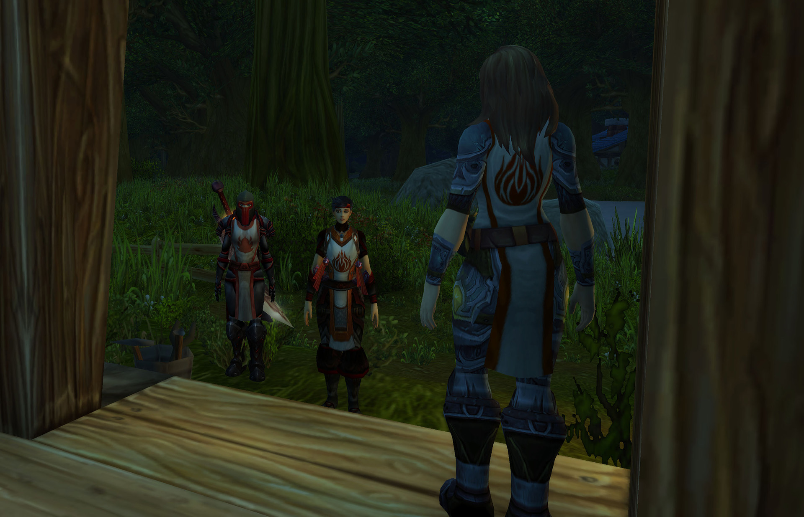
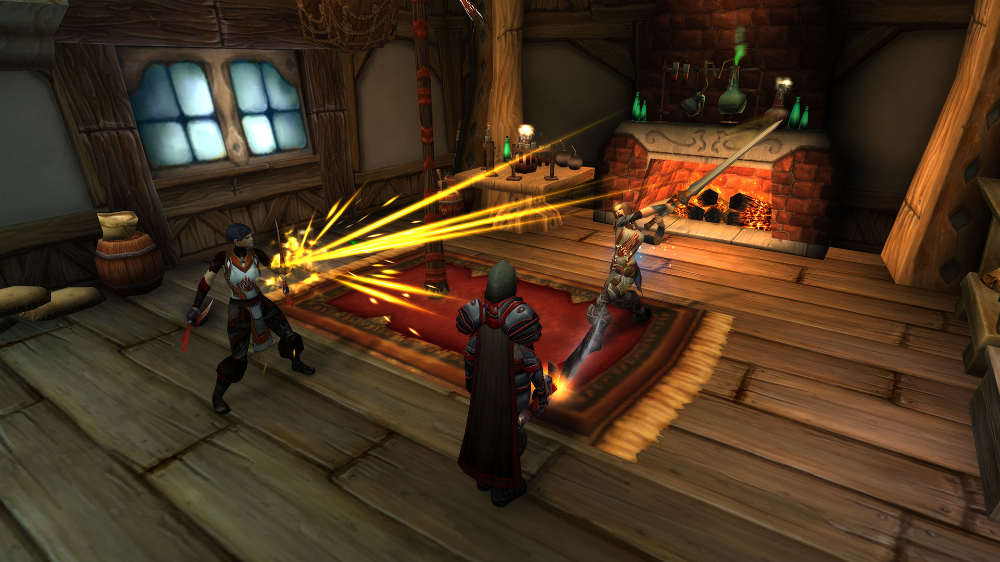
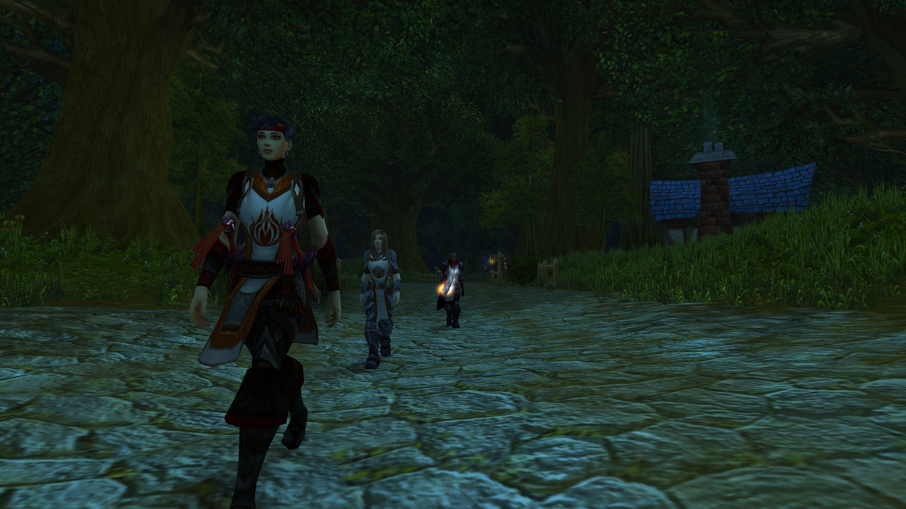

# 第三幕 渔夫之主

## 圣女被绑架

\[莉莉丶丹玛斯\]: 你过来了

\[莉莉丶丹玛斯\]: 走吧 跟我来

\[莉莉丶丹玛斯\]: 一会动手小心点

\[莉莉丶丹玛斯\]: 别弄出太大的动静

莉莉丶丹玛斯 骑上了坐骑

\[莉莉丶丹玛斯\]: 小心点

莉莉丶丹玛斯 下了坐骑

\[莉莉丶丹玛斯\]: 我先进去

\[莉莉丶丹玛斯\]: 你小心点

\[佐伊一世\]: 你们好——?

\[莉莉丶丹玛斯\]: 佐伊

\[莉莉丶丹玛斯\]: 怎么说那

\[莉莉丶丹玛斯\]: 我不希望伤害到你

\[莉莉丶丹玛斯\]: 所以跟我们走吧

佐伊一世 向莉莉丶丹玛斯表示疑惑

\[佐伊一世\]: 什么跟你们走?

\[莉莉丶丹玛斯\]: 对

\[莉莉丶丹玛斯\]: 你以谋害大团长之名被逮捕了

\[佐伊一世\]: 什么?!

\[佐伊一世\]: 我?！

\[莉莉丶丹玛斯\]: 希望你不要反抗

\[佐伊一世\]: 你在开什么玩笑!

\[莉莉丶丹玛斯\]: 我也很遗憾

\[莉莉丶丹玛斯\]: 但是这是事实

佐伊一世 望着莉莉丶丹玛斯，眯了眯眼睛

\[佐伊一世\]: 我懂了——毒是你下的，对不对?

\[莉莉丶丹玛斯\]: 你知道太多了

莉莉丶丹玛斯 堵住了门口

佐伊一世 猛地缩回屋子里——死死地关上大门，随手抄起自己的双手剑

\[莉莉丶丹玛斯\]: 动手

佐伊一世在莉莉丶丹玛斯面前躺下。

\[佐伊一世\]: \*咳嗽\*呸，奸细。

\[莉莉丶丹玛斯\]: 带上她 咱们走

把佐伊扶了起来。绑起佐伊的双手。

\[莉莉丶丹玛斯\]: 走吧 佐伊。

佐伊一世 吐了一口鲜血

\[莉莉丶丹玛斯\]: 我真的不想伤害你

\[莉莉丶丹玛斯\]: 今晚上我们要通过三角路口，，

\[莉莉丶丹玛斯\]: 不能让南方人发现我们

\[佐伊一世\]: 事已至此，不必多说了。

莉莉丶丹玛斯 给了佐伊一世

莉莉丶丹玛斯 一拳

\[佐伊一世\]: \*咳嗽\*咳咳——

\[莉莉丶丹玛斯\]: 你不要挑战我的耐心，

\[莉莉丶丹玛斯\]: 走吧 带着她

\[佐伊一世\]: 你还有耐心么，恩?

\[莉莉丶丹玛斯\]: 造成这的一切 都不是我的错

\[佐伊一世\]: 住口！你这个厚颜无耻之徒！

\[莉莉丶丹玛斯\]: 你们已经忘记了 忘记了仇恨

\[莉莉丶丹玛斯\]: 实话告诉你把

\[莉莉丶丹玛斯\]: 法瑞的毒就是我下的

\[莉莉丶丹玛斯\]: 她已经被腐化了

\[莉莉丶丹玛斯\]: 她已经被南方人给腐化了

\[莉莉丶丹玛斯\]: 忘记咱们曾经的仇恨

\[莉莉丶丹玛斯\]: 被那些贵族。。也对 她以前也是贵族

\[佐伊一世\]: \*垂下眼皮·念着祷文\*

\[莉莉丶丹玛斯\]: 我只想救赎我的家乡

\[莉莉丶丹玛斯\]: 杀死那些亡灵

\[莉莉丶丹玛斯\]: 走吧 还有很长一段路要赶

莉莉丶丹玛斯 走向了树后

\[莉莉丶丹玛斯\]: 我在这里藏了几匹马

\[莉莉丶丹玛斯\]: 你带着她，

\[莉莉丶丹玛斯\]: 咱们走

\[莉莉丶丹玛斯\]: 回家

佐伊一世 装作不经意的样子，撕裂了一寸战袍的边角

