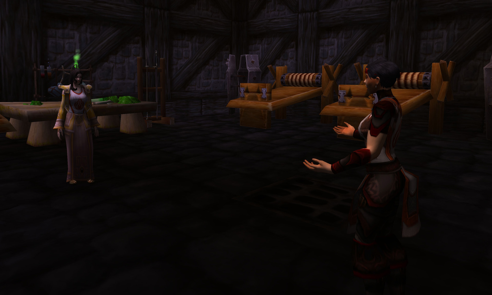
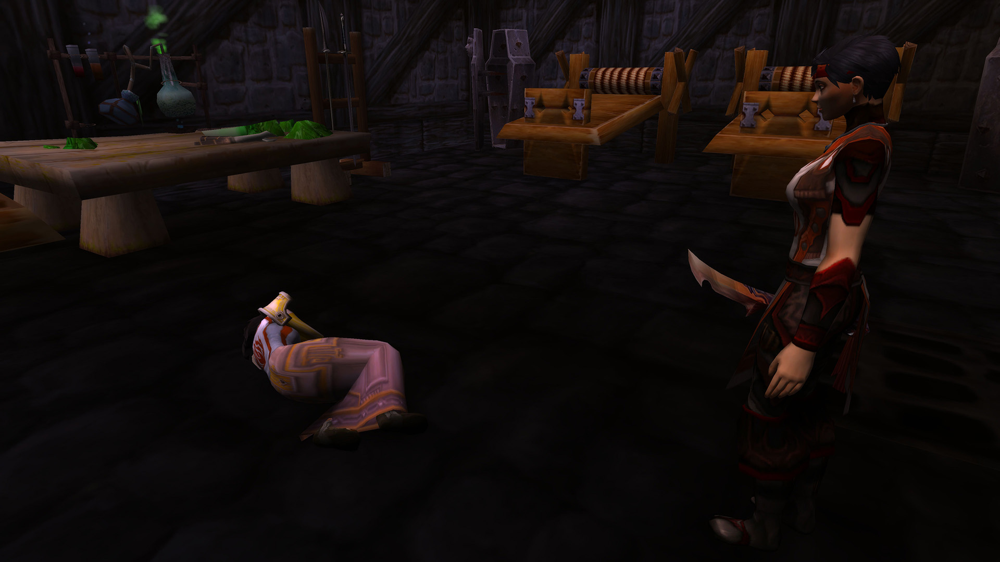
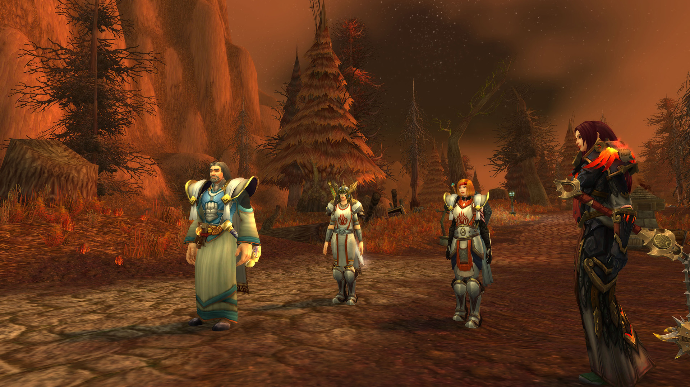
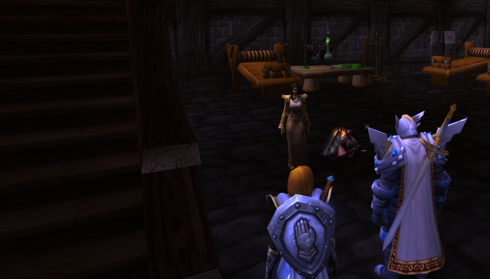
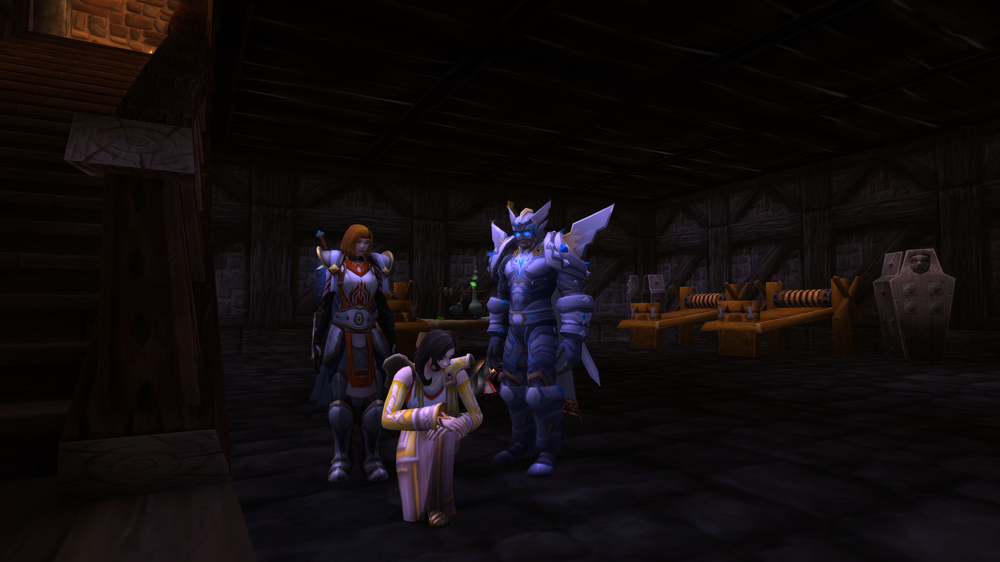
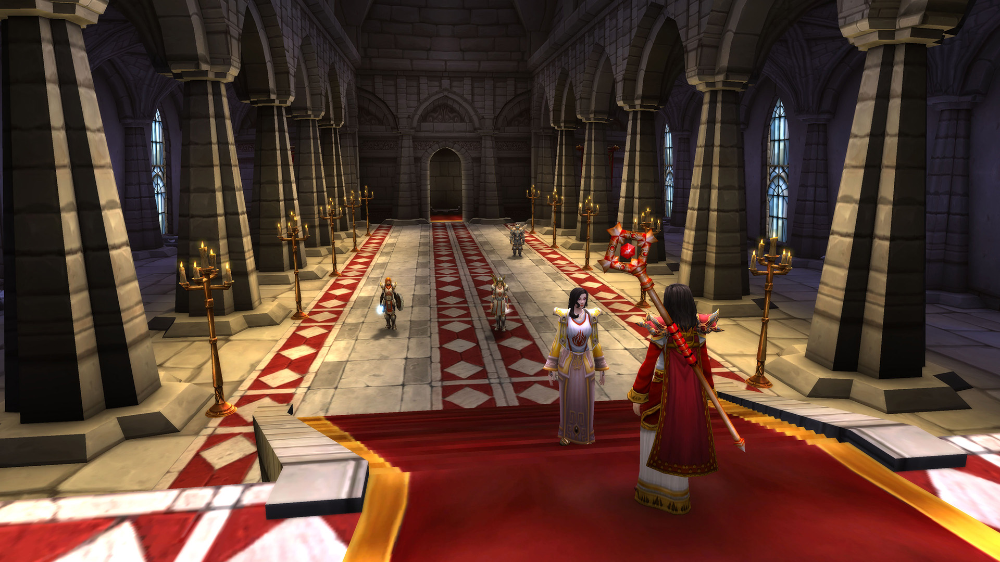
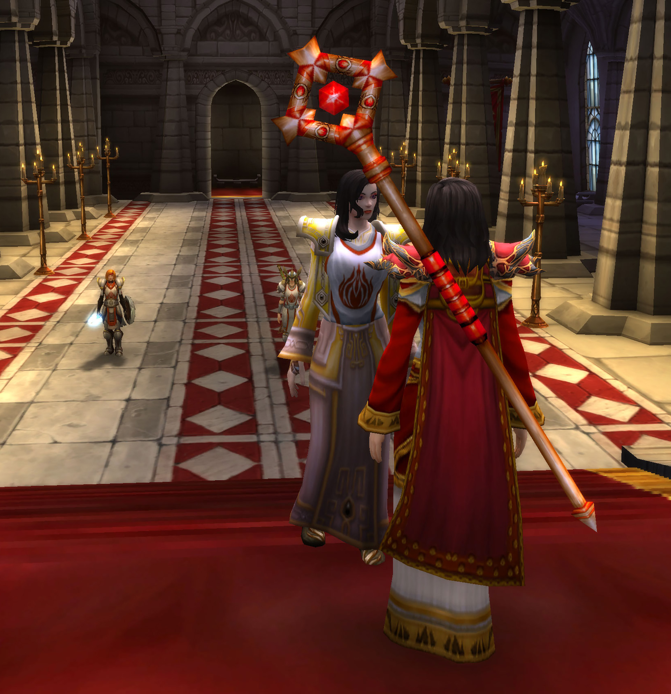
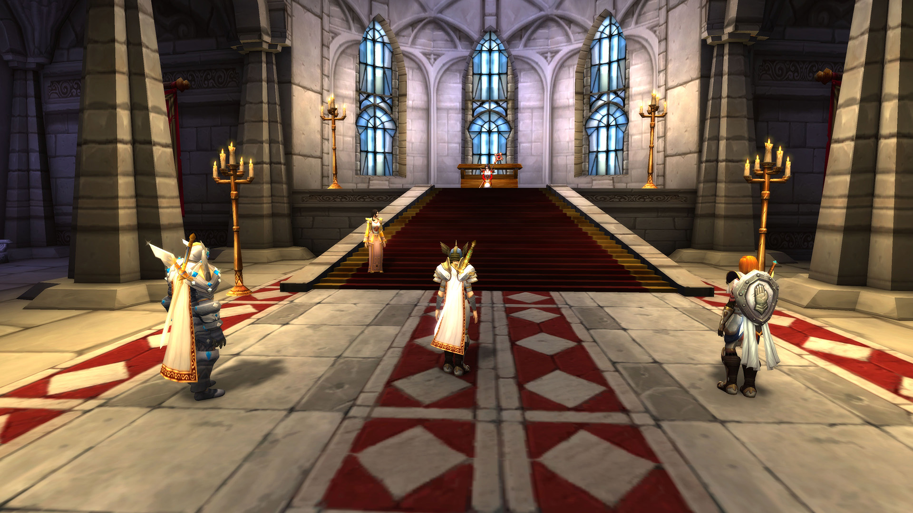

# 第四幕 血色之夜

## 审问圣女

圣女被绑架到提尔之手。

记录开始于 06/06/2021 的 19:27:15。？

\[莉莉丶丹玛斯]: 安妮女士

\[莉莉丶丹玛斯]: 说吧

凯特琳丶安妮 有些敌对的看着莉莉丶丹玛斯

\[莉莉丶丹玛斯]: 圣杯怎么使用

\[凯特琳丶安妮]: 我怎么知道

凯特琳丶安妮 向着墙边啐了一口血

\[莉莉丶丹玛斯]: 你是圣女。 你会不知道？

\[莉莉丶丹玛斯]: 别逼我动手

\[凯特琳丶安妮]: 呸，你这个叛徒

莉莉丶丹玛斯 走向了凯特琳丶安妮

\[莉莉丶丹玛斯]: 说不说

凯特琳丶安妮 受痛发出了痛苦的声音

\[莉莉丶丹玛斯]: 现在还只是用拳头

莉莉丶丹玛斯 拿出了一把匕首

\[凯特琳丶安妮]: 等我的同伴来救我了，你就会知道什么是痛苦

\[莉莉丶丹玛斯]: 可是你美丽的小脸蛋就要花了

莉莉丶丹玛斯 丢了丢手中的匕首

\[凯特琳丶安妮]: 呸，我诅咒你

\[莉莉丶丹玛斯]: 当匕首划过你美丽的小脸蛋的时候。。

\[莉莉丶丹玛斯]: 说吧。。

凯特琳丶安妮 被吓得晕了过去（装的）

\[莉莉丶丹玛斯]: 我们以前还是战友。

凯特琳丶安妮在莉莉丶丹玛斯面前躺下。

莉莉丶丹玛斯- 面对以前的战友，还是下不去手！

\[莉莉丶丹玛斯]: 你看好她 别让他跑了 我去查看下书籍上有没有线索

莉莉丶丹玛斯- 离开了地下室。

## 提尔之手的地下室

骑士团成员追踪到提尔之手。

记录开始于 06/06/2021 的 21:26:29。

\[朱丝缇雅]: 呼...就是这里了

\[朱丝缇雅]: 提尔之手

\[索娜德]: 显然是这里

\[法瑞雅]: 血色十字军最后的堡垒之一。

\[朱斯提尼阿诺]: 看起来好宏伟....这里曾经一定是一个美丽的城市

\[朱丝缇雅]: 我们这么进去没事吗?

朱斯提尼阿诺 发自内心由衷得赞叹着

\[朱斯提尼阿诺]: 我不知道....应该没问题吧?

\[朱丝缇雅]: 我曾经在这里追随过火叶

\[朱丝缇雅]: 让我来带路吧

索娜德点了点头。

朱斯提尼阿诺对朱丝缇雅点了点头。

\[朱丝缇雅]: 如果说圣女被关押了，那一定是那个地下监牢

\[朱斯提尼阿诺]: 当心一点...听说这里的人都不太友好

朱斯提尼阿诺 看着周围高大的建筑，红色的洛丹伦旗，不由得打了一个冷颤

朱丝缇雅 指了指面前的建筑

\[朱丝缇雅]: 应该就在这里

索娜德 看了看四周

\[索娜德]: 怎么说

\[朱斯提尼阿诺]: 啊.....

\[索娜德]: 这...

\[法瑞雅]: 来者何人？

\[朱斯提尼阿诺]: 你好......我是......

\[血色士兵]: 别想靠近一步！

朱斯提尼阿诺 因为紧张说话有些不利索

索娜德 眯着眸子盯着法瑞雅胸前的徽记

凯特琳丶安妮 从后面给了守卫一锤子

\[朱斯提尼阿诺]: 我是...路过的...我想来找一个叫安妮的女人

你躺了下来。

索娜德 注意到了身旁骑士的不安

\[凯特琳丶安妮]: 你们终于来了....

朱斯提尼阿诺 有些震惊地看着法瑞雅缓缓倒下

凯特琳丶安妮 揉了揉自己受伤的地方

\[索娜德]: 我感觉有点不对劲，阁下\*低声对亚瑟说\*

\[朱斯提尼阿诺]: 额.....您是..

\[凯特琳丶安妮]: 我就是安妮

索娜德看着朱斯提尼阿诺。

朱斯提尼阿诺 扭头看着索娜德，有些茫然

\[朱斯提尼阿诺]: 啊，你好...我叫亚瑟，我奉大团长法瑞之命来寻找您和圣杯

\[凯特琳丶安妮]: 啊....没见过的人

索娜德 总感觉，这里散发着一股诡异

\[凯特琳丶安妮]: 但是法瑞...

\[凯特琳丶安妮]: 没错，我记得大团长

\[朱斯提尼阿诺]: 圣杯应该还在您手上吧

凯特琳丶安妮 摇头

\[凯特琳丶安妮]: 不在了，被这里的头头拿走了

\[凯特琳丶安妮]: 她就在大教堂

索娜德 的掌心悄悄握住一丝圣光能量

朱斯提尼阿诺 咬了咬自己的嘴唇，他有些懊恼地敲了敲自己的胸甲

\[凯特琳丶安妮]: 你们知道圣杯的用途了？

\[朱斯提尼阿诺]: 意思是要我们去那里把圣杯拿回来么

朱斯提尼阿诺 摇了摇头

\[凯特琳丶安妮]: 这里的狂热者觉得圣杯可以净化亡灵

\[索娜德]: 净化?

\[朱斯提尼阿诺]: 这里可是\*指了指地上晕过去的人\*他们的地盘....靠我们几个人想要抢回圣杯可太难了

\[凯特琳丶安妮]: 确实，尤其是圣杯的真正用途只是鉴定使用它的人是否是正义的

\[凯特琳丶安妮]: 并不能精华亡灵

\[朱斯提尼阿诺]: 那我们该怎么...拿回它呢

\[凯特琳丶安妮]: 我们悄悄的

\[凯特琳丶安妮]: 先不动声色的从大门出去

索娜德 抿唇不语

朱斯提尼阿诺对凯特琳丶安妮点了点头。

\[凯特琳丶安妮]: 我是说如果你们是这么进来的话

\[凯特琳丶安妮]: 最好就是原路出去

\[朱斯提尼阿诺]: 其实..我也不知道我们是怎么进来的...反正就是进来了

\[凯特琳丶安妮]: 啊.....

\[凯特琳丶安妮]: 那就原路出去吧...

\[朱斯提尼阿诺]: 小姐你带路吧....我们不是要去找圣杯嘛

索娜德 后退几步让开路

\[凯特琳丶安妮]: 我觉得你们最好押送着我

朱斯提尼阿诺 感觉自己的脑袋嗡嗡的

\[朱斯提尼阿诺]: 额.....就这么押送您么

\[索娜德]: 押送........

\[凯特琳丶安妮]: 五花大绑也行

\[凯特琳丶安妮]: 你们动手吧

朱斯提尼阿诺对凯特琳丶安妮点了点头。

凯特琳丶安妮在朱斯提尼阿诺面前跪下。

朱斯提尼阿诺 从牢房的角落里拿起一根绳子

\[索娜德]: 真的要....真..绑吗

\[朱斯提尼阿诺]: 听她的呗

\[索娜德]: 如您所愿

朱斯提尼阿诺 用绳子将凯特琳丶安妮绑住

\[索娜德]: 得罪了

\[凯特琳丶安妮]: 对了，我再提一句，圣杯里的圣水可以解圣杯的毒

\[朱斯提尼阿诺]: 那走吧

## 提尔之手大教堂

骑士团成员来到大教堂面对莉莉丶丹玛斯。

表弟慢热手 说: 一个人去很危险吧？

朱斯提尼阿诺向你挥手致意。

\[凯特琳丶安妮]: 就是她....

\[凯特琳丶安妮]: 圣杯在她那里

\[凯特琳丶安妮]: 请帮我解绑吧

\[朱斯提尼阿诺]: 她看起来好像不是很好惹...

索娜德 抬头看向前方

朱斯提尼阿诺 将凯特琳丶安妮身后的绳子解开

凯特琳丶安妮 舒展了一下自己的手腕

\[索娜德]: 那么准备交接?

\[凯特琳丶安妮]: 嗯...

\[凯特琳丶安妮]: 莉莉

\[凯特琳丶安妮]: 快把圣杯交出来！

朱斯提尼阿诺 喃喃自语，但感觉自己说的话好像不太符合场合，最后还是闭嘴了

凯特琳丶安妮 走上前去

\[凯特琳丶安妮]: 别说废话了

\[凯特琳丶安妮]: 圣水可以救法瑞

凯特琳丶安妮 拿出了短匕刺了过去，但是正好被莉莉躲过了

记录开始于 06/06/2021 的 21:51:15。

\[莉莉丶丹玛斯]: 安妮，你们还是来了

\[凯特琳丶安妮]: 你的罪行罄竹难书！

\[索娜德]: 什么？

\[光明骑士]: 就是你！

\[莉莉丶丹玛斯]: 我有什么罪行

\[凯特琳丶安妮]: 给你个痛快这是我最大的仁慈了！

\[莉莉丶丹玛斯]: 看看外面吧

\[朱斯提尼阿诺]: 啊，你好，我叫亚瑟，我今天来是想要你手上的圣杯的

\[莉莉丶丹玛斯]: 你们杀害的每个亡灵

\[莉莉丶丹玛斯]: 都是当年的战友

\[莉莉丶丹玛斯]: 你有能力

\[索娜德]: 注意你的言行

\[莉莉丶丹玛斯]: 你为什么不能解救他们

\[凯特琳丶安妮]: 你错了莉莉，圣杯没有救助他们的能力

\[莉莉丶丹玛斯]: 难道南方的快乐的生活 让你堕落了？

\[莉莉丶丹玛斯]: 还记得法瑞吗？

\[莉莉丶丹玛斯]: 一只南方人的忠犬。。

\[凯特琳丶安妮]: 呸...快交出圣杯

\[朱斯提尼阿诺]: 我的导师告诉过我，恪守三美德的人便能获得圣光的祝福

\[莉莉丶丹玛斯]: 你是想要这个吗？

\[莉莉丶丹玛斯]: 你有能力解救外面的战友 你为什么不做那？

\[索娜德]: 我并不太想用武力来取走圣杯，但现在我们没的选\*举起武器\*

\[凯特琳丶安妮]: 快给我

\[凯特琳丶安妮]: 圣水可以救法瑞！

\[莉莉丶丹玛斯]: 安妮

\[莉莉丶丹玛斯]: 我亲爱的战友

\[朱斯提尼阿诺]: 亚瑟看到对方拔出了武器，于是他也拔出武器以应对接下来的情况

\[莉莉丶丹玛斯]: 法瑞重要 难道外面的战友不重要吗？

\[莉莉丶丹玛斯]: 你肯定有能力解救他们

\[莉莉丶丹玛斯]: 我看过书籍

\[莉莉丶丹玛斯]: 圣杯肯定有能力的

\[凯特琳丶安妮]: 你不明白，圣杯没有这个能力....

\[莉莉丶丹玛斯]: 不 你这都是借口

\[莉莉丶丹玛斯]: 我求你了

\[莉莉丶丹玛斯]: 你救救他们吧

\[莉莉丶丹玛斯]: 那怕拿走我的姓名

\[莉莉丶丹玛斯]: 你从来都没有打败我

\[莉莉丶丹玛斯]: 我是说真的

\[莉莉丶丹玛斯]: 安妮

\[莉莉丶丹玛斯]: 你看着我

\[莉莉丶丹玛斯]: 我们是战友

\[凯特琳丶安妮]: 现在不是了....

\[莉莉丶丹玛斯]: 告诉我 不要欺骗我

\[朱斯提尼阿诺]: 亚瑟叹了口气，内心为这些狂热的十字军们祈祷，他或许理解了部分圣光的民众们和位置而战的人的想法

\[莉莉丶丹玛斯]: 真的没办法吗？

\[凯特琳丶安妮]: 真的没有办法

\[莉莉丶丹玛斯]: 把圣杯递给了安妮

\[莉莉丶丹玛斯]: 坐了下来

\[凯特琳丶安妮]: 呼....

\[莉莉丶丹玛斯]: 好吧

\[法瑞雅]: 我们怎么处置这个叛徒？

\[莉莉丶丹玛斯]: 一切都结束了

\[朱斯提尼阿诺]: 亚瑟将武器慢慢收了回去

\[凯特琳丶安妮]: 收起了短匕

\[朱斯提尼阿诺]: 她也只是为了自己的战友们，算了吧

\[索娜德]: 圣光是仁慈的\*收回武器\*

\[朱斯提尼阿诺]: 放过她吧

\[光明骑士]: 那就带她回去审判？

\[莉莉丶丹玛斯]: 随便你们把。。

\[光明骑士]: 让圣光审判她的罪行！

\[凯特琳丶安妮]: 我同意，他应该交给法瑞来处理

\[莉莉丶丹玛斯]: 已经没有希望了。。

\[索娜德]: 公正的审判

\[莉莉丶丹玛斯]: 为什么会这样，，

\[朱斯提尼阿诺]: 留她在这里吧，圣光自然会评判她的

\[莉莉丶丹玛斯]: 给了我希望 又被击破

\[光明骑士]: 我们必须带她回去审判。

\[光明骑士]: 如果不是就地处决的话。

\[光明骑士]: 这是骑士团的规条。

\[凯特琳丶安妮]: 安妮将莉莉绑了起来

\[朱斯提尼阿诺]: 亚瑟擦了擦自己的眼角，无奈地叹了口气

\[莉莉丶丹玛斯]: 动手把 安妮

\[索娜德]: 我反对处决他，因为我们没有这个权利

\[凯特琳丶安妮]: 跟我们走吧莉莉，让你接受审判

\[莉莉丶丹玛斯]: 我不想见到那只南方的忠犬

\[莉莉丶丹玛斯]: 你还是处决我把

\[莉莉丶丹玛斯]: 我不想离开我的家

\[光明骑士]: 既然这是骑士团的决定，那么你会受到审判。

\[光明骑士]: 愿圣光怜悯你的灵魂。

\[莉莉丶丹玛斯]: 好吧，，还是最后再去看她一眼把
