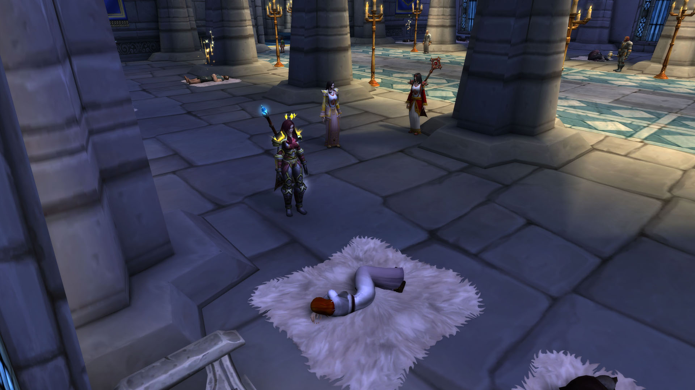
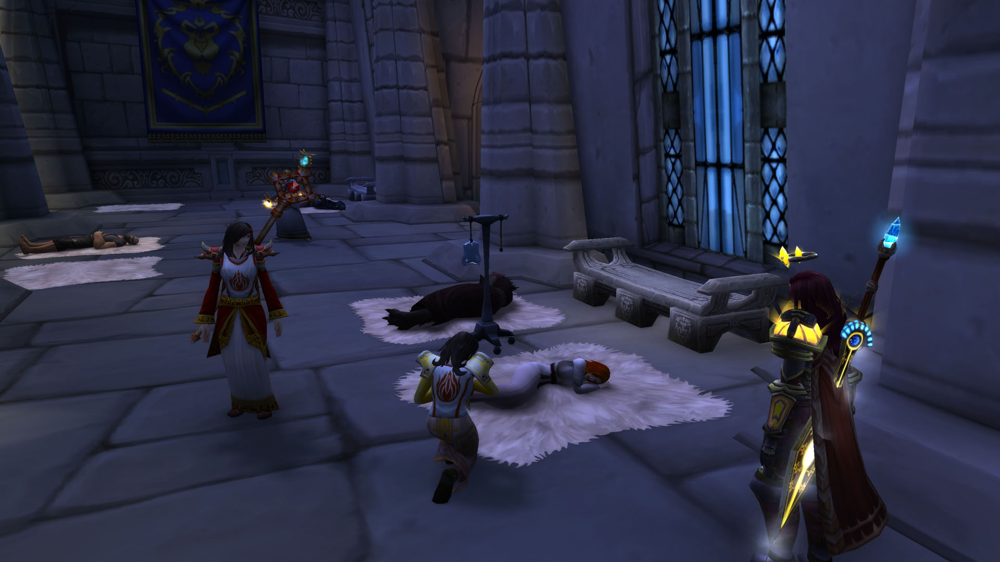
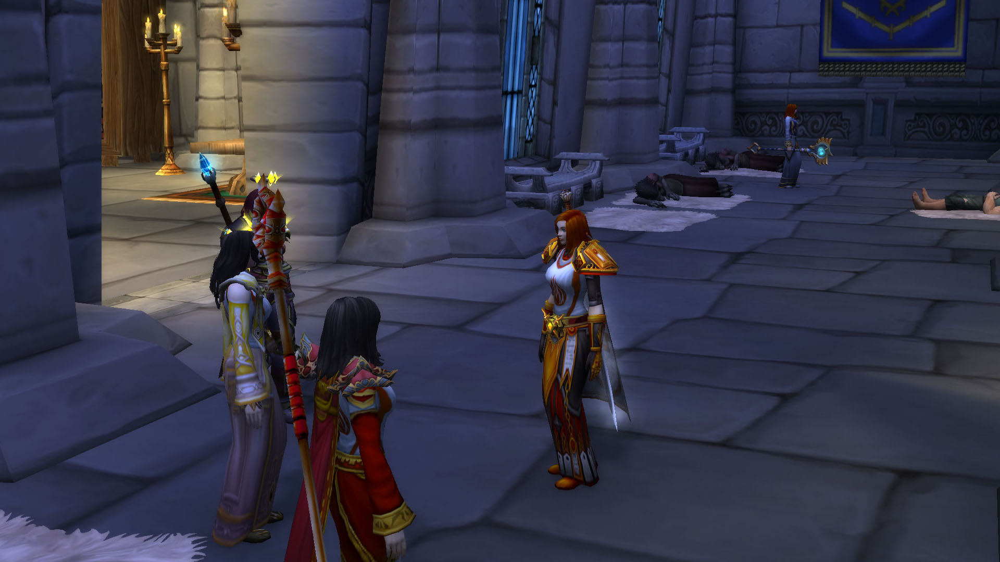

# 第五幕 圣杯去向

## &#x20;回到大教堂

骑士们回到了大教堂。

<figure><figcaption>
骑士们去看法瑞雅
</figcaption></figure>

记录开始于 06/13/2021 的 19:31:15。 你躺了下来。&#x20;

\[斯诺蕾]: 安妮 真的不敢相信&#x20;

\[斯诺蕾]: 你回来了&#x20;

\[凯特琳丶安妮]: 是的....&#x20;

\[凯特琳丶安妮]: 对亏了咱们的同僚&#x20;

凯特琳丶安妮 看着四周的大家&#x20;

\[斯诺蕾]: 圣杯那？ 带回来了吗&#x20;

凯特琳丶安妮对本杰明修士点了点头。&#x20;

\[斯诺蕾]: 法瑞快坚持不住了&#x20;

\[斯诺蕾]: 只有你和圣杯能就她&#x20;

\[凯特琳丶安妮]: 请静坐，让我看看 凯特琳丶安妮在你面前跪下。&#x20;

\[凯特琳丶安妮]: 没错了，是圣杯的毒&#x20;

\[斯诺蕾]: 哦 真的吗?&#x20;

\[斯诺蕾]: 那说明法瑞还有救&#x20;

\[凯特琳丶安妮]: 卡特认为呢？&#x20;

\[弗蕾雅丶卡特]: 我么&#x20;

\[弗蕾雅丶卡特]: 只要没死，都还有救

<figure><figcaption>
治疗法瑞雅
</figcaption></figure>

凯特琳丶安妮 庄重的点点头

\[斯诺蕾]: 那赶紧开始吧

\[凯特琳丶安妮]: 那么...请集中精神，我要开始祝祷词了

凯特琳丶安妮 闭上眼睛，让神圣的光辉和心中的正义充斥全身

弗蕾雅丶卡特 思考自己应该做什么

凯特琳丶安妮 庄重的祷告到

\[凯特琳丶安妮]: 圣光之中圣杯

凯特琳丶安妮 举起了圣杯

\[凯特琳丶安妮]: 将生命之圣水倾泻而下

\[凯特琳丶安妮]: 滋养我们的灵魂

\[凯特琳丶安妮]: 不灭灵魂之火焰

凯特琳丶安妮 再次举起了圣杯

\[凯特琳丶安妮]: 圣光之中圣杯

\[凯特琳丶安妮]: 与我们一共同在

\[凯特琳丶安妮]: 灭绝邪恶的侵扰

\[凯特琳丶安妮]: 与我们日夜同在

凯特琳丶安妮 将圣杯庄重的举得更高了

\[凯特琳丶安妮]: 圣光之中圣杯

\[凯特琳丶安妮]: 盛过那圣骑士乌瑟尔之血

\[凯特琳丶安妮]: 宽恕我们的罪行

\[凯特琳丶安妮]: 在圣光的照耀之下

凯特琳丶安妮 将圣杯靠向自己，她看了看升杯中的圣水，又看了看自己的同僚和法瑞

\[凯特琳丶安妮]: 我将见证正义

凯特琳丶安妮 喝了一小口圣水，她感觉到圣水似乎和自己相呼应

\[斯诺蕾]: 我们将见证历史

弗蕾雅丶卡特点了点头。

凯特琳丶安妮 靠近了法瑞，她将圣水喂给了法瑞

法瑞雅 喝下圣水，艰难地睁开眼睛

\[凯特琳丶安妮]: 请醒过来吧

\[斯诺蕾]: 醒来了。。

\[斯诺蕾]: 天哪

\[法瑞雅]: 我昏迷多久了？

弗蕾雅丶卡特 对圣水的奇迹感到惊讶

\[斯诺蕾]: 额。。也不是很长时间

\[凯特琳丶安妮]: 您终于醒过来了

\[法瑞雅]: 感谢你们救了我

法瑞雅 看向凯特琳丶安妮

\[法瑞雅]: 你就是那正义之人

凯特琳丶安妮对你点了点头。

\[凯特琳丶安妮]: 我是新任的圣女

\[法瑞雅]: 喝下圣杯的水需要勇气

\[凯特琳丶安妮]: 多谢您的称赞

\[法瑞雅]: 我的盔甲……我需要它们

<figure><figcaption>
法瑞雅被治愈
</figcaption></figure>

法瑞雅 站起 \[法瑞雅]: 我感觉到一切都更新了&#x20;

\[弗蕾雅丶卡特]: 快一个月了&#x20;

\[法瑞雅]: 但是骑士团之中有一个叛徒&#x20;

凯特琳丶安妮: 我们抓到了她&#x20;

凯特琳丶安妮: 她就是莉莉·丹尼斯&#x20;

\[法瑞雅]: 那她将面临审判&#x20;

凯特琳丶安妮 严肃的点了点头
