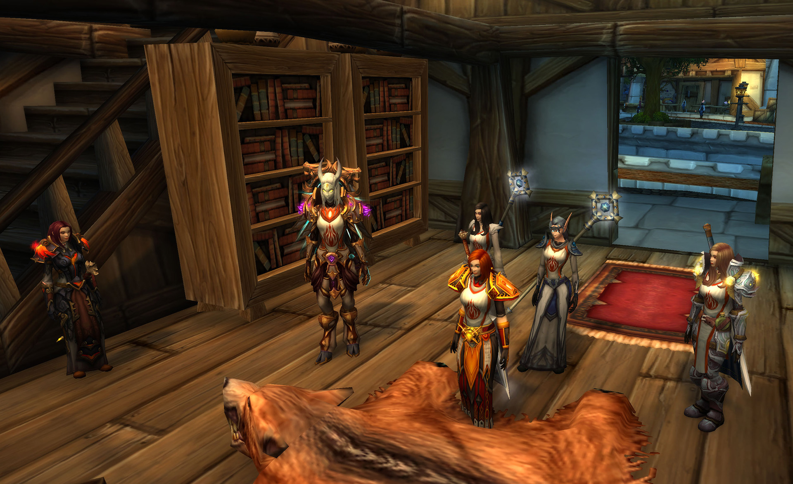

# 第一幕 圣墓被毁

传闻骑士团在暴风城的墓地被毁。

## 墓地被毁

记录开始于 05/16/2021 的 20:18:41。

\[佐伊一世\]: \*气喘吁吁\*我听到了一些不好的消息——

\[法瑞雅\]: 是的，我也听说了。

\[法瑞雅\]: 听说骑士团的墓地出了事。

\[法瑞雅\]: 我们进去看吧。

\[法瑞雅\]: 圣光……

\[朱丝缇雅\]: 这是...

\[圣洁裁决者\]: 这，

\[法瑞雅\]: 那是守墓人安纳特·兰顿！

佐伊一世 愣了一下，看着被挖开的墓地——

\[威克\]: 怎么了各位？

\[圣洁裁决者\]: 坟墓被挖开了

\[法瑞雅\]: 坟墓还都被挖开了。

\[朱丝缇雅\]: 看来应该是在找什么东西

\[朱丝缇雅\]: 大团长你看

\[法瑞雅\]: 法瑞查看着骑士们的墓志铭。

\[朱丝缇雅\]: 墓中的物品并没有明显减少

朱斯提尼阿诺 到达聚集地后，他一眼便看到了那个异族夹在人群中，他不禁皱皱眉，找了一个人较为少的地方站着

\[法瑞雅\]: 帕拉斯·圣剑、拥光者克拉拉、斯蒂凡、巴鲁沙和塞拉夫·夜愿，他们的坟墓都被翻开了。

\[圣洁裁决者\]: 这里面到底埋藏着什么

法瑞雅 看着安纳特倒在墓前。

法瑞雅 她身上还残余着圣光神术的痕迹，她被圣光所杀。

朱丝缇雅跪了下来。

\[圣洁裁决者\]: 会不会和之前那封吓人的信有关

法瑞雅 看着安纳特的脖子上……那有一个标记……

你跪了下来。

\[佐伊一世\]: 你是说……圣杯?

圣洁裁决者跪了下来。

\[圣洁裁决者\]: 是的

朱斯提尼阿诺 看着被翻得一片狼藉的墓地，摇了摇头

法瑞雅 查看安纳特脖子上的印记，那是……一个L字。

朱丝缇雅 注意到了那天在旅店里的陌生男人

法瑞雅 皱眉，或许这个标记象征着洛丹伦，但它是血红色的。

\[法瑞雅\]: 守墓人被杀，圣墓被毁。

\[法瑞雅\]: 他们一定是在找什么。

\[法瑞雅\]: 但是……

朱斯提尼阿诺 看着法瑞雅手中的徽章，那是血色十字军的标志，但在这污秽遍地的南方王国，他理智地保持了沉默

\[法瑞雅\]: 无论是谁这么做。

\[法瑞雅\]: 他们不知道一件事。

\[法瑞雅\]: 他们不知道，这里并没有埋葬着骑士们。

\[法瑞雅\]: 这是一个象征性的墓地。

\[法瑞雅\]: 象征着炙热之心骑士团的长眠。

\[佐伊一世\]: 就像……衣冠冢?

\[圣洁裁决者\]: 那其骑士们的真正埋藏之地在哪？？

\[法瑞雅\]: 是的，象征性的墓地。但是既然这里被挖开了，那么真的墓地可能也已经被发现。

\[法瑞雅\]: 就连我也忘记了真正的墓地在哪。

\[朱斯提尼阿诺\]: 诅咒教派，他们也许是想要这些尸体，可惜扑了空

朱斯提尼阿诺 缓缓开口猜测到

\[法瑞雅\]: 你们需要去寻找骑士团真正的墓地，或许，通过阅读古籍能知道。

朱丝缇雅 侧头看向了朱斯提尼阿诺

\[法瑞雅\]: 我认为事情可能并不简单，这些人可能觊觎骑士团的宝藏。

\[佐伊一世\]: 愿圣光碾碎他们，如此胆大包天的在联盟的心脏挖——\*看向大团长·止住了嘴\*

朱斯提尼阿诺 直视着墓志铭，脸色阴沉

朱丝缇雅对你点了点头。

\[法瑞雅\]: 他们可能认为骑士团的墓地里有埋藏着圣物。

\[法瑞雅\]: 骑士团的三大圣物，真理圣契、命运之剑、圣杯。

\[法瑞雅\]: 真理圣契已经失落，命运之剑在我手上，那么就剩下圣杯了。

\[朱丝缇雅\]: 那么....这个人的目标是圣杯

佐伊一世向米丝蒂挥手致意。

\[朱斯提尼阿诺\]: 这世界上宝物有很多，但是为了获取宝物而亵渎墓地的，除了那群畜生我想不出其他人来

\[法瑞雅\]: 去图书馆吧。骑士团的古籍里应该有记录。

\[法瑞雅\]: 记录着骑士团真正的墓地。

## 查阅古籍

法瑞雅 在图书馆门口等候。

法瑞雅 等其他骑士们去寻找古籍。

\[佐伊一世\]: 啊，这里——

\[米丝蒂\]: 骑士团的书籍

佐伊一世 连忙取下来一本书，翻阅起来

米丝蒂 拍拍佐伊一世的肩膀

\[圣洁裁决者\]: 据说他是个隐藏自己的高手

\[佐伊一世\]: 不过，信上说，当年战死的勇士们，

\[佐伊一世\]: 都埋在了一个地下墓穴里。

\[米丝蒂\]: 这件事和在暴风城发生的事情有关联吗

\[法瑞雅\]: 一个地下墓穴？

\[法瑞雅\]: 听起来像是这样。

\[法瑞雅\]: 它在哪？

\[佐伊一世\]: 冰冠冰川?我不确信。

\[米丝蒂\]: 索多里尔河附近

\[法瑞雅\]: 是的……我想起来了。

\[法瑞雅\]: 索多里尔河附近的墓穴！

\[法瑞雅\]: 我们现在就启程。

\[米丝蒂\]: 除了这本书

\[米丝蒂\]: 我还找到了其他东西

\[佐伊一世\]: 索多里尔?

## 真正墓地

骑士团真正的墓地，就在索多里尔河附近。骑士们连夜赶往。

\[法瑞雅\]: 啊，我看到你换了战斗的装备。

朱斯提尼阿诺对你点了点头。

\[朱斯提尼阿诺\]: 我很悲伤...图尔加斯女士

\[法瑞雅\]: 对于守墓人的事件吗？

\[法瑞雅\]: 她已经做骑士团的守墓人很久了……

\[朱斯提尼阿诺\]: 我没想到，西洛丹伦和东洛丹伦变成了这幅模样

\[法瑞雅\]: 你已经很久没回来过了吧？

\[法瑞雅\]: 我也是……但我知道这里的样子。这里还是老样子。

朱丝缇雅 注意到了血红的骑士团盾牌

\[朱斯提尼阿诺\]: 守墓人如果没有守住那些神圣的安眠之所，以生命为代价来陪葬也是合理的

\[朱斯提尼阿诺\]: 是的，黑门20年之后我就没有来过这里

\[法瑞雅\]: 生命为代价不免太沉重了。幸而那只是骑士团象征性的墓地。

\[法瑞雅\]: 我们之后要寻找的，是真正的墓地。

朱丝缇雅 干咳了两声

朱斯提尼阿诺 看着索多里尔河边的枯枝败叶，因愤怒而浑身颤抖

\[朱丝缇雅\]: 抱歉打扰你们

\[朱丝缇雅\]: 但是我是黑门30年从这里离开的

米丝蒂向佐伊一世表示感谢。

\[朱丝缇雅\]: 这里可能已经不是当年的面貌了

朱斯提尼阿诺 在人群中忽然发现了米丝蒂

\[朱斯提尼阿诺\]: 我不知道我们这一群人中还有“高贵”的精灵

\[米丝蒂\]: 我不知道我们这一群人中还有人没穿战袍

\[朱斯提尼阿诺\]: 你们的自私自利，和对联盟的背叛我是不会忘记的

红发的凯瑟琳 正打算说什么，发现气氛不太对。

米丝蒂 轻松地笑笑

\[朱丝缇雅\]: 高等精灵对银色黎明和银色北伐军的帮助很多

朱斯提尼阿诺 盯着米丝蒂，以应对各种情况

\[朱丝缇雅\]: 先生请不要带有偏见

\[米丝蒂\]: 不需要跟这种人解释，女士

朱丝缇雅对着米丝蒂叹了口气。

\[米丝蒂\]: 他们需要多读书

\[朱斯提尼阿诺\]: 我和背叛盟友的，两面三刀的种族没什么可说的

\[朱丝缇雅\]: 看来这种偏见至少3代人才能消弭

\[法瑞雅\]: 好了他们来了。

\[米丝蒂\]: 我倒是无所谓哈哈

红发的凯瑟琳 看了一眼朱斯提尼阿诺。

\[朱丝缇雅\]: 啊...

朱斯提尼阿诺 看着这片黄土色的土地，悲伤地用手扶在桥梁的石头上

朱丝缇雅 拍了拍朱斯提尼阿诺的肩膀

\[佐伊一世\]: 马不停蹄?

\[朱丝缇雅\]: 抱歉，看来这里有很多你的回忆

\[朱丝缇雅\]: 但是我们还是先出发吧

\[朱斯提尼阿诺\]: 不，我没来过几次这里

\[法瑞雅\]: 我的记忆已经模糊了。

\[法瑞雅\]: 毕竟我也是应该被“埋葬”的人了。

佐伊一世 感觉气氛有点压抑

\[法瑞雅\]: 斯蒂凡以为我一直待在了壁炉谷。但我知道我的冒险还没结束。

\[法瑞雅\]: 我只是依稀记得骑士团的墓地。

红发的凯瑟琳 不易察觉地打量着队伍里的众人。

\[佐伊一世\]: 这就是亡灵为什么必须被救赎的原因。

\[法瑞雅\]: 这里充满了亡灵

\[米丝蒂\]: 有人受伤了吗？

\[圣洁裁决者\]: 有好多亡灵

\[法瑞雅\]: 我想就是这里了。索多里尔河附近的墓穴。

\[朱丝缇雅\]: 但是...为什么这么多巨魔僵尸

法瑞雅 发现这里的墓穴也被翻开了。

法瑞雅 各处都是搜寻的痕迹。

\[圣洁裁决者\]: 圣骑士们的遗体为什么会埋藏在这么阴森的地方

米丝蒂 发现了卷轴

\[法瑞雅\]: 你们可以看下附近还有什么线索没有？

\[圣洁裁决者\]: 没有圣光的照耀

\[米丝蒂\]: 这里有一个卷轴

\[朱斯提尼阿诺\]: “这世上有耳聋眼瞎之人，多余地上灰尘”

米丝蒂 出示了\[撕烂的卷轴\]

\[朱斯提尼阿诺\]: “这世上有蒙昧迂曲之人，多于天上繁星”

\[米丝蒂\]: 让我们保护圣杯

法瑞雅 凑过头去看了卷轴。

佐伊一世 上下打量了一下朱斯提尼阿诺的穿着

\[红发的凯瑟琳\]: 保护圣杯，否则……

\[圣洁裁决者\]: 好吧，黑暗越是茂盛的地方，光明愈显珍贵

朱丝缇雅 出示了\[撕烂的卷轴\]

\[红发的凯瑟琳\]: 这“圣杯”这次的目标？

\[法瑞雅\]: 是的，看来骑士团还有不为人知的历史。

\[法瑞雅\]: 难道我们被确定为是圣杯的保护者？

\[法瑞雅\]: 否则就会被诅咒？

朱斯提尼阿诺 在石碑上寻找着骑士团的历史简介

\[法瑞雅\]: 上面说，“保护圣杯，否则圣水会变毒药！”

\[红发的凯瑟琳\]: 那么，圣杯究竟是什么？一个杯子？或者别的什么东西？

\[法瑞雅\]: 连我也不知道这是什么意思。

\[佐伊一世\]: 或许……

佐伊一世 仔细的想了想

\[米丝蒂\]: 圣水是圣杯里盛放的水

\[米丝蒂\]: 现在圣杯都不见了

红发的凯瑟琳 搜寻着附近可能被称作“圣杯”的物品。

\[法瑞雅\]: 如果圣杯被埋藏在这里，那么很明显它已经被盗走了。

\[法瑞雅\]: 这里到处都是翻找的痕迹。

\[佐伊一世\]: 我们先离开这里吧。

\[红发的凯瑟琳\]: 显然，无论它是什么，至少它不在这。

\[法瑞雅\]: 我们回到暴风城骑士团的驻地吧。

朱丝缇雅点了点头。

\[米丝蒂\]: 法师有暴风城的传送坐标吗？

\[朱丝缇雅\]: 我可以开启传送门

朱斯提尼阿诺 仔细地打量着圣洁裁决者

\[米丝蒂\]: 太好了

\[朱丝缇雅\]: 稍等

\[佐伊一世\]: 传送用的素材……?

朱丝缇雅 在搜寻着暴风城的坐标

\[朱丝缇雅\]: 嘘....

\[朱斯提尼阿诺\]: 图尔加斯女士，找到你需要的东西了么

\[法瑞雅\]: 没有，我们没有找到圣杯。

朱丝缇雅 眉头紧锁，随后舒展开，然后她抛出了传送门符文，随后，一道传送门打开了

\[朱斯提尼阿诺\]: 这里看起来好像没有收到太大的破坏

## 回到驻地

骑士们回到暴风城的驻地。

\[法瑞雅\]: 跟我进去吧。

\[法瑞雅\]: 你们看到这四张椅子，先不要坐。

佐伊一世 打量了一下房间

\[法瑞雅\]: 有三张椅子，是留给天威骑士的。

\[法瑞雅\]: 左边这三张。

\[法瑞雅\]: 但是………

红发的凯瑟琳 往楼上张望了一下。

\[法瑞雅\]: 最右边这张，这张椅子……

\[法瑞雅\]: 它有一个特别的名字，叫骑士之座。

\[法瑞雅\]: 坐上去的骑士，将会成为圣洁骑士，负责寻找圣杯。

朱斯提尼阿诺 靠在墙边，目睹家园变成了那样他仿佛耗尽了自己所有的力气

\[法瑞雅\]: 在骑士墓地里我们发现，骑士团的其中一个古老的传统就是保护圣杯。

米丝蒂对你点了点头。

\[法瑞雅\]: 如今圣杯失踪，我们也需要一个寻找圣杯的骑士。

\[法瑞雅\]: 但是相传坐上这个椅子的人。

\[法瑞雅\]: 如果他或者她不是一个正义之人。

\[法瑞雅\]: 他会因此遭受厄运！

朱斯提尼阿诺 安静地聆听着，沉默不语

\[米丝蒂\]: 我提议你来坐这个位置

\[法瑞雅\]: 所以在这么多位骑士之中……哦，不，我不能。

\[法瑞雅\]: 我恐怕并不合适。

\[米丝蒂\]: 我相信你是那个正义之人

\[法瑞雅\]: 在这么多位骑士之中，我们需要有一位正义之人站出来。

\[圣洁裁决者\]: 我也相信你，法瑞雅，大团长

\[朱丝缇雅\]: 那会是？

\[佐伊一世\]: 或许——

朱丝缇雅 好奇的看着大团长法瑞雅

\[佐伊一世\]: 我们不用现在就决定什么什么骑士……我相信——

红发的凯瑟琳 对自己的信仰笃信无疑，但有另一种东西阻止着她迈出脚步。

\[佐伊一世\]: \*改口\*我想，寻找圣杯是我们所有人的责任。

\[法瑞雅\]: 佐伊，我认为你或许可以尝试？

佐伊一世被你惊呆了。

\[法瑞雅\]: 我认识你，你正直纯粹。

红发的凯瑟琳 看向佐伊。

\[佐伊一世\]: 不，我不能，至少不能再诸多前辈面前班门弄斧。

\[朱斯提尼阿诺\]: “人若不知满足满足，便要生灾祸，贪欲能令丰裕的变贫瘠，平和的起争端，安宁的生杀戮”

佐伊一世 疯狂的摇头

朱丝缇雅 看向佐伊

\[朱丝缇雅\]: 佐伊，你可以的

\[朱丝缇雅\]: 我支持你

## 骑士之座

朱丝缇雅 坚定的站在佐伊身后

\[佐伊一世\]: 我何德何能担此大任?不，不可以。

\[红发的凯瑟琳\]: 我会献上我的剑与盾。

\[法瑞雅\]: 坐上这个位置，需要大量的勇气，也需要纯净的心灵。

法瑞雅 指了最右边的座位。

\[佐伊一世\]: 不如……我们先讨论一下，圣杯遗失的问题?

米丝蒂 拍拍佐伊一世的肩膀

佐伊一世 小心翼翼的撇开话题

\[米丝蒂\]: 我也认为你可以当此重任

红发的凯瑟琳 扶着锤柄，看着佐伊一世。

\[米丝蒂\]: 我将以圣光的名义为你祈福

\[米丝蒂\]: 去吧，骑士

\[米丝蒂\]: 刚才圣光已经显圣了

\[米丝蒂\]: 你被圣光选中了

\[圣洁裁决者\]: 我将为您祝福，使您坚不可摧

\[朱斯提尼阿诺\]: 叛徒也能代表圣光么?

\[圣洁裁决者\]: 叛徒？

\[佐伊一世\]: 那——

\[朱丝缇雅\]: 冷静，同胞们

\[佐伊一世\]: 我坐一下?

朱斯提尼阿诺 看着圣洁裁决者的双眼

佐伊一世被圣洁裁决者惊呆了。

\[朱丝缇雅\]: 现在是关键时刻

\[米丝蒂\]: 去吧，接受你的命运

\[法瑞雅\]: 小心，这可是一个困难的决定。

\[米丝蒂\]: 不要被庸人干扰

\[朱斯提尼阿诺\]: 我知道你们，另一个世界来的客人

\[朱丝缇雅\]: 加油，佐伊

\[法瑞雅\]: 很可能代表大量的危险。

\[法瑞雅\]: 无法预测的命运。

佐伊一世 头上渗出了冷汗

\[法瑞雅\]: 事实上，骑士团的命运也是如此。

\[圣洁裁决者\]: 我们同燃烧军团战斗力无数个世纪

\[米丝蒂\]: 不要害怕，我们在你背后支持你

佐伊一世 走了两步——

\[圣洁裁决者\]: 圣光亦赐我身躯

\[朱斯提尼阿诺\]: “对于拜异教者，你要谨慎，切不可被他们的巧言利口所迷惑”

佐伊一世 比划了一个祈祷的手势，深吸一口气，硬着胆子坐了上去——坐了一点点

\[圣洁裁决者\]: 你说谁是叛徒

米丝蒂向佐伊一世大声喝彩。真棒！

\[朱斯提尼阿诺\]: 对么，客人？

\[佐伊一世\]: 这——这样?

\[米丝蒂\]: 你需要更坚定

\[朱丝缇雅\]: 你是正义的化身

\[法瑞雅\]: 这……需要整个坐上去我看。

\[朱斯提尼阿诺\]: 当然不是指你，我指的是背叛洛丹伦，背叛联盟的叛徒

佐伊一世 都快哭了！

\[米丝蒂\]: 我想团长是对的

\[法瑞雅\]: 它以后就是你的座位了。

\[米丝蒂\]: 你需要像圣光证明，你的勇气和决心

米丝蒂向佐伊一世大声喝彩。真棒！

你满怀敬意地向佐伊一世致礼。

\[圣洁裁决者\]: 为何这样说，他们都是坚定的斗士

\[佐伊一世\]: 我不会忽然变成无脑的亡灵吧\*哭丧着一个脸\*

米丝蒂坚决地对佐伊一世说不。

\[法瑞雅\]: 不，这是正途。

红发的凯瑟琳 皱了皱眉。

\[法瑞雅\]: 圣杯骑士，骑士团的圣女。

\[米丝蒂\]: 我相信你会完成使命

朱斯提尼阿诺 看着圣洁裁决者，露出了一丝笑容

佐伊一世 紧张兮兮

\[朱斯提尼阿诺\]: 奎尔萨拉斯的历史，就是一部背叛的历史\*看着天花板上的蜘蛛网\*

\[米丝蒂\]: 稍等团长

\[朱丝缇雅\]: 放心，我们会一直跟随你

\[米丝蒂\]: 我有事要报告

\[法瑞雅\]: 什么事？

米丝蒂 把\[撕烂的卷轴1\]拿出给大家看

\[米丝蒂\]: 我在房间里发现了这个

\[米丝蒂\]: 大家看看

\[米丝蒂\]: 我在房间里发现了这个\[一封还来不及烧掉的信\]

\[米丝蒂\]: 有人想要控制你

\[法瑞雅\]: 这……跟之前的那封信可能出自同样的人的手。

\[米丝蒂\]: 收信人的头衔是长官，所以我推测是军队组织

红发的凯瑟琳 看完信件，一脸严肃。

\[法瑞雅\]: 我们无需惧怕。圣光在我们这边。

\[米丝蒂\]: 我相信在座的人没有惧怕

\[米丝蒂\]: 但是我们需要知道敌人是谁

\[法瑞雅\]: 是的，他们恐怕很快就会露出马脚。

米丝蒂对你点了点头。

\[米丝蒂\]: 而且我们今天拥立了圣女

\[米丝蒂\]: 今后就算您不幸牺牲

\[米丝蒂\]: 骑士团也后继有人

\[朱丝缇雅\]: 不错…

朱斯提尼阿诺 远远观察着佐伊一世，耸了耸肩，明显他不相信“圣女”这套说辞

法瑞雅 凝重地看了圣女的位置。

红发的凯瑟琳 轻轻握了握锤柄。

\[米丝蒂\]: 不过只要我在

\[米丝蒂\]: 我会倾尽全力避免这种事发生

\[圣洁裁决者\]: 我的圣盾会护您周全

米丝蒂满怀敬意地向你致礼。

\[圣洁裁决者\]: 既然如此，那我们赶紧备战吧

\[圣洁裁决者\]: 您没意见吧，十字军

\[红发的凯瑟琳\]: 我会去打听圣杯的消息。

## 忘却记忆

5月20日，法瑞与骑士们参与了提拉加德之傲在诺文顿庄园举行的宴会。

5月21日，艾尔文森林。阿亚莎·布伦特与莉莉·丹玛斯相见。

记录开始于 05/21/2021 的 21:10:40。

\[莉莉丶丹玛斯\]: 你喊我来什么事情

\[法瑞雅\]: 圣杯的事，它没有用……

\[莉莉丶丹玛斯\]: 这不可能啊

\[法瑞雅\]: 用过圣杯去装水，水只会变成毒药。

\[法瑞雅\]: 并没有净化亡灵的作用。

\[莉莉丶丹玛斯\]: 不应该啊

\[莉莉丶丹玛斯\]: 毕竟是从她嘴里说出来的

\[法瑞雅\]: 法瑞可能记错了，或者她随便说的。

\[法瑞雅\]: 我们被骗了。

\[莉莉丶丹玛斯\]: 这不应该

\[莉莉丶丹玛斯\]: 她还在追查这事

\[法瑞雅\]: 那说不定是连她也不知道圣杯的用法。

莉莉丶丹玛斯 若有所思

\[法瑞雅\]: 但是他们最近立了一个圣女，作为追寻圣杯的骑士。

\[法瑞雅\]: 我认为这可能跟圣杯的作用有关。既然叫做圣杯，不可能只能制造毒药。

\[莉莉丶丹玛斯\]: 这样吧。 她可能知道点我们不知道的。。

\[法瑞雅\]: 不然这就是一件邪物了。

\[莉莉丶丹玛斯\]: 你说的对，有机会我去谈谈她的口风

\[法瑞雅\]: 好的，尽快。他们也在寻找圣杯。

\[莉莉丶丹玛斯\]: 明白了。

\[莉莉丶丹玛斯\]: 不过，我想对她动手了

\[莉莉丶丹玛斯\]: 她已经堕落了

\[法瑞雅\]: 我也已经受够了这些骑士虚伪的口径。

\[莉莉丶丹玛斯\]: 成为了南方贵族的座上宾。。

\[法瑞雅\]: 炙热之心骑士团必将失败。

\[莉莉丶丹玛斯\]: 洛丹伦必将复国。

\[莉莉丶丹玛斯\]: 一切为了洛丹伦

\[法瑞雅\]: 为了洛丹伦！

\[莉莉丶丹玛斯\]: 剩下的都交给我吧，，我会查明圣杯的事情

法瑞雅 点头。

\[莉莉丶丹玛斯\]: 你注意安全。

\[法瑞雅\]: 我忠于十字军。

\[莉莉丶丹玛斯\]: 一切为了洛丹伦

\[莉莉丶丹玛斯\]: 我先走了

