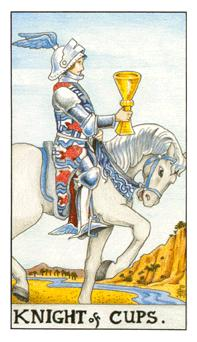

# 剧情物品

## 第一幕 圣墓被毁

### 炙热之心骑士团墓志铭

所在地点：[炙热之心骑士团暴风城墓地](https://fari.gitbook.io/zhirezhixin/setting/zhi-re-zhi-xin-qi-shi-tuan-di-dian#zhi-re-zhi-xin-qi-shi-tuan-bao-feng-cheng-mu-di)

**骑士们在此安眠**

你从左到右分别能看到五个圣骑士的墓碑。他们是帕拉斯·圣剑、拥光者克拉拉、斯蒂凡、巴鲁沙、塞拉夫·夜愿。你好奇他们是谁，有过怎样的故事。

**墓志铭**

帕拉斯·圣剑

圣剑之名，象征高贵。

拥光者克拉拉

炙热之心骑士团最后的盾牌。

斯蒂凡

去战斗吧，圣光与你们同在。

巴鲁沙

随和好脾气。

塞拉夫·夜愿

补救这个残破的世界。

### 撕烂的卷轴

所在地点：[炙热之心骑士团之墓](https://fari.gitbook.io/zhirezhixin/setting/zhi-re-zhi-xin-qi-shi-tuan-di-dian#zhi-re-zhi-xin-qi-shi-tuan-zhi-mu)

圣杯守护者的职责

保护圣杯，否则死亡诅咒你们！

保护圣杯，否则圣水会变毒药！

保护圣杯，否则……

### 吓人的信

许多骑士收到了一封吓人的信

xxx，

“这个圣杯是为谁准备的呢？”

一行血色的字映入眼帘。你好奇地打开了这封信：

你是炙热之心骑士团的人，那么你听好了。你们失败了，彻底地失败。你们见死不救，坐以待毙。还有法瑞，你们根本不认识她，不认识真正的她。她为何在多年后重新出现？恐怕连她都不知道，她到底是谁……

不负责任的骑士团，我诅咒你们，我诅咒你们所有人！

（下面的字迹太过潦草，甚至疯狂）

邮递员凯尔文（Kelvin）

### 一封还来不及烧掉的信

所在地点：[炙热之心骑士团暴风城驻地](https://fari.gitbook.io/zhirezhixin/setting/zhi-re-zhi-xin-qi-shi-tuan-di-dian#zhi-re-zhi-xin-qi-shi-tuan-bao-feng-cheng-zhu-di)

长官，

一切都准备好了，他们相信了我。他们太急着征兵，以至于松懈于审查。炙热之心骑士团正如你所说的，古老而且腐朽。斯蒂凡已经不在，取而代之的是单纯的法瑞。她很快将在我们的控制之下，我会照你说的做。炙热之心骑士团必须为他们的袖手旁观付出代价……

（下面的署名被抹掉了）

### 一张圣杯骑士卡牌

所在地点：[炙热之心骑士团暴风城驻地](https://fari.gitbook.io/zhirezhixin/setting/zhi-re-zhi-xin-qi-shi-tuan-di-dian#zhi-re-zhi-xin-qi-shi-tuan-bao-feng-cheng-zhu-di)

这是一张暗月马戏团的塔罗牌。

不同于权杖骑士或宝剑骑士的迅捷骑马姿态，圣杯骑士的白马很有绅士风度，优雅地行进，跟主人一样。圣杯骑士平举着圣杯，他的眼光有些梦幻，深深注视着圣杯。

他的衣服上有红鱼图案，鱼象征想象力、创意和精神，红色则指出骑士的热忱。他的头盔和鞋子上都有翅膀图案，象征想象力。这一人一马就这样朝着河流前进。

（卡牌背面写着地址，暴风城教堂区南部小花园）

## 第二幕 圣杯传说

### 一瓶宁神花药剂

所在地点：暴风城大教堂伤员休息处

它或许能延续圣骑士的生命！

宁神花的香气很淡，它也是国王所用的药草。传说中能治愈大部分疾病，但它无法逆转诅咒。你必须为法瑞找到真正的解药。这种解药只有血色十字军有，或者找到圣杯，制造出圣水。圣杯无论是否被诅咒，都有强大的圣光之力。

### 圣杯传说

所在地：暴风城教堂区南面的小花园

内容见：[圣杯](https://fari.gitbook.io/zhirezhixin/setting/zhi-re-zhi-xin-qi-shi-tuan-de-sheng-wu#sheng-bei)

### 骑士评议会召集令


xxx，


鉴于近来发生的守墓人安纳特·兰顿死亡，骑士团真正的墓地中圣杯被盗，还有骑士团的征兵事务，现决定于5月23日，星期日举行骑士评议会。这次骑士评议会由团长主持，鉴于三位天威骑士和天威主教缺席。我们将讨论近来发生的事宜，请各位骑士准时出席。

大团长，

法瑞

