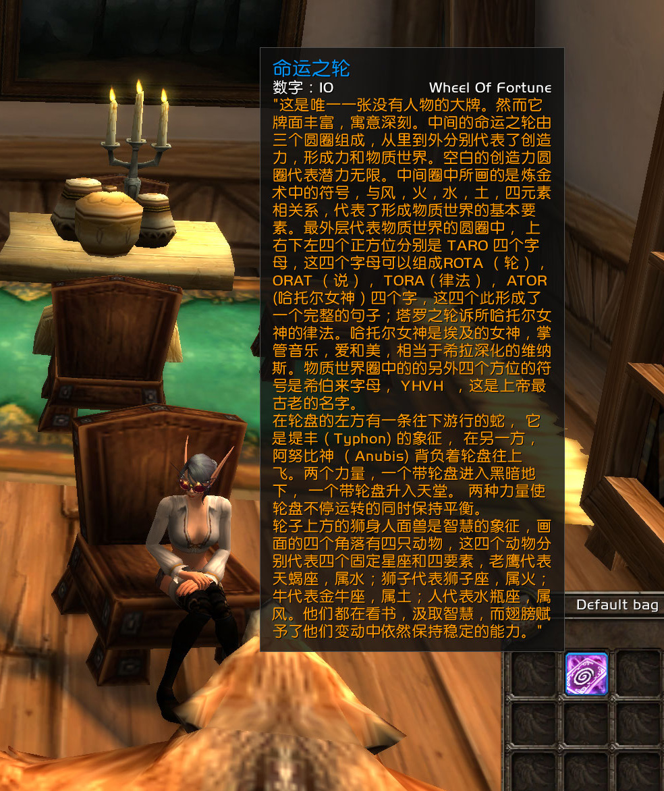
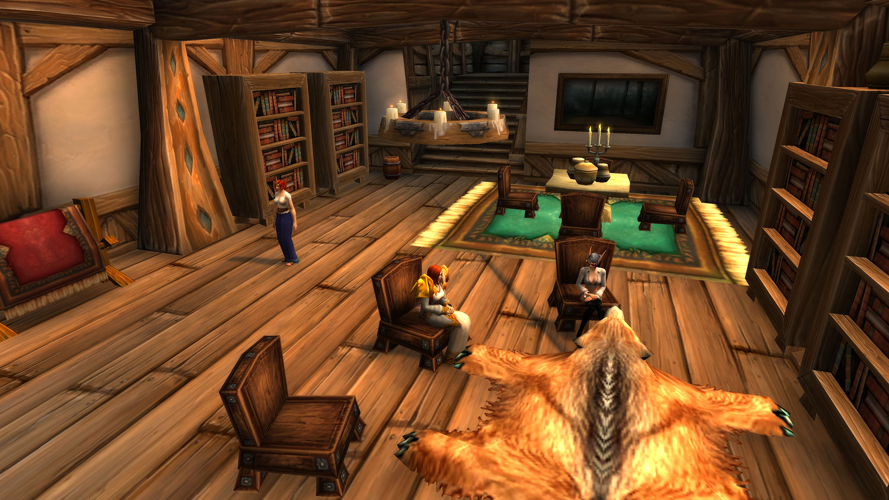

# 序 命运之轮

法瑞对骑士团的未来感到迷茫，请科勒斯协会的希瑞儿·星月作了占卜。

记录开始于 05/13/2021 的 19:09:23。

希瑞儿向你鞠躬。

\[希瑞儿]: 请问是您的预约吗？

\[法瑞雅]: 你好，占卜师。是的，我预约了查看命运。

希瑞儿对你点了点头。

希瑞儿 拿出一副塔罗牌

\[希瑞儿]: 现在闭上眼，摒除杂念

\[法瑞雅]: 我近来感到内心中一阵沉重。

希瑞儿点了点头。

\[希瑞儿]: 默念着你的诉求

法瑞雅 闭上眼睛，在心中默念自己想知道的命运。

\[希瑞儿]: 来\~看看是什么牌吧

法瑞雅 翻开牌面，倒吸了一口气。

\[法瑞雅]: 命运之轮，正位。

希瑞儿对你点了点头。

\[希瑞儿]: 这张牌预示着你要问的事情有不可预测性，命运之轮是一直在转动的

\[希瑞儿]: 而且福祸相生

\[希瑞儿]: 正位，意味着转向了好的方面

\[法瑞雅]: 我一直对骑士团的命运感到不安。

\[法瑞雅]: 那么说最终一切都会好起来？

\[希瑞儿]: 别担心，这种不安会过去的

\[希瑞儿]: 即便是之前的福祸变换，也都会消散

\[法瑞雅]: 我们会不会经历一系列的挫折，然后才找到命运之路呢？

\[法瑞雅]: 所以既有好的也有坏的？

\[希瑞儿]: 事实上你正在经历挫折

\[希瑞儿]: 你经历了命运的转变

\[希瑞儿]: 而不久的将来，会有好的转变

\[法瑞雅]: 我希望如此。

\[希瑞儿]: 否极泰来

\[希瑞儿]: 这是一个命运的轮回

\[希瑞儿]: 你的命运会经历这些的

\[希瑞儿]: 耐心等上一阵子吧

\[希瑞儿]: 以上

\[希瑞儿]: 占卜完了

\[法瑞雅]: 谢谢你，占卜师。

\[希瑞儿]: 那么，我走啦

\[希瑞儿]: 下次再来找我哈

\[法瑞雅]: 好的。

希瑞儿向你挥手告别。再见！
