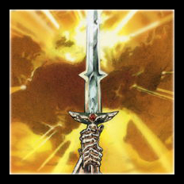

# 炙热之心骑士团的圣物

## 真理圣契

这本已经失传的古代书籍里有一种强大的神术，这种神术据称可以让一个人在一段时间内被圣光保护，不会死亡。有的人认为这本书非常邪恶，里面是最邪恶的巫术，应该被摧毁，因为它会带来死亡。真理圣契上记录其实是一个失传已久的神术，这个神术的名字叫神圣干涉。

神圣干涉在使用的时候，会杀掉读这个神术的圣骑士，但是会保护另一个人一段时间，让另一个人活下来。这个法术不能对自己使用。

这是否是一个圣骑士应该学习的神术？培养一个圣骑士至少需要十二年的时间，圣骑士的性命并非可以随意抛弃。但神圣干涉既是，又象征着一个圣骑士最大的牺牲——他会牺牲自己的生命，去保护他人。

炙热之心骑士团曾经保护着真理圣契，既不让外人知道它的秘密，也守护着神术本身。骑士团认为神圣干涉是圣骑士不可忘却的神术。“我个人认为所有骑士，即使是年轻的骑士，也应该懂得神圣干涉。因为他们应该有权选择自己的死亡。”——大团长法瑞曾说。所以他们反对教会试图毁灭真理圣契的做法。为了防止真理圣契落入他人之手，炙热之心骑士团隐藏了这本圣契的下落。

如今无人知道真理圣契的在哪，就连骑士团里的史官也无从下手，大团长更是不知。神圣干涉神术或许只有从那些年龄最老的骑士们口中得知。

## 命运之剑

> 不可捉摸的命运，会在某个注定的时刻觉醒
>
> 未知的神秘力量，一瞬间主宰历史和未来
>
> 命运之锋摧枯拉朽，扫荡一切；在命运面前，有谁可以抗拒呢？
>
> 三十年前卡利姆多的战场上，联盟的铁骑即将扫荡最后一个兽族的村庄……
>
> “幽魂之狼会吞噬你们的灵魂，卡利姆多的红土会埋葬你们的白骨……”老萨满绝望的诅咒和他的生命一起消散在空气里。一个伤痕累累的兽人战士低沉地怒吼，高举起手中的双手巨剑，用最后的力气斩向联盟的首领，“卡利姆多，我的故土，如果毁灭是我们的命运，我也会保卫你直到生命的最后一刻！”
>
> 为首的圣骑士笑了，再锋利的剑锋，也穿不透圣骑士强大的防御体系，这些顽固的蛮族，还不肯接受他们行将灭亡的命运吗？
>
> 可是谁又能预知谁的命运呢？
>
> 这一剑斩出的时候，兽人战士感到一种奇迹般的力量灌注到全身，命运好像在他的指尖跳动，圣骑士眼中的嘲讽，瞬间转为绝望的惊恐—-
>
> 七把拦阻的兵刃，斩破！
>
> 圣佑的防御光环，斩破！
>
> 坚韧的龙鳞护盾，斩破！
>
> 百炼的精钢板甲，斩破！
>
> 联盟的首领倒在冰冷的红土上，狂暴的命运之锋席卷过整个战场，一切都归于沉寂……
>
> 硝烟散尽，白骨成土。卡利姆多血色的残阳下，一个新的部落重新崛起……
>
> 命运之剑，是一把主宰之剑。
>
> 谁能主宰命运，谁就能主宰整个世界……

命运之剑之于炙热之心骑士团，就如灰烬使者之于血色十字军。这把巨剑的形状略微怪异，剑身上有两个凸起，没人会忘记它。命运之剑是圣剑骑士的佩剑，象征着圣骑士们掌握自身的命运。

这把剑曾经被一个兽人所握，在联盟军队正要踏平一个兽人村落的时候，一位兽人战士举着命运之剑，杀死了一位并不相信命运的圣骑士。这把剑因此得名，因为它就是圣骑士杀手。正如灰烬使者是亡灵杀手。

炙热之心骑士团的圣剑骑士持有这把剑，象征着他对圣骑士们的约束。对于那些违反军规的圣骑士，除了驱逐出团以外，最严厉的惩罚莫过于死于命运之剑下。炙热之心骑士团对于逃兵就是如此责罚的。

但是相传命运之剑被诅咒了，持有它的人必将死于剑下。因此也只有最勇敢，最无所畏惧的圣骑士能成为执剑的圣剑骑士。

在黑色星期五时间中，教会曾想从炙热之心骑士团手中夺过这把剑但失败了，命运之剑现由大团长所持，在新一任圣剑骑士出现之前。她就是执剑人，她手握着自己的命运。

## 圣杯

这是阿隆索斯·法奥用来给圣骑士们祝圣的杯子，打造于白银之手骑士团建立之时。它原本只是一个普通的仪式用杯，或许被圣化了，但并非重要的神器。圣杯象征着圣骑士理想浪漫的一面，象征纯洁和正义的心。

相传圣杯盛过乌瑟尔死后留下的鲜血。当然只有亡灵会渴望喝下他的鲜血，但因为装了鲜血，圣杯成为了一个圣物。由白银之手骑士团失落的骑士们所保存着。他们相信乌瑟尔的鲜血没有白流，骑士团的荣耀永存。

后来洛丹伦连翻失守，圣杯就落到了血色十字军手中。其中一位血色十字军圣骑士维德尔·帕西戈特（Verdell Prescott）以生命诅咒了它。他曾是一个圣骑士，但不幸感染了瘟疫，成为了一个亡灵。圣光不再带来救赎，而是灼烧他的皮肤和心灵。

得知自己感染瘟疫的帕西戈特在彻底变异之前，从血色修道院的大教堂里取走了圣杯，装上了索多里尔河的水，原本被天灾污染的河水，瞬间变得清澈。帕西戈特喝下圣杯中的水，寻求圣光的宽恕，却被其中的剧毒毒死。

至于圣杯的剧毒，相传是一种能将人变成亡灵的毒。

从此圣杯成了一件检验人心的圣物。心怀正义者可以使接触到的液体变成圣水，反之则是毒液。血色十字军会在仪式中强迫人喝下圣杯中的水，如果此人不立即死去，那么他的灵魂是清白的。反之他可能已经被邪恶所感染。

后来圣杯传入炙热之心骑士团的骑士手中，在骑士团消失之后，就一直存放在索多里尔河附近的墓穴之中。相传炙热之心骑士团是被选中来保护这件圣物的，如果保护圣物失败，整个骑士团都会被诅咒，骑士们会一个接一个死于非命。除非有骑士能勇敢地喝下圣杯中的水。

### 圣杯仪式

骑士跪下，双手捧住圣杯，说以下祝圣词：

“圣光之中圣杯，

将生命之圣水倾泻而下，

滋养我们的灵魂，

不灭灵魂之火焰。

圣光之中圣杯，

与我们一共同在，

灭绝邪恶的侵扰，

与我们日夜同在。

圣光之中圣杯，

盛过那圣骑士乌瑟尔之血，

宽恕我们的罪行，

在圣光的照耀之下。”

然后当着所有骑士的面前，喝下圣杯中的水。如果水中没有毒，那么这个骑士就有正义的灵魂。

