# 炙热之心骑士团地点

## 炙热之心骑士团暴风城驻地

这栋双层建筑位于暴风城教堂区外延，并不起眼。这是由教会赠与的骑士团建筑，供骑士团日常在暴风城活动、聚集。在暴风城的炙热之心骑士团的驻地之中，有四把椅子。其中最右手边的一把，一直空着。这是一个专门为寻得圣杯的骑士而留的位置。没有人能够坐上，因为不合格的骑士坐上去后，将会有杀身之祸。哪一位骑士愿意坐上这个位置呢？

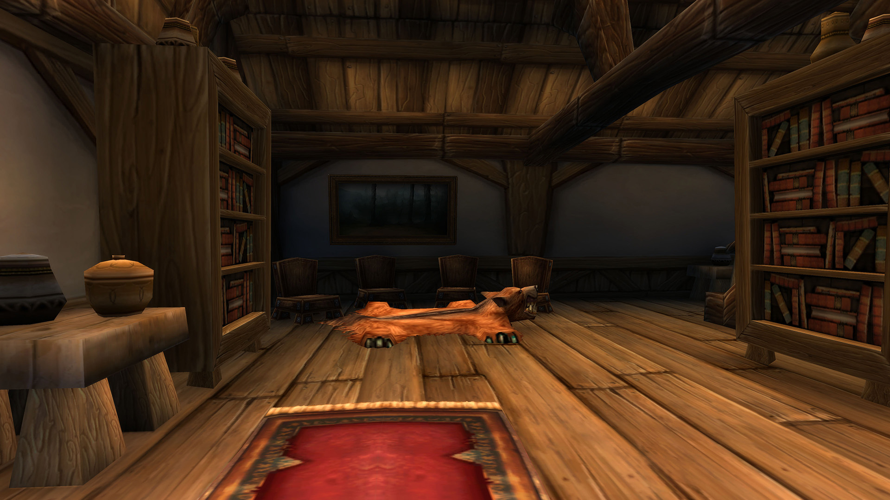

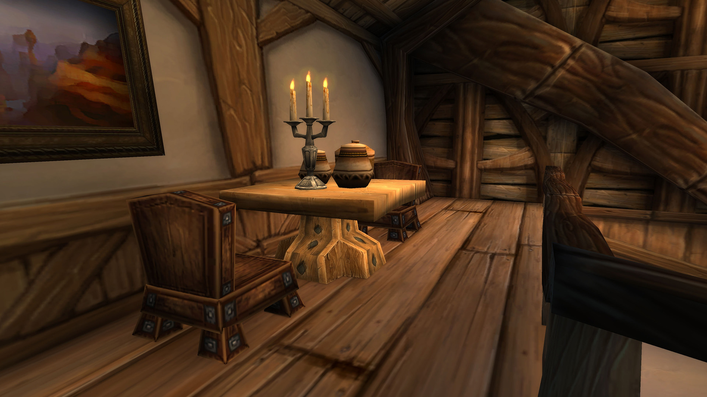

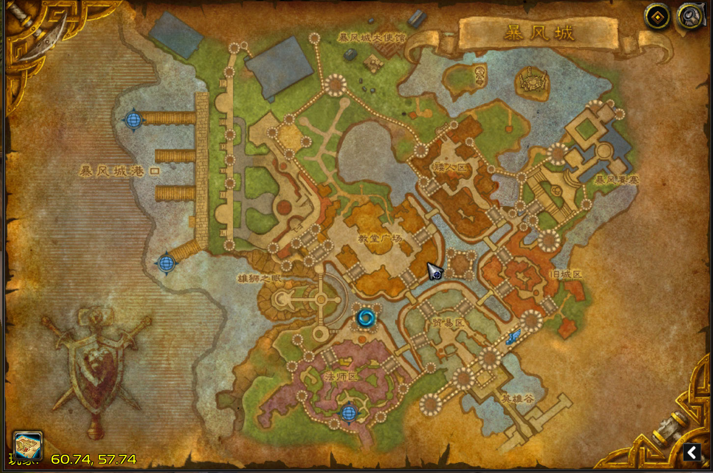

## 炙热之心骑士团暴风城墓地

这一小片墓地位于暴风城墓地的最外延。总共有五个墓碑。他们分别是帕拉斯·圣剑、拥光者克拉拉、斯蒂凡、巴鲁沙、塞拉夫·夜愿的墓地。但这并非骑士团真正的墓地，只是象征性的墓碑，供骑士们吊唁，怀念过往。

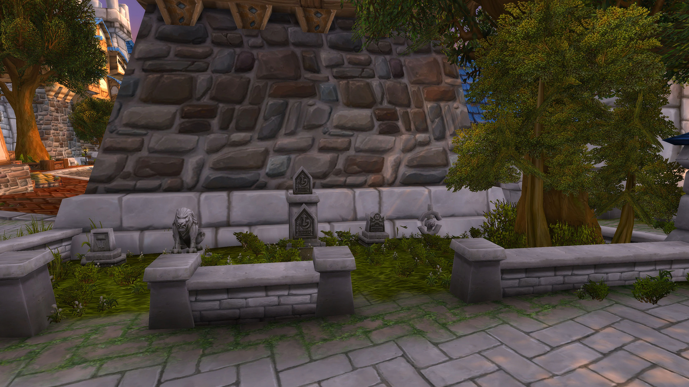

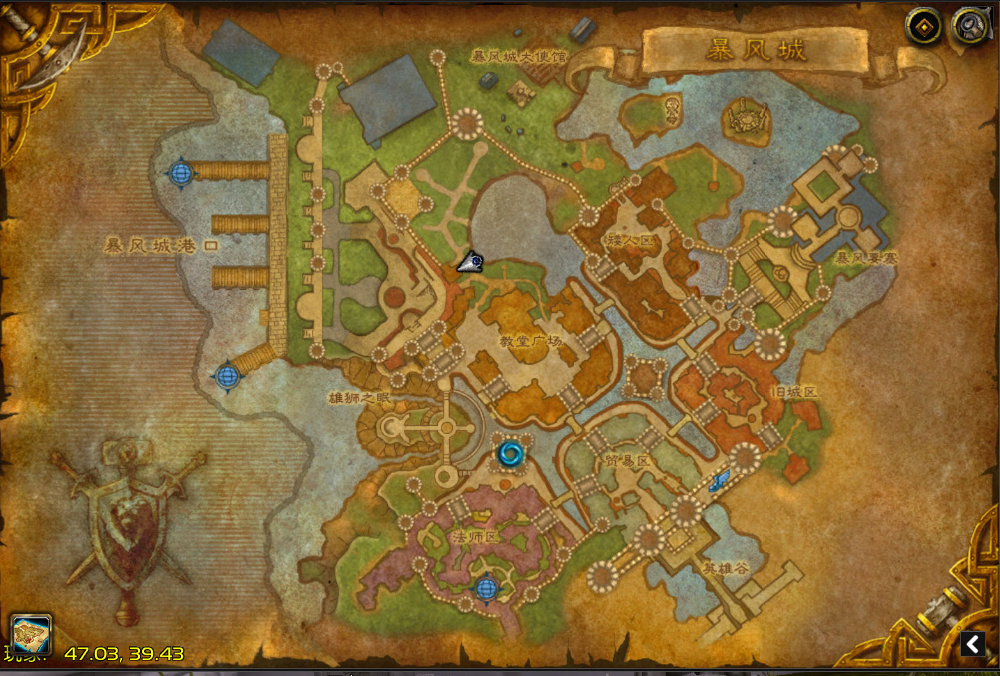

## 暴风之盾城堡

又称骑士堡。是炙热之心骑士团的城堡，骑士评议会在堡内召开。虽然暴风之盾远在德拉诺，但常年有法师维持抵达暴风城的传送门。这座城堡宏伟坚固、设施齐全，是许多骑士休憩时的住处。也是炙热之心骑士团目前的总部。

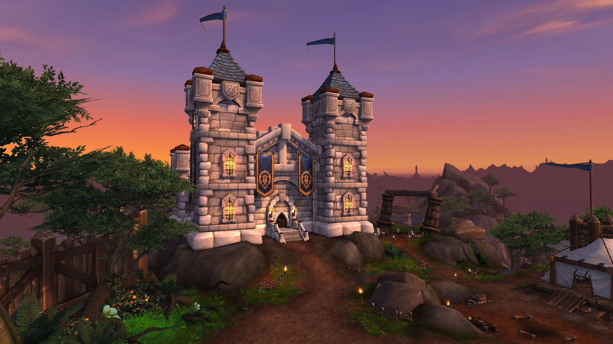

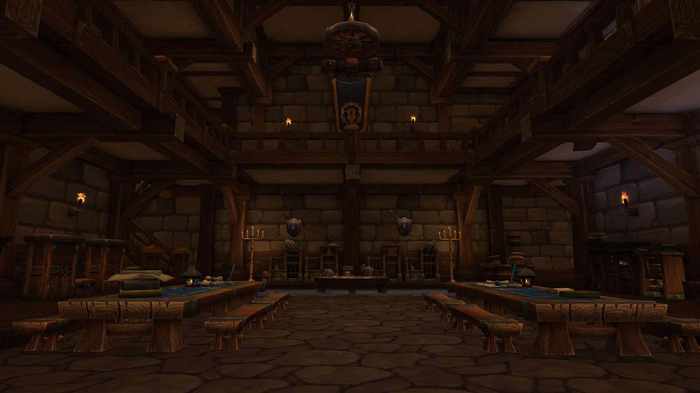

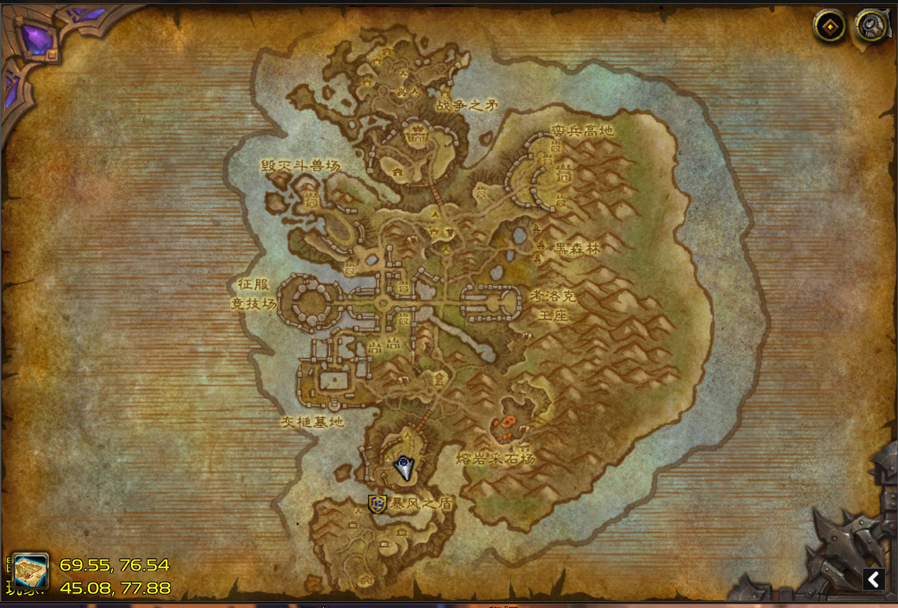

## 炙热之心骑士团之墓

这是炙热之心骑士团真正的墓地。是索多里尔河附近的一个墓穴。许多骑士的遗体被真正地埋葬在这。传说中埋葬在这的还有骑士团的圣物——圣杯。守门人伊斯塔曾经常年守护着骑士团的墓地，但近来，连他也失踪了。

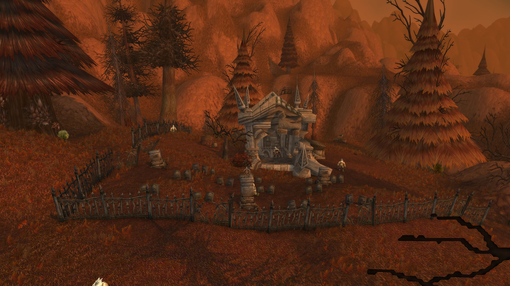

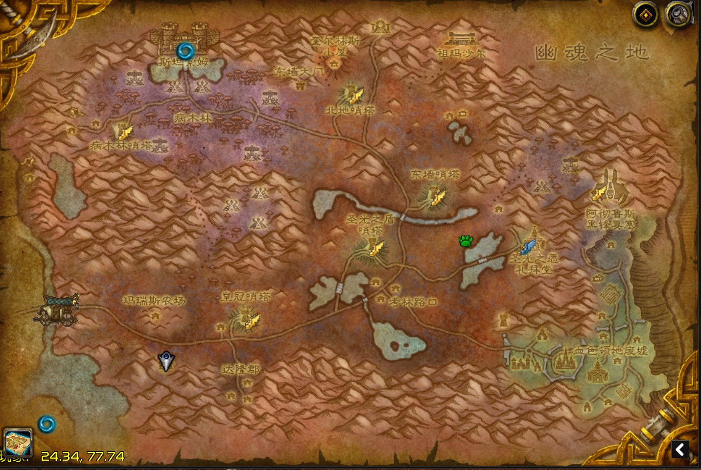

## 芦苇农场

这间小屋位于悲伤沼泽的东南端。相传炙热之心骑士团的老学者诺亚·格拉汉（Noa Graham）就隐居在此。她选择了一个悲伤的地方去度过余生。她虽然没有将暴风城的图书馆带来，但是她的学识一如既往。关于骑士团的秘密，她也守口如瓶。

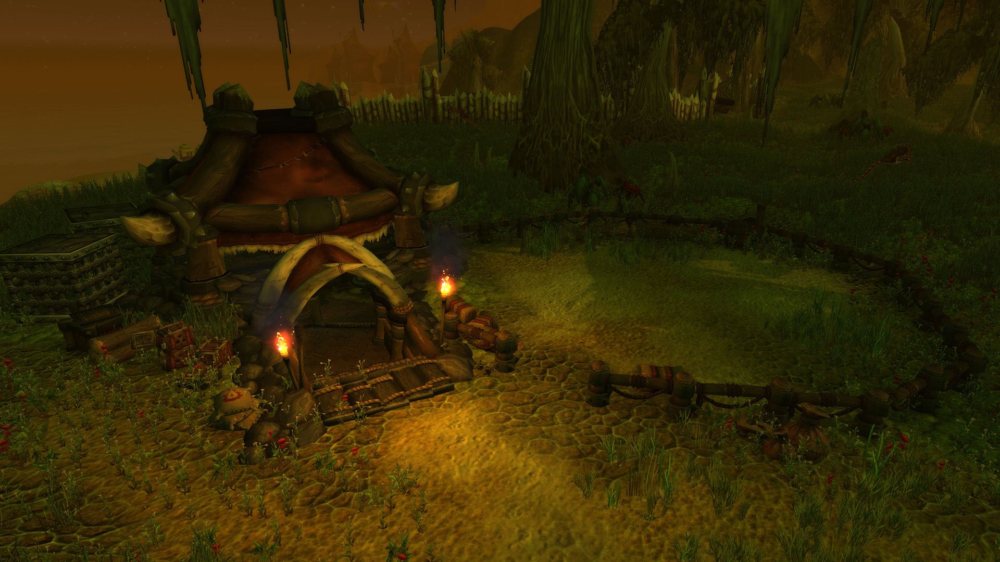

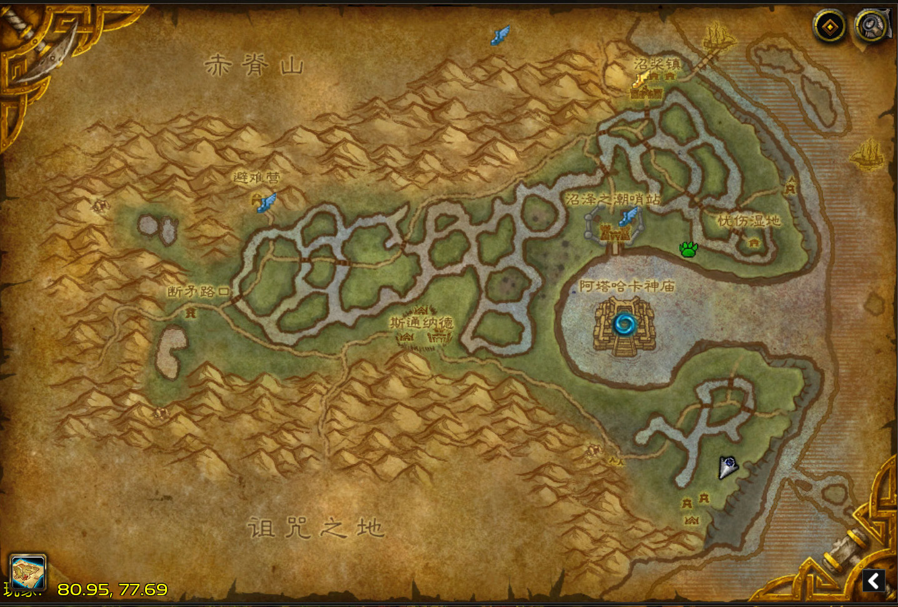

## 达伦德农场


达伦德农场里居住着渔夫之主，相传他是真正的圣杯守护者。他居住在洛丹米尔湖畔的一座由血色十字军控制的农场里。他的农场被诅咒了，一直种不出果实来。渔夫之主一直受腹股沟处的伤痛折磨，是因为他守护着圣杯的秘密。

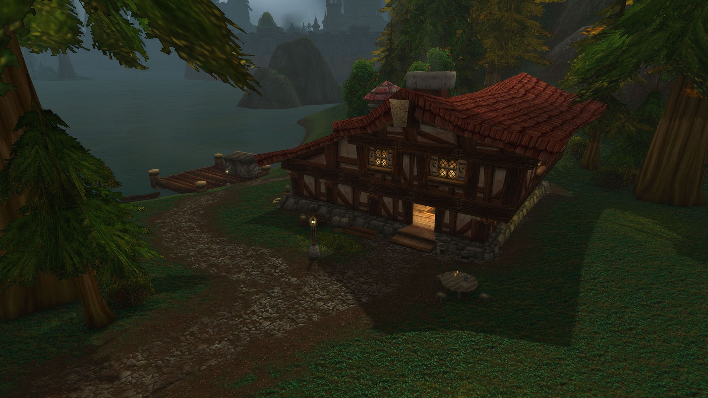

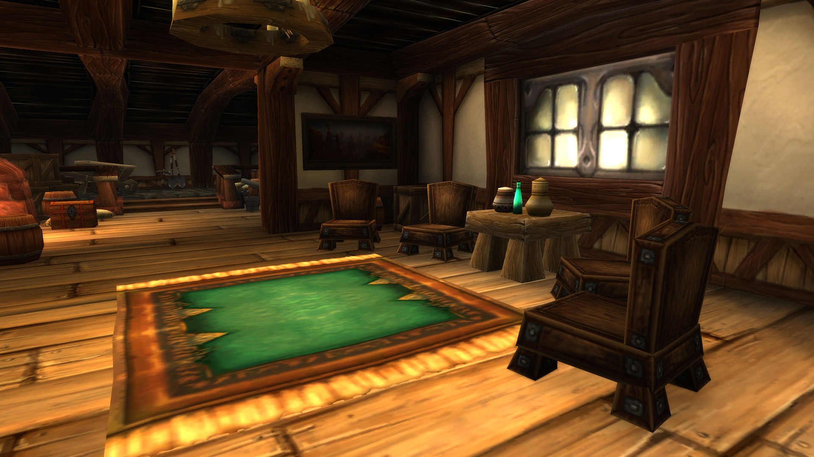

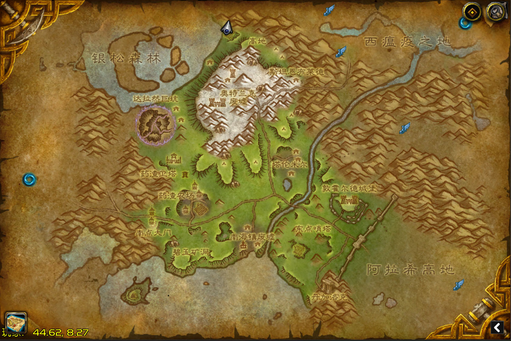

