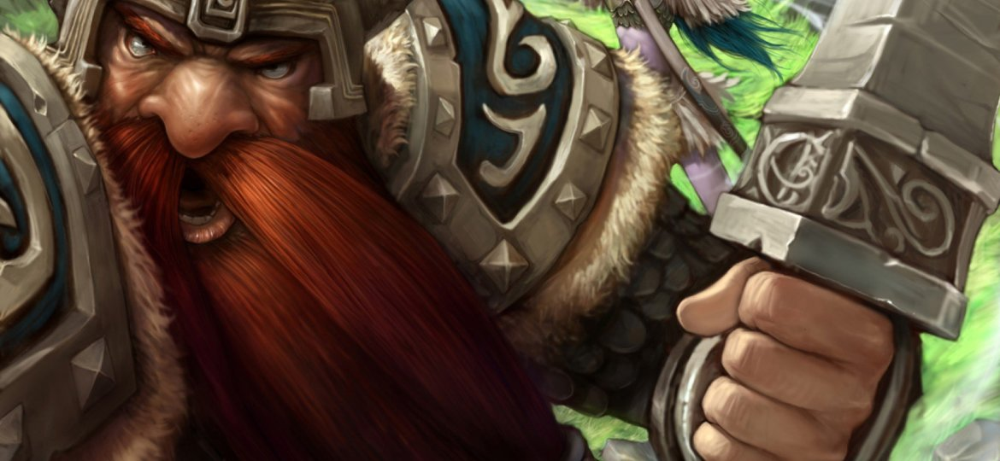

# 矮人圣骑士红胡子菲特烈终于苏醒了

这份记录来自前炙热之心骑士团的红胡子菲特烈。2012年3月。

炙热之心骑士团的“红胡子菲特烈”在沉睡了近一年之后终于有苏醒的迹象了，但是现在的骑士团已经成了一个空壳子。根据调查，本周只有团长“怀恩弗丁”和人类法师“阿姆逊贾德尔”出现，并为骑士团做出过贡献。老矮人对此非常失望，经过一番天人交战之后，决定离开曾经给予他荣耀和辉煌的骑士团。

现在摆在老矮人面前的路由三条：

1、加入守护者联盟，优点：从此不会在出现同伴如鸟兽散的情况。缺点，老矮人的学生“巨锤汉克”就在这个组织，而且已经是守护者，老矮人加入后很可能做这小鬼的部下，或者和这小鬼平起平坐，这人丢不起啊。否决

2、加入提尔之光十字军，优点：又有一群狂热的同伴。缺点：也许在某一天又会发生独守空营的状况。结论：如果机缘巧合的话，可以加入。

3、回归多年前建立的私人武装——哥萨克，事实上这是一个类似新手学校的组织，巨锤汉克曾经也是其中一员，现任首领是喜欢钻牛角尖的、学究气十足的侏儒术士，克拉兹·齿轮，外号束缚之影，简称束缚，这个组织有堪比守护者联盟的艾泽拉斯稀有物资供应，但是老矮人明显已经不需要这些东西了。结论：如果不能顺利的加入提尔之光十字军的话，可以考虑当这个自由人组织的首领，虽然这个组织同时出现的成员数量“绝对不可能”超过两个人。

