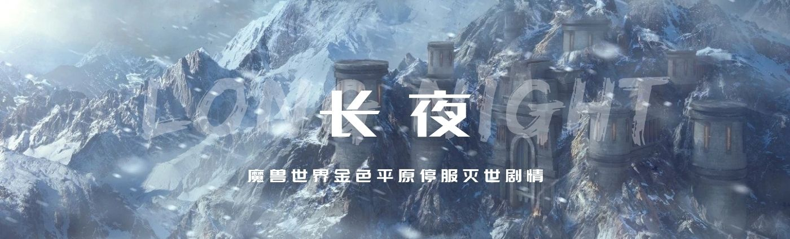
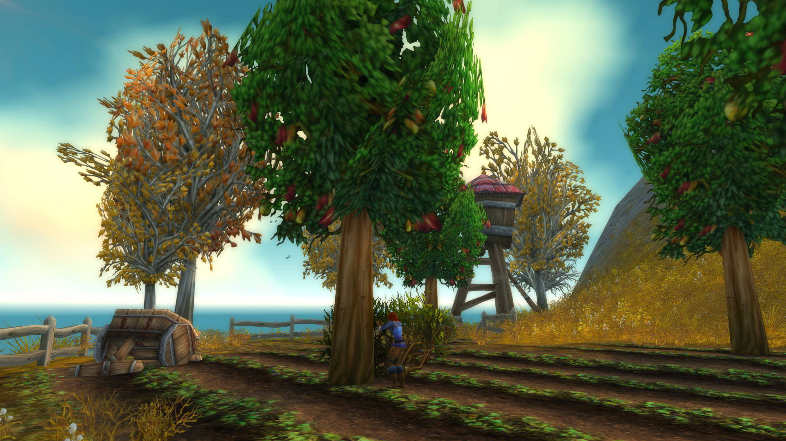
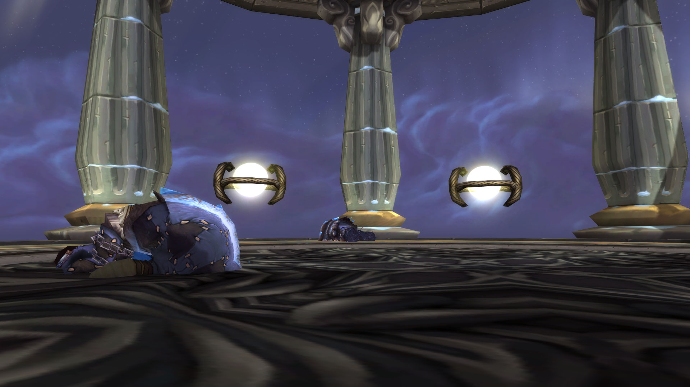
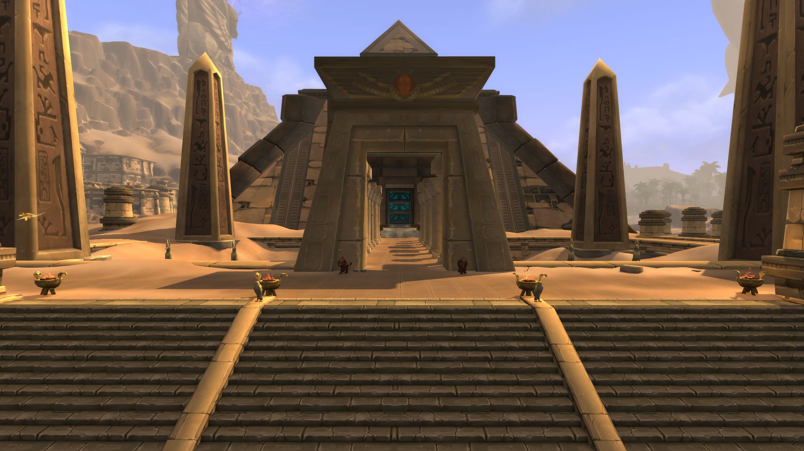
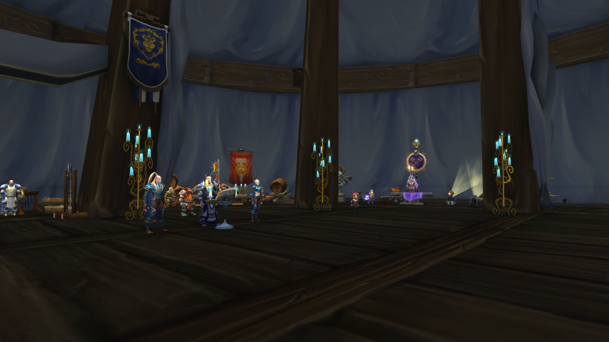
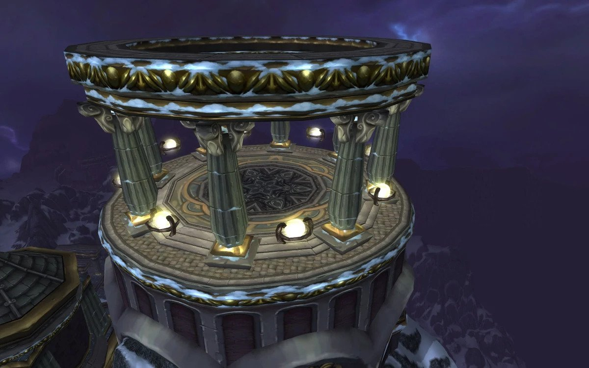

# 长夜

<figure><figcaption></figcaption></figure>

“最后一个月的时间，如果你们没能成功，就是血肉文明的末日。” ——拉夏，太阳的造物

守护者霍迪尔的死亡，开启了霍迪尔之冬。原本在盛夏的艾泽拉斯众国度，下起了暴风雪，四面八方，暴雪呼啸，冰霜刺骨，寒风如刀。日光消逝，天色灰暗……再也没有了阳光，大地没有了暖意。

终末的白霜席卷尘世，永恒的冬天，忘却了记忆。这是一个世界的末时。

英雄们，你们将阻止凛冬，还是灭亡于永寒？这是一次剧情活动，你，或许会改变所有人的命运。

## 1、霍迪尔之冬

<figure><figcaption>
达芙妮的苹果园
</figcaption></figure>

西部荒野海岸悬崖上，达芙妮·斯迪威尔邀请了曾经在她面前展示过勇气，独自一人面对5个迪菲亚盗贼的圣骑士，和圣骑士的朋友们一起到她的苹果园，品尝深秋成熟了的苹果。这是一次好友间的叙旧聚会，多年未见的英雄，忙于战争的勇士，都接受了达芙妮的邀请。他们经历过太多远征，但他们不知道，如今再次需要当年的勇气了。

西部荒野地处南方，并非苦寒之地，到了深秋，也不过是有些许凉风。在长滩上，在海水边，英雄们升起篝火彻夜长谈。篝火的光暖和了饱经风霜的双手和内心，噼啪作响的柴火，吟游诗人的鲁特琴。一切歌声依旧，往事若即若离。这个苹果园，曾是英雄们最久远的回忆之一，那时的世界，连苹果都未曾落下。

英雄们说起当前的冒险，巨龙群岛重新出现，再一次的远征。然而这一次远征巨龙群岛并未成功。始祖龙王莱萨杰丝没有被打败，放出了四元素始祖龙王，击溃了所有守护巨龙，包括红龙女王阿莱克丝塔萨。莱萨杰丝说过，她就是要恢复迦拉克隆时代的荣光。是的，她要成为像迦拉克隆一样强大的始祖龙。

英雄们继续说着他们听过的传说，在万神殿离开艾泽拉斯后的漫长岁月中，无数生命形态在这个世界的地表上繁荣生长。其中最为野蛮和狡猾的是居住在卡利姆多冰寒的北部地带的始祖龙。不同种类的始祖龙有着各式各样的力量与能力：其中一些拥有令人难以置信的巨大的身体和双翼，他们的灵魂与这个世界本身紧密相连；另一些获得了弥漫在世界上的潜在元素能量的影响。

迦拉克隆曾是艾泽拉斯最大的一条始祖龙。在吞食了无数同类的尸体后，迦拉克隆的体型变得庞大。最强大的守护者——提尔首先注意到了迦拉克隆给这个世界带来的危险。

提尔在五条最大也是最有智慧的始祖龙——阿莱克丝塔萨、奈萨里奥、玛里苟斯、伊瑟拉和诺兹多姆身上找到了答案。他们种类各异，各自拥有独一无二的力量。就连阿莱克丝塔萨和伊瑟拉这对姐妹也驾驭着截然不同的能力。坚韧善良的阿莱克丝塔萨能够喷吐烈焰；强大的奈萨里奥力量惊人，他那震耳欲聋的咆哮声能将骨头和岩石震得粉碎；狡猾的玛里苟斯能够吐出冰霜气息，将敌人冻结在寒冰里；睿智的诺兹多姆会卷起漫天飞沙来将敌人致盲；神秘的伊瑟拉能用气息使敌人衰弱，汲取他们的意志，令其进入深度恍惚状态。

提尔恳求这五条始祖龙与他一同对抗迦拉克隆。这些生物起初对这个接近自己的陌生来客不甚信任，但他们很快就决定与他并肩作战。尽管特性迥异，五条龙却出人意料地团结一心，共同抗敌。最终，迦拉克隆的尸体倒地不起，砸在一片冰寒冻原上，那里就是后来的龙骨荒野。

如今莱萨杰丝通过放出了四元素始祖龙王，击溃了英雄们和所有守护巨龙。没有人知道她会对整个艾泽拉斯做出什么。没有人知道，她的下一步计划。所以即使今天的气氛是温和叙旧的，英雄们其实心中也有凝重的担忧。

一个吟游诗人，说起了一个古怪的故事。其中五个泰坦守护者，都有他们的梦境。在首席管理者奥丁的梦境中，瓦格里不再受到诅咒，英魂为他而战。在风暴之王托里姆的梦境中，妻子西芙并未死去，兄弟洛肯没有背叛。在生命之王芙蕾雅的梦境中，她战胜了上古之神，走出郁郁葱葱的温室，为世界带去生命。在创造之王米米尔隆的梦境中，他为这个世界献出生命。

但是寒冰之王霍迪尔的梦境，更为古怪。漫长寒冷的严冬，会终结世上的血肉生命，再没有夏天，没有阳光。冰雪从四面八方吹来，有数不清的战乱，兄弟之间互相杀戮，所有的日子都是寒冷而黑暗。一旦霍迪尔的守护者之心停止跳动，长夜降临。

艾泽拉斯有两种可能的毁灭方式，火或冰，起源熔炉或者霍迪尔之冬。起源熔炉的程序在未被修改前，如果启动，会让整个艾泽拉斯的生态圈毁灭。起源熔炉同时也有关押克苏恩的用途。此为在烈火中终结。霍迪尔之冬，则是终末的白霜，一头狼吞噬太阳，月亮产生月蚀，光明陨落，漫长的冬天。

英雄们，如果你们能选择，你们会选择烈火还是寒冰？

吟游诗人说，我要你们记得，如果火焰末日或者长夜冰封到来，你们两者都不会选择。火焰天启虽然恐怖，却是急速死亡。长夜冰封看似温和，实际上是更加绝望的慢性自杀。所以你们将守护这个世界，免遭长夜。

还没等吟游诗人说完，天空中的云层变后，开始下起雪来。雪，西部荒野从来没见过雪。这不可能，虽然这已是深秋。风雪落下，熄灭了篝火。大量苹果被冻得从树上落下，这是那智慧果，砸中树底的人们。

“快进屋里！”圣骑士喊道，英雄们都躲进了达芙妮的家中，才没有在暴风雪中冻得发抖。

英雄们缩在达芙妮的家中讨论对策，寒风呼啸，他们不得不在壁炉边取暖。连火光都摇曳，几乎要熄灭了。火光里带着世界的最后一丝暖意。没有人知道，他们要面对的，是怎样的一场危机。

他们听说始祖龙王莱萨杰丝在战斗结束后，似乎飞向了风暴峭壁。这是他们唯一的线索，英雄们决定前往风暴峭壁调查。

## 2、奥杜尔调查

<figure><figcaption>
寒冬神殿
</figcaption></figure>

他们没有莱萨杰丝飞得快，有的事恐怕已经无法挽回。英雄们在风暴峭壁的冰霜堡集结，准备前往风暴峭壁的寒冬神殿调查。因为有的英雄认为，霍迪尔守护着冬天，而这次气候失衡，很可能和这位守护者有关。

飞往寒冬神殿的路途，只让原本寒冷的冬天更甚了。风暴峭壁常年冰封，但英雄们听说，就连炎热如荆棘谷，都下起了暴风雪。荆棘谷的地精们抱怨生意难做，但难做的不仅有生意，事实上，这次寒冬已经在杀死那些无法御寒的人们。尤其是身处南方，从未见过雪的。

但冰雪无法冷冻的，是英雄们的内心，他们坚信，一如往日的冒险——他们中有的人经历过安其拉之门，即使是世界性的危机，在各个种族的团结一心之下，必定可以化解。这不是末日，而他们会凯旋归来。

经历了一路上的风雪，他们抵达了极寒的寒冬神殿，却只在神殿的地上看见了一具具霍迪尔的仆从的尸体。霍迪尔本人不知所踪，恐怕是被莱萨杰丝杀死后，抛弃在茫茫雪原之中了。他们来晚了。

其中一个霍迪尔的仆从，还有一息尚存，他在生命的最后一刻，为英雄们讲述了神殿中到底发生了什么。莱萨杰丝来到风暴峭壁，她释放了风暴，一时间电闪雷鸣。奥杜尔的守护者们与之鏖战，却败下阵来，四个守护者被一一杀死，他们是生命之王芙蕾雅，创造之王米米尔隆，风暴之王托里姆，冬日之王霍迪尔。第五个守护者首席管理者奥丁，虽在英灵殿，最终也被莱萨杰丝杀死。

五个守护者，无一幸免。

看着风暴从天际降下，霍迪尔死前愤怒地说道：“就让寒冬净化这一切，既然没有生命值得拯救。欧米茄，启动！”

他的声音刚落下，远古引擎开始运作，世界各地开始飘雪，进入冰封。最后的纪元就此降临，终末的白霜落下，没有生命得以逃脱，冰封中直到永恒，连时间也会在风雪中静止。没有希望了，凡人们。

霍迪尔的仆从说完，也咽下了最后一口气，彻底死去。整个寒冬神殿里只弥漫着死亡。更多的雪落下，英雄们的内心又寒冷了一分。这是世界的寒意，这是终焉的钟声。没有人能够逃脱。

此时侏儒通讯器中传来一条急讯：“我是布莱恩·铜须，艾泽拉斯最伟大的探险家。关于霍迪尔之冬，我召唤英雄们到铁炉堡进行会议。紧急，紧急！”

其中一个英雄记得，布莱恩曾经率领一支部队深入奥杜尔，想要发掘它的秘密，最后成为探险队中唯一的幸存者。因此对奥杜尔的秘密，还有守护者的一切，布莱恩有……好吧，独特的见解。

英雄们跨过传送门，回到了尚有一丝暖意的铁炉堡，这也是布莱恩选择在此开会的原因——暖和。整个艾泽拉斯已经找不到有这种供暖设备的地方了，因此许多人也到铁炉堡寻求避难。难民们挤在大熔炉边上，伸出手取暖。麦格尼·铜须国王没有来警告英雄们，因为他认为“欧米茄”无法对艾泽拉斯有危害。

但布莱恩·铜须认为，要阻止霍迪尔之冬的继续，他们必须在一切希望消逝之前，再一次扭转乾坤。修复霍迪尔，让他重新回到寒冬神殿，停止“欧米茄”程序。但是在那之前，他们必须首先打败四大元素龙王，不然一切又是徒劳。否则守护者会一直被袭击。

而要修复霍迪尔，其实要修复任何一个奥杜尔守护者，都需要守护者之心——活着的其他守护者的心脏。听到这，英雄们不禁感叹，看来这又是有一场腥风血雨。不可能有守护者自愿献出自己的心脏，不是吗？

“我有一个‘疯狂’的计划，”布莱恩说，“奥丹姆有四个守护者：阿穆纳伊，生命的造物。塞特斯，毁灭的造物。伊希斯特，魔法的造物。拉夏，太阳的造物。我们取出奥丹姆守护者们的心脏，拯救奥杜尔的守护者，然后和守护者们一起击败四元素始祖龙王，然后救霍迪尔，关闭‘欧米茄’代码。我提议这个计划，因为我们别无选择。”

“为什么要先击败四元素始祖龙王，再救霍迪尔？难道不应该马上阻止霍迪尔之冬吗？奥丹姆守护者只有四个，而奥杜尔守护者有五个，”其中一个英雄问道。其他英雄也疑惑，这个计划听起来，太疯狂。

“因为霍迪尔之冬，虽然很可怕，却恰好可以削弱四元素始祖龙王的力量。我的详细计划是这样，”布莱恩继续道，“阿穆纳伊，生命的造物，对应生命之王芙蕾雅，我们用阿穆纳伊的守护者之心复活芙蕾雅。塞特斯，毁灭的造物，是一个死灵，但也代表智慧对应创造之王米米尔隆，我们用塞特斯的守护者之心复活米米尔隆。伊希斯特，魔法的造物，对应风暴之王托里姆，我们用伊希斯特的守护者之心复活托里姆。拉夏，太阳的造物，对应首席管理者奥丁，我们用拉夏的守护者之心复活奥丁。”

“听我说，英雄们，复活这四位守护者是必须的，”布莱恩激动道，“因为米米尔隆是提供神器的，奥丁和托里姆主要是对付四元素始祖龙王的，芙蕾雅是后勤。我们需要守护者们的帮助，还有英雄们的努力，才可能战胜四元素始祖龙王。”

“但是正好还差冬日之王霍迪尔，”其中一个英雄说，“难道不是只有修复霍迪尔，才能关闭‘欧米茄’代码，阻止霍迪尔之冬吗？”

“那就是之后的事了，”布莱恩其实也没着落，显露出他的疯狂不靠谱，“我们会有办法。”

英雄们接着讨论了许久，也没有找出比布莱恩的建议更好的办法，他们决定去往奥丹姆，直面四个守护者。

## 3、守护者之心

<figure><figcaption>
起源大厅
</figcaption></figure>

英雄们去往奥丹姆，原本炙热的沙漠之地也下着雪，黄沙上铺满了纯白，此地的居民都聚集在室内，聚集在篝火边。但是连篝火也行将熄灭，这本不会发生在永夏的国度，但英雄们依旧相信，相信他们能终结寒冬。

布莱恩带着英雄们来到起源大厅，试着和奥丹姆的守护者们理论。根据布莱恩传达回来的信息，拉夏，太阳的造物，说道：“霍迪尔之冬是凡人的事情，而我们的唯一工作，是开启起源熔炉。本应由我们带来末日。”

“什么？”一位英雄震惊道，“开启起源熔炉，那岂不是同样是灭世之举？一个是火，一个是冰。我们已经处于寒冬末日之中，难道还要遭遇烈焰吗？”

“我想此事确实已至此，”布莱恩说，“他们不但认同霍迪尔之冬，甚至想要以另外一种方式毁灭这个世界。难道不是很明显吗，我们现在应该做的事。如果这些守护者已经不打算守护这个世界，我们会守护它。”

“我知道你们在暗示什么，”另一位英雄说道，“但我认为我们不应该贸然攻击奥丹姆的守护者。既然奥杜尔守护者霍迪尔之死，启动了‘欧米茄’代码，启动了霍迪尔之冬。谁知道奥丹姆的守护者如果死亡，那会造成什么后果？”

“现在是选择冰霜还是火焰的境地了，如果我们不阻止奥丹姆的守护者们，起源熔炉将会被开启，”布莱恩严酷地指出，“如果我们阻止奥丹姆的守护者们，用他们的守护者之心，复活奥杜尔的四位守护者，奥丁，芙蕾雅，米米尔隆和托里姆。我们或许有战胜四元素始祖龙王的机会，我们或许还可以阻止霍迪尔之冬。英雄们，怎么说？”

英雄们经过激烈的争论，最终选择了进攻起源大厅，这是一次绝望的进攻。冰还是火，他们都不愿意选择。一个世界应该在平衡与力量中幸存，而非在两个糟糕的决定中作选择。烈火还是寒冰，他们都不选。

英雄们第一个攻击的是阿穆纳伊，生命的造物。尽管在设计上，起源大厅里生命重组系统的初衷，是将艾泽拉斯降解为最基本的元素结构，但它同时也能够创造新的生命。为此，结构体阿穆纳伊控制着设施内部流动的自然能量，确保生命能在重塑后的艾泽拉斯继续存在。

阿穆纳伊看见入侵者，怒斥道：“你们的生命能量将使这座殿堂更加辉煌！”阿穆纳伊以生命之力要求生命枯萎，又猛烈生长。有的英雄甚至被偷取生命，被拉到空中，短暂时间不能动弹。但阿穆纳伊最终不支倒地，最后说：“轮回仍将继续……”英雄们挖出阿穆纳伊的守护者之心，双手沾满灰烬。阿穆纳伊的守护者之心会被用在复活生命之王芙蕾雅上。

他们第二个攻击的是伊希斯特，魔法的造物。起源大厅所产生的奥术能量充盈在其内部，伊希斯特的职责就是对其进行调控。传说这个构造体对这一貌似是天赐的奥术掌控能力过于沉迷了。

伊希斯特已经听到了阿穆纳伊的死亡呼喊，不会不战而败，说道：“直视这片星空！你看到了什么？”这些凡人，估计连真正直视星空的勇气都没有。伊希斯特对英雄们发射混沌之箭，又释放流星雨，天空迷雾。伊希斯特死时喊道：“永世的黑暗……因你们而降临。”英雄们挖出伊希斯特的守护者之心，但也为此而震撼。或许伊希斯特的诅咒，会降临到他们所有人身上。伊希斯特会被用在复活风暴之王托里姆身上。

第三个守护者是塞特斯，毁灭的造物。考虑到起源大厅的用途，泰坦认为创造一个掌握毁灭力量的结构体十分必要，那就会塞特斯。要是塞特斯被腐化了，那么后果将是灾难性的。

塞特斯看到无畏的英雄们，喊道：“无法控制的事物令你们恐惧，但你能控制你们的恐惧吗？”英雄们恐惧的，难道不是那绝望长夜？这让他们无法控制，无法存活。赛特斯使用混乱箭，但不敌英雄们的进攻。塞特斯最终说：“是的！驾驭……你们的……仇恨。”英雄们挖出塞特斯的守护者之心，这会被用在复活创造之王米米尔隆之上。

最后一个奥丹姆守护者拉夏，太阳的造物。拉夏所监管着的能量，滋养也湮灭了他的无数同类。他是四个构造体中最强的一个，其能力可以将一千个太阳的怒火倾泻到艾泽拉斯之上。

拉夏知道这是自己的末日，他只是喊道：“亵渎者！恶棍！魔鬼！离开这座神殿！”凡人们无论带着何种目的而来，都是亵渎。守护者的计划不应该被打断，他甚至后悔自己没更早启动起源熔炉，烧毁这群凡人。他释放火焰旋风，日之打击，但这或许是英雄们最后一次看见太阳的能量了。他死前说道：“最后一个月的时间，如果你们没能成功，就是血肉文明的末日。炽热之光……请接纳我。”

他的守护者之心，将会被用于复活首席管理者奥丁。英雄们虽然已经手刃四个奥丹姆守护者，但拉夏的最后一句话，让他们疑惑中带着恐惧。“一个月是什么意思？”其中一个英雄问道，“霍迪尔之冬的最终寒潮难道不是要在三个冬天，风之冬，剑之冬，狼之冬之后才到来吗，他说一个月？！”

英雄们踏过传送门回到暴风城，整个暴风城都覆盖在白雪之中。他们赶到法师圣殿，其中高阶法师马吉塔·仲马告诉他们，根据法师们的研究。霍迪尔之冬确实加深了，英雄们只有一个月的时间复活守护者们，并打败四元素始祖龙王。再想办法修复霍迪尔。世界的末时，近了。

## 4、银色之比武

<figure><figcaption>
银色盟约大帐
</figcaption></figure>

英雄们聚集在银色比武场银色盟约大帐之中，庆祝他们的胜利。寒冬很快会结束，他们庆幸。因为经历了九死一生，许多英雄涌现了，另外的英雄陨落了，英雄们最终战胜了四元素始祖龙王。吟游诗人再次弹起鲁特琴，有的英雄甚至喝得微醺了。

吟游诗人唱道，这是一场电闪雷鸣，元素风暴的战斗，始祖龙的咆哮和哀鸣。守护者奥丁、托里姆、芙蕾雅和米米尔隆也都负伤。疯狂的怒吼，最后的绝唱，圣光和魔法充斥战场，能量喷溅，有人死亡，有人奋战。到了最后一刻四元素始祖龙王陨落。

“胜利！”领头的英雄喊道，“我们获得了胜利！”

英雄环顾四周，站在同伴的尸体之中，这是一次损失惨重的战斗。为了扭转世界末日，为了艾泽拉斯的气候平衡，他们付出了一切，甚至更多。但胜利近在咫尺，他们的勇气和力量，最终战胜了命运，不是吗？

这就是人类的历史，我们的故事。每一次危难当头，都有最勇敢的人站出来，为艾泽拉斯而战。每一次外敌入侵，都有最强大的人站出来，为联盟力挽狂澜。他们总能获胜，从来没有失去希望，这就是我们的故事。

但这不仅是一个种族，甚至一个阵营要面对的灾难，这次霍迪尔之冬，是世界性的。英雄们虽然战胜了四元素始祖龙王，现在还有一个问题。他们没有多余的守护者之心去修复霍迪尔了。横亘在英雄们面前的，是一道不可跨越的鸿沟。凡人与守护者之间的力量对比，不可一日跨越。

吟游诗人说到这，甚至落下眼泪。周围的英雄也听得入了迷，虽然大帐篷内生着火，但暴风雪的寒冷仍刺骨。日光消逝，天色灰暗……再也没有了阳光，大地没有了暖意。他们所剩的时间不多了。

“没有守护者能救霍迪尔了，”其中一个英雄阴郁地指出，“虽然我们战胜了四元素始祖龙王，但我们离胜利，还有遥远的距离。你为什么说我们胜利了？现在还没到单方面宣布胜利的时候。”

吟游诗人继续唱道，但是有一个守护者，他怜悯艾泽拉斯的血肉生命。他就是米米尔隆，创造之王。米米尔隆和我们一样，认为这个世界不该就此毁灭，因此他献出了自己的生命。给了我们最后一颗守护者之心。他说，他会救霍迪尔。他会救所有血肉生命。

“血肉诅咒让泰坦造物归于羸弱，”米米尔隆最后说，“血肉诅咒也同样让凡人种族得以生出了那些必不可少的品质：勇气、决心，以及英雄的气概。活下去吧，凡人们，你们不会看到世界的终结。就让我首先进入永眠。活下去。”

然而各国政治的博弈，考虑到使用守护者之心拯救霍迪尔的巨大影响力，各国开始争论谁的人去救霍迪尔，结束霍迪尔之冬。最终决定以银色比武大会确立护送守护者之心的人选。同时比武大会也是给民众信念。霍迪尔之冬已经导致粮食和燃料告急，各大主城几乎都在冻死人。

地表岩浆都被冻成了黑曜石，铁炉堡甚至关闭大门，阻挡寒气。然而部落的城市受灾更为严重。寒冷、饥饿、失去信心都将成为动荡的因素。甚至还有暮光教徒、拜荒教徒要处理。人们急需一场真正的胜利，以稳定信心。在末日到来之前，希望比任何事物都要珍贵。

“我们应该马上将守护者之心送往寒冬神殿，修复霍迪尔，”其中一位英雄指出，这位英雄的声音并不大。几乎盖不过篝火的声音。没有人听得进去，因为虽然他们为米米尔隆的牺牲所动容，但更为沉醉在其中的，是胜利后的盲目乐观。

“不，他们已经决定了，应该举行银色比武大会，大赛的冠军享有运送守护者之心的殊荣。然后我们会护送他或她去往寒冬神殿。”另一位英雄说。更多英雄附和，经历四元素始祖龙王一役，他们都累了，只想听希望，而非绝望之语。

“是的，让我们通过比武大会，好好修整吧！我们已经拯救了世界，又一次，何必着急？我们举行银色比武大会，”更多人附和道。长久的霍迪尔之冬，已经消磨了人们的希望太久，如今这场庆祝，将让他们重整旗鼓。

“我们拯救了自己，避免了天启，难道不应该好好庆祝？”还有人说道，许多英雄应和。他们都渴望庆祝，渴望任何温暖的事物。而非继续在寒冷中前行，他们已经赢了这个世界，他们逆转了未来。他们值得。

况且银色比武场离风暴峭壁也不远，获胜的勇士，更是能够获得运送守护者之心的荣耀。这是众望所归，英雄们都开始准备自己的武器和法术，想要大展身手。没有人记得这次危机，不待人。

这是血肉生命的本性。他们活着的时间本不长，于是在有限的生命之中，总寻找仪式性的行为，纪念自己。有时甚至忘却了迫在眉睫的生存危机。他们追求荣耀，甚至是死后的荣耀，而非卑微而活。这又如何能怪他们呢？

银色比武大会如约举行，来自各大组织的英雄们，都派出他们之中最好的格斗选手。欲争夺最终的胜利，获得护送守护者之心的荣耀。这将是记录在史册之中的殊荣，人们会记得是这位勇士，亲手拯救世界于终末白霜。

血肉生命如果没有荣耀，宁可去死。他们的时间不多了。更多的雪悄然降落在艾泽拉斯各地，从东部王国到库尔提拉斯，到破碎群岛，到赞达拉，潘达利亚和卡利姆多，没有一块土地幸免于雪。

但艾泽拉斯的英雄们，正在忙于庆祝他们的胜利。没有人会认为世界上有任何必死的灾难，没有什么是生命本身强韧的力量所不能抗衡的。世界毁灭？不，他们会当面嘲笑死亡。他们就是胜利者。

有人曾说过，弱小和无知从来不是生存的障碍，傲慢才是。这句话也消逝在风雪之中，寒风吹过，诸国雪飘。太阳早已失去了光芒，去铁炉堡避难的人们，挤在大熔炉面前，也不禁发着抖。愿英雄们终凯旋而归。

## 5、最后的远征

<figure><figcaption>
寒冬神殿
</figcaption></figure>

不要在我的墓碑前哭泣，&#x20;

我不在那里，我没有长眠。

我是凛冽的寒风，

&#x20;掠过诺森德的雪原。

我是温柔的春雨，&#x20;

滋润着西部荒野的麦田。

我是清幽的黎明，&#x20;

弥漫在荆棘谷的林间。

我是雄浑的鼓声，&#x20;

飞越纳格兰的云端。

我是温暖的群星，

&#x20;点缀达纳苏斯的夜晚。

我是高歌的飞鸟，&#x20;

留存于美好的人间。

不要在我的墓碑前哭泣，&#x20;

我不在那里，我从未长眠。

——《奥利卡的诗》

暗影蔽日，渡鸦吞天。&#x20;

黑翼遮云，天火湮灭。&#x20;

安歇吧，我的孩子，安歇吧。&#x20;

就连烈日也要安歇。

——《鲁克玛的摇篮曲》

英雄们最终决出胜负，飞向寒冬神殿时，仿佛听见了这几首诗歌的吟唱。这个世界已经进入了末时，碎片般的诗歌代码，也藏进飘雪之中。英雄们的内心仍发着光与热，他们依旧坚信自己已经胜利，刻在石中的命运，已被逆转。

寒风中飘来的诗句，只会打碎脆弱者的心，多年来，英雄们经历的一切，早已磨砺了他们的意志。绝不言败，即使到了最后一刻，绝不放弃，即使到了终焉之时。他们列队飞翔在风暴峭壁的寒风之中。

曾经他们奋战在东部王国和卡利姆多，通过重新开启的黑暗之门，远征外域。亡灵天灾军队对艾泽拉斯发动大规模的攻击，他们远征诺森德。在大地的裂变之中，整个世界都陷入了崩塌的灾难，但他们活了下来。去往潘达利亚，去往德拉诺。再次抵抗燃烧军团，联盟和部落的第四次战争。最终巨龙群岛重见天日。

毁灭世界的灾难，邪恶，军团，他们都曾面对过。如今的霍迪尔之冬，他们甚至不会感到恐惧。他们总会获得最后的胜利，总会战斗到最后一刻，不曾也不会绝望。这就是艾泽拉斯的魂魄。

英雄们唱着走向下一个胜利的歌谣，飞向寒冬神殿。暴风雪中难以看清寒冬神殿的轮廓，但他们有侏儒导航体系，一切万无一失。获得银色比武大会胜利的英雄，护送着米米尔隆牺牲而来的守护者之心。

英雄们可记得那西部荒野达芙妮·斯迪威尔的苹果园，一切的开始。从吃下智慧果的那一天起，他们流浪艾泽拉斯。这里的每一草每一木，都沾着清晨的露，而非霍迪尔的冰雪，他们会度过这一次寒冬。看见一切的新生，看到春回大地，鲜花挂满枝头。他们相信，每一个英雄内心中都相信。

但他们不知道，这个世界有最后的刻时，远古引擎的代码已经启动。如果他们没有选择在银色比武场庆祝胜利，他们就能赶上最后一刻，或许吧。这不是一个悲伤的故事，再会了，艾泽拉斯。

英雄们抵达寒冬神殿的那一刻，远古引擎的冰封喷向世界，所有生物都被变成了冰雕。
