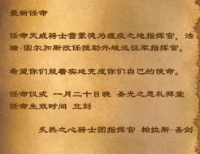
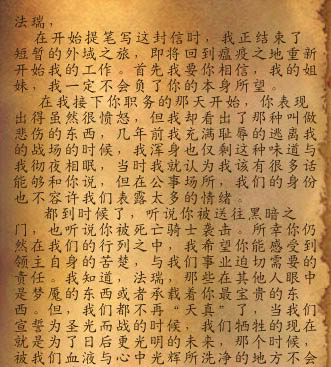
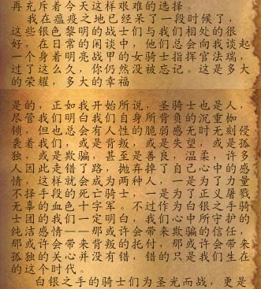
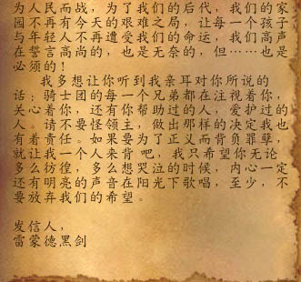
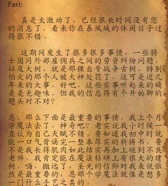
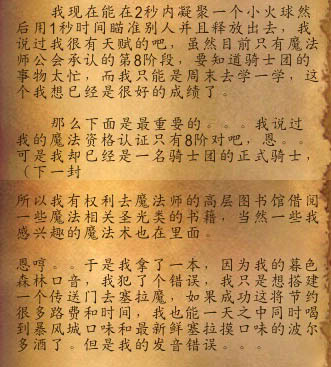
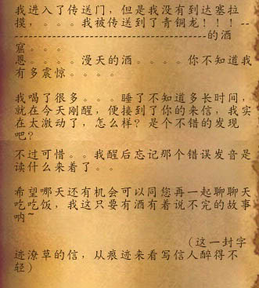
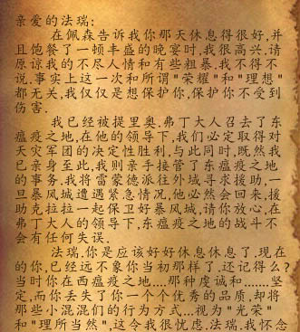
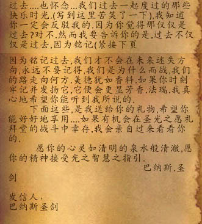

# 从洛丹伦到镶金玫瑰

2009年

根据这封任命书，我的西瘟疫之地指挥官职务被撤除。我无法想象当时我会说什么，西瘟疫之地是我将盾牌上的刺磨锋利的地方……我站在乌瑟尔的墓前，而周围是一圈亡者的尸体。西瘟疫之地，或者说洛丹伦，是我重新遇见主教艾卓拉司的地方，尽管那时她被暗影之力缠绕。她说，我认得她了。然而我被一个新的军官接替了……虽然如今我不记得，但当时的愤怒……帕拉斯不得不命令我在镶金玫瑰里休息。

> 最新任命
>
> 任命天威骑士雷蒙德为瘟疫之地指挥官，法瑞·图尔加斯改任援助外遇远征军指挥官。
>
> 希望你们能着实地完成你们的使命。
>
> 任命仪式 一月二十日晚 圣光之愿礼拜堂
>
> 任命生效时间 立刻
>
> 炙热之心骑士团指挥官 帕拉斯·圣剑

以下是两封来自雷蒙德黑剑的信，信中提到他曾经逃离战场，那时的悲伤让他能理解这件事。

> 法瑞，
>
> 在开始提笔写这封信时，我正结束了短暂的外遇之旅，即将回到瘟疫之地重新开始我的工作。首先我要你相信，我的姐妹，我一定不会负了你的本身所望。
>
> 在我接下你职务的那天开始，你表现出得虽然很愤怒，但我却看出了那种叫做悲伤的东西，几年前我充满耻辱的逃离我的战场的时候，我浑身也仅剩这种味道与我彻夜相眠，当时我就认为我该有很多话能够和你说，但在公事场所，我们的身份也不容许我们表露太多的情绪。
>
> 都到时候了，听说你被送往黑暗之们，也听说你被死亡骑士袭击。所幸你仍然在我们的行列之中，我希望你能感受到领主自身的苦楚，与我们事业迫切需要的责任。我知道，法瑞，那些在其他人眼中是梦魇的东西或许承载着你最宝贵的东西。但，我们都不再“天真”了，当我们宣誓为圣光而战的时候，我们牺牲的现在就是为了日后更光明的未来，那个时候，被我们血液与心中光辉所洗净的地方不会再充斥着今天这样艰难的选择。
>
> 我在瘟疫之地已经呆了一段时候了，这些银色黎明的战士们与我们相处的很好，在日常的闲谈中，他们总会向喔谈起一个身着明亮战甲的女骑士指挥官法瑞，过了这么久，你仍然没被忘记。这是多大的荣耀，多大的幸福。
>
> 是的，正如我开始所说，圣骑士也是人，尽管我们明白我们自身所背负的沉重枷锁，但也总会有人性的脆弱感无时无刻侵袭着我们，或是背叛，或是失望，或是孤独，或是欺骗，甚至是善良，温柔，许多人因此走错了路，抛弃掉了自己心中的感情，这样就会成为两种人，一是为了力量不择手段的死亡骑士，一是为了正义屠戮无辜的血色十字军。不过作为白银之手骑士团的我们一定明白，我们心中所守护的纯洁感情——那或许会带来欺骗的信任，那或许会带来背叛的托付，那或许会带来孤独的关心没有错，错的只是我们生在这个时代。
>
> 白银之手的骑士们为圣光而战，更是为人民而战，为了我们的后代，我们的家园不再有今天的艰难之局，让每一个孩子与年轻人不再遭受我们的命运，我们高声在誓言高尚的，也是无奈的，但……也是必须的！
>
> 我多想让你听到我亲耳对你所说的话：骑士团的每一个兄弟都在注视着你，关心着你，还有你帮助过的人，爱护过的人。请不要怪领主，做出那样的决定我也有着责任。如果要为了正义而背负罪孽，就让我一个人来背吧，我只希望你无论多么彷徨，多么想哭泣的时候，内心一定还有明亮的声音在阳光下歌唱，至少，不要放弃我们的希望。
>
> 发信人，
>
> 雷蒙德黑剑

当时我只觉得这封信干燥，只是它很长，我不记得我回答了什么。但我从箱底找到了另一封信：

> 你的信写得真好。
>
> 我能够深刻的感受到你压抑的痛苦。
>
> 我不知道我这样说是否合适。
>
> 会不会“交浅言深”
>
> 我不直到痛苦源自何来。
>
> 也直到理由的愚蠢。
>
> 但我们总无法改变。
>
> 这就是来自凡人的渺小。
>
> 雷蒙德没资格要求法瑞释怀。
>
> 但天威骑士雷蒙德有责任要求指挥官法瑞明白。
>
> 我们的事业充满了悲伤，责任，怒火，以及种种冰冷的牺牲。
>
> 但那是正义的，总有一天，我们要让这个世界不再具有那么多如果。
>
> 我一个人无法做到，但我会是做这件事的人中其中一个。
>
> 总有一天，我们中的一个会带着所有英魂的信念抵达终点。
>
> 而不是倒在之前。
>
> L·M

我在暴风城休息的时候，佩森圣光从很远…很远的地方寄的信，他学了魔法！呃，他一定醉了。

> Fari：
>
> 真是太激动了，已经很长时间没有您的消息了，看来你在暴风城的休闲日子过得很不错。
>
> 这期间发生了很多很多事情，一些骑士团同外部雇佣兵之间的劳资纠纷问题，以及大树，就是那棵自号战争古树，特别怕火的那个人被大神处罚了，这可是近几年来的大事，好吧，这些实事听起来的确是毫无趣味，但我的信总得有个开始聊的题头对不对？
>
> 恩，那么下面是最重要的事情，我上个月学魔法去了，神奇吧？老实说我小时候一直认为自己天赋不错。要知道我初中时旧能一口气背诵完一本厚实的祈祷书，要不是我长得肌肉如此结实再加上碰到不良老师，我肯定能在魔法钻研上有很大得建树，嗨，撤远了，圣光的信仰对我来说依然是最重要的，恩那个学魔法就像是想多一门什么手艺之类的。
>
> 我现在能在2秒内凝聚一个小火球然后用1秒时间瞄准别人并且释放出去，我说过我很有天赋的吧，虽然目前只有魔法师公会承认的第8阶段，要知道骑士团的事物太忙，而我只能是周末去学一学，这个我想已经是很好的成绩了。那么下面是最重要的……我说过我的魔法资格认证只有8阶对吧，恩，可是我却已经是一名骑士团的正式骑士，所以我有权利去魔法师的高层图书馆借阅一些魔法相关圣光类的书籍，当然一些我感兴趣的魔法术也在里面。
>
> 恩哼……于是我拿了一本，因为我的暮色森林口音，我犯了个错误，我只是想搭建一个传送门去塞拉魔，如果成功这将节约很多路费和时间，我也能在一天之中同时喝到暴风城口味和新鲜塞拉摸口味的波尔多酒了。但是我的发音错误……
>
> 我进入了传送门，但是我没有到达塞拉摸……我被传送到了青铜龙！！……的酒窟……恩……漫天的酒……你不知道我有多震惊……
>
> 我喝了很多……睡了不知多长时间，就在今天刚醒，便接到了你的来信，我实在太激动了，怎么样？是个不错的发现吧？
>
> 不过可惜……我醒后忘记那个错误发音是怎么读来着了……
>
> 希望哪天还有机会可以同您再一次聊聊天吃吃饭，我这只要有酒有着说不完的故事呐……
>
> （这一封字迹潦草的信，从痕迹来看写信人醉得不轻）
>
> 发信人，
>
> 佩森圣光

我前往提尔之手调查死亡骑士出没的传闻。后由于对重获头颅的圣剑骑士不信任，以及，我对血色十字军的同情——按照帕拉斯的话说。雷蒙德黑剑接替了我的西瘟疫之地指挥官职务。我记不清，或许那时我的愤怒不只是转身离去。无论如何，我被要求暂时居住在镶金玫瑰旅店，放下武器和盔甲。期间帕拉斯寄给我一封信——

> 亲爱的法瑞：
>
> 在佩森告诉我你那天休息得很好，并且饱餐了一顿丰盛的晚宴时，我很高兴。请原谅我的不尽人情和有些粗暴。我不得不说，事实上这一次和所谓“荣耀”和“理想”都无关，我仅仅是想保护你，保护你不受到伤害。
>
> 我已经被提里奥·弗丁大人召去了东瘟疫之地，在他的领导下，我们必定取得对天灾军团的决定性胜利。与此同时，既然我们已经亲身至此，我则亲手接管了东瘟疫之地的事务。我将雷蒙德派往外域寻求援助，一旦暴风城遭遇紧急情况，他必然会回来，援助克拉拉一起保卫好暴风城。请你放心，在弗丁大人的领导下，东瘟疫的战斗不会有任何失误。
>
> 法瑞，你是应当好好休息休息了。现在的你，已经远不像你当初那样了。还记得么？当时你在西瘟疫之地……那种虔诚和……坚定，而你失去了你一个个优秀的品质，却将那些小混混们的行为方式……视为“光荣”和“理所当然”，这令我很担忧。法瑞，我怀念过去……也怀念……我们过去一起度过的那些快乐时光（写到这里苦笑了一下）。我知道你一定会反驳我的，因为你觉得那仅仅是过去？对不，然而我要告诉你的是，过不不仅是过去。
>
> 因为铭记过去，我们才不会在未来迷失方向。永远不要忘记，我们是为什么而战，我们的路走向何方。美德犹如香料，如果你时刻牢记并发扬它，它便会更显芳香。法瑞，我真心地希望你能听到我所说的。
>
> 下面这些，是我送给你的礼物。希望你能好好地享用……如果有机会在圣光之愿礼拜堂的战斗中幸存，我会亲自过来看看你的。
>
> 愿你的心灵如清明的泉水般清澈，愿你的精神接受光之智慧之指引。
>
> 巴纳斯·圣剑

“美德犹如香料”，不知道他从哪本书上看到这个比喻。但当一切过去，重新读到它，我还能闻到香味。或许只是旧纸卷里那种让人鼻子流涕，眼睛睁不开的气味。

2012年

她看向窗外，长夏里北郡的风抚过羽毛笔末，但风安静，没有对她说任何一个名或者誓言。她闭上眼睛，回忆就涌进她的灵魂像水流，时间已经洗走了当年的歌声，魔法流淌声，剑与盾的碰击……全部失去了。

她微笑着提笔写道——

致瑟纱·碧空之歌：

我是法瑞·图尔加斯，如果你记得我的名，如果你能写信给其他炙热之心骑士团的修士。两年前我在圣光大教堂与你们道别……但如今一切都不重要了……那年帕拉斯认为我对血色十字军过于同情，不愿沾他们的血，除去我在瘟疫之地的指挥官职务。后来我居住在北郡修道院，每天在图书馆里阅读旧洛丹伦手稿，没有碰过我的剑和盾。

后来从骑士团来的信件少了。我听说世界变了，哨兵岭烧毁，巨龙降落，洛丹伦绿树重生。我希望能尽快回到北方，如果可能，他们说新的要塞兴起，他们说田地里又有稻谷了……但烈马骑手们在哪，死木里的烟散尽，新一年的春雨和收获，软草地里的风，断裂的号角和长盾。我想念他们的名，与我们一同征战的守护者们，暗金玫瑰的钱袋，维纶的纳鲁圣者，树杆上不能刻字的德鲁伊，他们的名和传说。

很久以前，梅林·白银盾，如果你认识他，还有帕拉斯和我说他们怎么总在狮王之傲喝酒，那是在我还没来到南方的时候。他们说那时所有旅者都在狮王之傲酒馆，房间不够，他们就会睡在酒窖里。那时西部荒野人民军的领袖则蒙着绿面巾，躲在灌木丛里，他们叫那狮王之傲时代，那时英雄们喜欢喝一杯，然后唱歌。

我是法瑞·图尔加斯，如果你记得我的名，如果你能写信给其他当年的战友。噢，如果你能写信给银月骑士索拉，告诉他我很感谢他当年护送我离开布瑞尔。写信给他们，告诉他们我在收集传说和手稿。无论我是继续留在北郡修道院，还是回到北方。洛丹伦从死的灰烬里醒来，炙热之心骑士团的旧愿已成，修道院的生活也让我不再渴望利剑和血……我只希望过去的故事不遗失在风中。

你的，  
法瑞·图尔加斯

