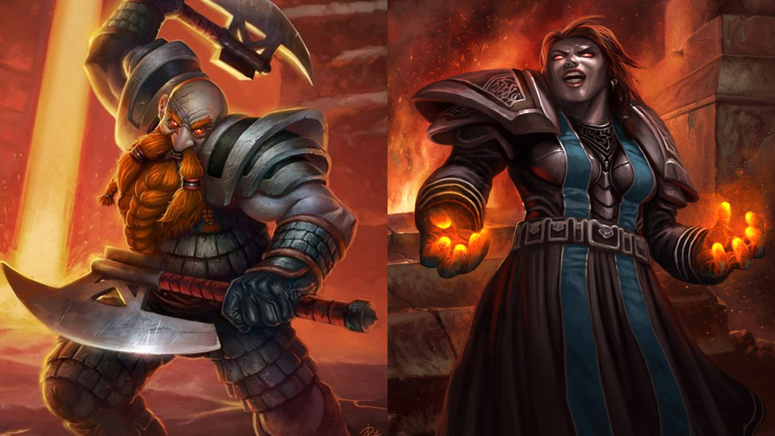

# 古格·火须的艾泽拉斯传说故事

古格·火须是海龟宝石酒馆的老板。之所以转载这篇故事，是因为第八个故事《远征》里有帕拉斯圣剑……而帕拉斯，无论如何，是炙热之心骑士团第二任大团长。本文现在存档于艾泽拉斯国家地理。

作者简介：古格 火须，男，黑铁矮人（火元素）旅行家兼作家，工程学爱好者，\[龟岩兄弟会]荣誉会长。由于第一篇作品描写水元素，而被赶出黑石山，从此以后习惯往自己脸上涂白面伪装铁炉堡矮人。

> ——来自古格·火须，酒馆老板的爱

## 艾泽拉斯传说（一）：《暗流》

这个故事发生在十四万年前。那个时候，艾泽拉斯没有联盟，也没有部落，那是泰坦与上古之神们战斗刚刚结束后的事情。在这个监牢——元素位面，一场新的战争才刚刚拉开帷幕。

安比索莫的水元素宫殿

海达克西斯公爵：“陛下，我们已经被拉格纳罗斯和奥拉基尔的军队腹背夹击了，如果再不反击的话，整个安比索莫大洋都会被蒸发的！他们想联手消灭我们！”

耐普图隆：“无谓的反抗只会让我们受到更大的伤害。”

海达克西斯公爵：“那我们应该做些什么呢，陛下？难道我们什么都不做，就这样坐以待毙吗？”

耐普图隆：“不。海达克西斯，你知道为什么泰坦只是监禁了我们，而不是消灭我们么？”

海达克西斯公爵：“我们元素是不灭的，即使把我们打成碎片，我们都会在碎片中重生。虽然这种重生会暂时性的削弱自身，但除此之外无需任何代价。”

耐普图隆：“海达克西斯，没想到你的思想竟然会与那些凡间生灵一般庸俗。”

海达克西斯公爵低下了头：“对不起，陛下。”

耐普图隆：“对于泰坦这个强大的种族来说，别说是击成碎片，他们可以轻而易举地让我们泯灭。”

海达克西斯公爵：“那为什么……——”

耐普图隆：“元素是艾泽拉斯重要的一部分，一旦失去了我们的约束。凡间生灵就会更加轻易地干戈相向。如果我们四族中的任何一员被消灭的话，那个世界都会陷入混乱。”

海达克西斯公爵：“可是这些和现在的情况毫无关系啊？陛下，您怎么关心起只有凡间生灵才关心的问题了？”

耐普图隆：“不。主人曾经告诉我——这就是我们的命运，元素之间的战斗将是永恒的。我们谁也无法取胜。凡间生灵？凡间生灵团结时的力量要远比一个元素强大，你以后会知道的。”

海达克西斯公爵：“即使这样，我们也必须给他们一点颜色瞧瞧，让他们知道我们水元素的厉害！”

耐普图隆：“他们会知道的，但那不是现在。”

海达克西斯公爵：“宁静的海面正被飓风席卷，冰冷的深海却因岩浆而翻腾。而我们却在这之间苟且偷生！您可以上下任意看看……他们迟早会攻打到这里的！”

耐普图隆看了看，头顶上远处是白色的漩涡——那是奥拉基尔的飓风，而脚下深处不断溢出火红岩浆——这是拉格纳罗斯的怒火。耐普图隆的眼神中唯一透露出的表情是轻蔑，傲慢的轻蔑。他望着海达克西斯公爵，缓缓的张开了水元素不大明显的嘴：“你今天已经说得够多了。”说罢，他转身向海洋中游去……

海达克西斯公爵：可是……陛下！

耐普图隆顿了一下，声音十分沉重：“作为一个水元素。你知道海面与深海之间是什么吗？”

海达克西斯公爵一言不发，他是否知道答案，我们无从得知。

耐普图隆咆哮着：“是汹涌的暗流！”随后，他消失在了冰冷漆黑的海洋之中……而他的声音依然回响在公爵的脑海中。

在接下来的几百年中，大海被不断的蒸发，而奥拉基尔和拉格纳罗斯却没有获得任何好处。倒是与世无争的土元素获得了更辽阔的大陆，因此风元素和火元素转而侵袭土元素的领域——迪霍姆。耐普图隆有预谋的帮助土元素击败了敌人。从此，风元素和火元素的盟约开始逐步瓦解，风王子桑德兰之死更是加快了这个进程。而假借同仇敌忾之名的耐普图隆淹没了石母大量土地，在大战中毫无损失的水元素成为了元素位面最强大的势力。

而今天，受耐普图隆派遣的海达克西斯公爵仅凭一箱珠宝，就让凡人们将拉格纳罗斯在艾泽拉斯的走卒们受尽了苦头。但令人费解的是，水元素们似乎并没有对拉格纳罗斯本人动手的想法，这到底是为什么呢？也许除了耐普图隆本人，没有人知道。

> 　　“……猎潮者耐普图隆是他所统治深海的灵魂。他是水、湖、河以及海洋的统治者。所有水元素和那些将使用水和寒作为主要能力的生物都会尊敬他。他拥有着大海般广阔的胸襟和暗流般凶狠的意志。这两个看似相互矛盾的情感让他犹如海潮般让人捉摸不定。作为上古之神最强大的副官，他所了解的许多知识比这个世界本身还要古老，并且有许多连其他元素领主都不知道的秘密……”
>
> ——艾泽拉斯传说人物传记《光与影》

## 艾泽拉斯传说（二）：《平凡》

这个故事仅仅是关于一个或者一些凡人。他们没有泰坦的伟力，元素的骁悍，但他们具有那唯一特殊的性质——平凡。

“弟弟，你真得这么决定了么？”这个男人带着红色的面罩，声音带有这一丝沙哑。

“嗯，作为一个技工，主要的目的是提升自己的技艺。而且同时还能够到处走走。”一边说着，这个年轻人一边将炽热的金属块放入水中。这么做，无非是想让武器更加坚硬，但是他知道——哥哥的技艺能够使用最简单的工具在最坚硬的石头上雕琢。

小艾德温·范克里夫与他哥哥最大的不同并不在于铁匠与石匠的差别，而是对人生意义的理解不同。对于小艾德温来说，他的梦想是成为一个伟大的铁匠，过着普通人的生活。而他哥哥不仅仅希望自己能够成为杰出的石匠，而且盼望着某一天自己能够干出一番惊天动地大事业，实际上，他已经做到了，他的迪菲亚兄弟会已经具有了与暴风城抗衡的力量，但仅仅抗衡是不够的，他的最终目标是亲手将自己雕琢的辉煌化为灰烬。

小艾德温临行之前赠送给了哥哥一把亲手打制的刀，那并不是什么神兵利器，那仅仅是一把普普通通的铜质雕工刀。为了避免与兄弟会撤上关系，他和妻子便更名改姓了。一个叫做乔丹·斯迪威尔的人离开了西部荒野，离开了暴风城的疆土。数年以前，乔丹为了继承父亲的手艺，而放弃了成为一名圣骑士的资格，这毫无疑问的验证了他对铸造的狂热。

乔丹去了很多地方，最长时间驻足于银松森林，而最终由于天灾，而安定在了矮人们的铁炉堡。

一天，丹莫洛的暴风雪格外的肆虐，而乔丹并没有因此而停止了铸造的工作，或者应该说是试炼。而一个暴风城的来客，暴风城石工协会的巴隆斯·阿历克斯顿，却阻断了他。他们一同走进了铁炉堡的一家小酒馆。

“请问您找我什么事情，阿历克斯顿先生？”

“别忙。”巴隆斯·阿历克斯顿从行囊中掏出了一个包裹，和一小桶酒——西部荒野的特产，雷霆啤酒，“艾德温·范克里夫死了。”

“什么？”疑问的同时，乔丹的身体颤了一下。

“西部荒野人民军雇用了一群人，连夜突袭了月溪镇和死亡矿井，并杀死了艾德温·范克里夫。”来者倒了一杯雷霆啤酒给乔丹，然后自己来了一杯。

乔丹脸上流露出一丝，仅仅一丝的痛苦。

“这些雇佣兵，夺走了他身上一切值钱的东西，尤其是他手中的残忍倒钩。唯一剩下的，是这把满是锈迹的匕首。”他随手打开了包裹，里面装着一把铜制雕工刀。

乔丹接过了包裹，里面的刀锈迹斑斑，但对于一个熟练的铸造者来说，他可以轻而易举地看出这是他的作品。他凝视着刀，不知道该说什么。

“这是属于你的，小艾德温·范克里夫。这也算是一种纪念吧。”巴隆斯起身，离开了。

随后，小艾德温·范克里夫，也就是乔丹，回到了铁炉堡门前，并开始了对刀的修复工作。

当他将灼热的刀身放入水中的时候，刀中渗出了血，那些死于这把刀的人的血。血在水缸中扩散开来，这是那些被血浸透的杀人利器的特性，而不应该是一把雕工刀的特性。当他将刀身取出来的时候，他看见了上面雕琢的文字，那是他哥哥的字迹——“兄弟”。他的手在颤抖，并不是因为丹莫洛那刺骨的寒风，而是心中一种悲痛。

无疑，这把雕工刀在艾德温·范克里夫的手里发挥了意想不到的用途，而且远远比其他残忍倒钩大，但是那些雇佣兵们却永远也不会知道。这就和艾德温本身一样，谁又会想到当年一个普普通通的石匠会成为今天令人闻风丧胆的强盗呢？

> 　　“……艾德温·范克里夫，一双平凡的巧手，可以重塑人类辉煌的城市，亦可扼杀人类脆弱的生命。‘兄弟’之刃，一把平凡的刀，可以成破铜烂铁，亦可成杀人利器。在暴风城贵族下令驱散石工后不久，范克里夫手下的迪菲亚兄弟会成为了暴风城国境内的一块心病。范克里夫下令兄弟会成员不得杀死行人、烧毁村庄，因为‘死去的行人不会携带任何盘缠，烧毁的村庄不会遗留任何财产’，但这一切似乎并没有被执行……”——艾泽拉斯人文志《征战之地》

## 艾泽拉斯传说（三）：《意志》

当一个机器拥有了自己的意志，他就不再是机器那么简单了。

我醒来了，我在挣扎，我不知道我是谁，我不知道。

两个巨大的怪物守卫着我，我无法动弹。

“战胜你眼前的敌人，撕裂它！”是那个声音。

我在这个声音的指引下走向了前方，我一直停地走，直到遇到了……

那是一只憎恶，散发着腐臭，腐烂的肢体张牙舞爪的挥动着。他的名字，叫做帕奇维克，克尔苏加德的战神……

此时此刻，我感到体内有无数的东西在挣扎，他们感到恐惧，感到无助。但这些都是毫无帮助的……

帕奇维克的斧头劈开了我的肩甲，我感到一丝痛苦，或者说，毫无痛苦？面对这样一个怪物，我变得手足无措，我想逃走，但四周没有任何通路。殿堂里充满了帕奇维克的食物——那些被它杀死的人或者怪物的尸骨。也许，我也会成为他们中的一个？

“不，你不会！”

为什么？

“因为，你的名字叫做塔迪乌斯，我的使徒！”

帕奇维克依然不断的撕裂着我的躯体，没有痛楚，没有恐惧。我的身体毅然僵硬，我不知道该怎么做。我是谁？我突然记起来了！我是洛丹伦的战士，为荣耀而战的勇士！而眼前的怪物杀死了一切，杀死了我的同胞！我的同胞在那里？它必须被除掉！

杀！

我将帕奇维克那臃肿的身躯，高高地举起，它那恶心的脓液顺着我的身体缓缓的流下，随后将其使劲地抛了出去。我的身体在颤抖，不是因为畏惧，不是因为疲惫，那是为什么？

“不玩了！”帕奇维克重新站立了起来，凶狠的向我过来。

你，去死吧！我愤怒的冲向了它，抓住了它的所谓的手。闪电从我的手中冒出，恨不得把它化为灰烬。我开始无情的撕裂它，血肉到处飞溅，脓液满地流淌。直到，它被我撕成了碎片！在那堆秽物中，我看见了一个倒影，那是我……

我是一个憎恶，我是一个怪物……原来的我，在哪里？

“你做得很好，使徒塔迪乌斯。”

时间……

一群人闯进了我的囚室，是的，我的囚室。我体内的冤魂开始翻滚……以及主人的意志……

“塔迪乌斯，现在是你表现的时候了……”

求求你，她在哀嚎，恳求着主人的怜悯。

“撕碎他们！你别无选择！”

我的肢体开始不由自主地移动，停下，停下这东西！

帮帮我，救救我！她呼喊着，但是谁又能够做到呢？

“让死亡拥抱你的敌人！”

不！

那两个看守我的怪物很快就在冰火刀箭的进攻下倒下了，他们冲向了我……

你们太迟了，我……只好服从！

我开始清除这些“敌人”，我与主人的意志发生了冲突，我的躯体行动变得十分迟缓……

我，以及我体内无数的冤魂，感受到了受伤的痛苦，而我们依然苦苦坚持着。我知道，主人，不，克尔苏加德想用这种方式来摧毁我们的阻隔，以便直接控制这杀人机器。

我，我们承受着双重折磨，残杀无辜的痛苦，以及剑与魔法的摧残。

“敌人”在“我”的铁拳下，纷纷倒下，而我也再也无法支持了……我折服在了克尔苏加德的伟力之下。

塔迪乌斯变得狂暴起来，他手中的闪电开始肆意的杀死任何触碰到的敌人，一双铁拳变得更加强悍有力。尖叫、呐喊，在我的耳边回荡，最后一声沉闷的落地。

塔迪乌斯死了……

谢谢……你……

我的灵魂变得缥缈。我，我们……自由了……

> 　　“……塔迪乌斯，我们目前研究所能制作出的最强憎恶，他拥有了对魔法和肢体更加完美的控制能力以及更加复杂的思维能力，因为我们给他注入了死去战士的冤魂。但是这一切并不像我们所想的那么简单，他逐渐对我们的束缚产生抗争。这直接降低了他的能力，本应比旧型号的战神帕奇维克更加凶悍的塔迪乌斯，由于这个思维上的冲突，实战能力大幅度下降，最终被击败……”——巫妖领主克尔苏加德 于 大墓地纳克萨玛斯

## 艾泽拉斯传说（四）：《死灰》故事

没有人知道这个故事发生在确切何时，我们只能够确定它的历史并不久远。几乎所有听过这个故事的人都希望这仅仅是个传说，否则，它将会在这疮痍的大地上留下又一道伤痕。当然，并不是所有的生灵都能个意识到——死灰也是会复燃的……

这是一座十分普通的黑铁矮人营帐，就像大熔炉附近的其他黑铁据点一样，为了取火方便而在熔岩边上安营。当然，我们的故事并不是关于如何建立一座黑铁营帐，而是关于发生这个营地的一席谈话。

两个黑铁矮人点起了一堆营火，他们的穿着显示出他们在黑铁帝国的权势。

“好久不见了，迦顿男爵。”

“加尔，你最近还好么？”

那堆营火蠢蠢欲动……旁边的熔岩也加快了流动的速度……

两个矮人并没有在意，继续喝酒。

“男爵，你找我到底什么事情？”

“是关于埃克索图斯和火焰之王……”

“随便谗言管理者是不会有好结果的，而且火焰之王现在对他如此重用。”

熔岩流动的速度越来越快，两个矮人转头看了看。

迦顿发出一阵难以置信的笑声，营火变得更加猛烈……

“你认为埃克索图斯深得火焰之王的信任？你错了！埃克索图斯仅仅是一个叛徒罢了。”

“你这是在挑战火焰之王的选择。”

“埃克索图斯和他的同类们早已不再是烈焰之域的臣民了，他们认为脆弱的暗影和奥术能够带给他们更为强大的力量。他们竭力劝说火焰之王接受黑铁矮人们的召唤，是为了到这里吸收更强大的力量。他们也知道火焰之王的强大程度不是一个小小的召唤能够承受的，而这个召唤也会大幅削弱火焰之王的实力。”

“火焰之王现在正在熔火之核深处休息，管理者履行着他的命令——禁止任何人打扰火焰之王。”

“不，那里仅仅存在一个由火焰之王一丝精华构成的幻影，并由埃克索图斯操纵着。他和他的同类们，这些并非元素的家伙，试图把我们的权力架空！在九个所谓的熔火之核守护者之中，有五个都是他的人，这是为了保守那幻想的秘密。他们从黑铁，甚至可能是耐法里奥斯那里学习暗影和奥术力量，作为交易，他们教会了那些凡人高阶火焰魔法，甚至如何操纵火元素。”

“那么真正的火焰之王到底在哪里？我并不在乎埃克索图斯他们干了什么，我只想知道火焰之王本人在什么地方？”

此时此刻，营火的燃料已经烧尽了，但是火焰依然没有熄灭。而熔岩已经变得更加汹涌，如同激流一样，激流，没有火元素喜欢激流。而两个矮人却若无其事，继续喝酒聊天。

“火焰之王……在进入这个位面时，他的力量将黑石山拔地而起，而他自己化为了死灰，他沉睡了。这些死灰洒落在了燃烧平原和灼热峡谷，任由凡人们肆意践踏！这些耻辱会连同埃克索图斯的背叛一起被火焰之王铭记。”

猛烈的营火突然熄灭了。接下来一股强烈的火焰从灰烬中炸出，把整个营地都化为了灰烬，包括那两个可怜的矮人也在火焰中消失了。仅剩下一句卡利姆多语的低鸣回荡……

“已经几个世纪了，死灰很快就会复燃……就如同元素位面的火山一样，对土元素造成最大伤害的，永远是那些土元素们已经认为平息却又突然爆发的死火山……拉格纳罗斯的怒火将横扫那些蔑视或者妄图控制火焰的敌人……我们从不征服，仅仅毁灭……”

> 　　炎魔拉格纳罗斯统治着火、热以及火灾。他被所有火元素和使用火为主要武器的生物所敬畏。拉格纳罗斯是狂暴而毫无理智的，他一有机会便会制造痛苦和恐怖。但是当他经历了失败之后，他往往会暂时性的具有理智，这使得他变得更加强大并能够彻底毁灭对手。这同时也是耐普图隆尽量避免和拉格纳罗斯战斗的原因之一，他并不希望使拉格纳罗斯有能够与自己抗衡，甚至打败自己的那么一天。而在拉格纳罗斯看来，打败耐普图隆只是个时间问题。当你打败拉格纳罗斯，践踏他留下的灰烬并肆意嘲笑他的时候，也许你该考虑考虑当脚下的死灰复燃，你该怎么做。
>
> ——艾泽拉斯传说人物传记《光与影》

## 艾泽拉斯传说（五）：《感情》

无数强大的盗贼都梦寐以求做到所谓的无情，但最终他们还是无法躲避感情的纠葛。

雨夜，拉文霍德庄园。在庄园的观景台上，坐着两位老人，他们手中各执着一只酒杯，窗外细雨细琐。

“小马迪亚斯就如我预料的一样，把目标干掉了。虽然对手是连小马迪亚斯母亲那样的优秀刺客都无法战胜的盗贼，但是实力平平的小马迪亚斯还是做到了。”说话的这位白发老人，身上衣着华丽，右手食指带着镶有拉文霍德徽记的戒指，他就是这里的主人——乔拉齐·拉文霍德公爵。

“公爵先生，何以有此预料？”这个人穿着一身夜行衣，带着兜帽，身材较为矮胖却并不臃肿。他是军情七处（他更喜欢“暴风城刺客”这个名头，远比那冠冕堂皇的所谓“军情七处”来的实在。）的头目之一，沃尔森·弗利摩尔。

“因为这个目标杀死了小马迪亚斯的母亲。”公爵答道，并示意潜行着的仆人重新酌满酒杯。

老弗利摩尔拿起了自己的酒杯，开始品味这希尔斯布莱德酿造工艺，似乎并没有在意公爵说了什么。

这场聊天陷入了尴尬的沉默，唯一的声音是那雨……

沉默……

依然是沉默……

“简单的说，就是恨。”公爵打破了这寂静，但这并不是因为他觉得任何不舒服，对于一个盗贼来说，还有什么比寂静更好的呢？

“他很爱他的母亲，虽然他是由外婆带大的。”老弗利摩尔的脸上露出一丝微笑，但很快就淡去了。

“这种爱最终转化为了对于杀手的仇恨，激发了小马迪亚斯的潜力。我相信在这之前，他的心灵一定遭受了不可言喻的挫折，因为他生活在了仇恨之中。”公爵把玩着自己的戒指。

“对手的死对他来说是一种实现，但也是新折磨的开始。”公爵喝了一口酒，继续说道，“也许目标的儿子会和他一样，找他报仇。这就是感情……”

寂静……

这场谈话再一次陷入了僵局……

依然是寂静……

“公爵先生……你知道么？”老弗利摩尔稍微停顿了一下，他面无表情地看着公爵，似乎在犹豫到底该不该说下去，“那个目标是小马迪亚斯的父亲，没有人告诉过他……”

没有人说话，窗外的雨也停了下来。

死寂，依然是死寂……

“感情……”

二十年前，当马迪亚斯的母亲被迫服从命令去暗杀他父亲的时候，在那毫无人烟的逆风小径，毫无选择余地的她在丈夫的面前自尽了。她最后一次说出了“我爱你”，并希望丈夫能够履行好照顾小马迪亚斯的诺言。当多年之后，这个消息第一次传入马迪亚斯脑海里的时候，他只知道有一个杀死他母亲的凶手，而不知晓那个被他母亲深爱着的父亲。

当他的父亲第一次发现马迪亚斯在暗中监视他的时候，就已经做好了死的准备。多年以来，他的心中一直背负着亡妻之痛，而骨肉离别的他也无法履行当初的诺言，但是他知道，他的死将会给马迪亚斯带来一个美好的前程。当被刺杀的时候，他故意放松戒备，最终死在了血泊之中……闭眼前，他心满意足地笑了，却什么都没说，因为他知道马迪亚斯不能够接受再次丢失一个亲人的事实……

> 　　关于拉文霍德庄园和暴风城刺客（军情七处）：暂时没有任何可靠的相关资料

## 艾泽拉斯传说（六）：《密室》

现在是晚上八点一刻，暴风城白日里的繁荣与浮华开始逐渐淡去，而对于大教堂地下密室中的四个人来说，一天的工作才刚刚开始。在这四个人之中，一个身着军队长官级别重甲的人坐在其他三个对面，中间隔着一些稍显紧张的空气和一张破旧不堪的桌子。桌子后面的三个人，也并不是什么大人物——穿着便服的军情七处特派盗贼，大教堂的一个牧师，以及暴风要塞派出的笔录。

笔录快速记录着其他三人的谈话：

档案号码：1666，第一次纪录（于晚八点一十五分开始）

A-安德烈。帕克 B-军情七处代表 C-大教堂代表

B：你先说说你记得些什么吧？

（12秒钟间隔）

A：我只记得上司告诉我，我被派往银松森林代表暴风城访问席瓦莱恩男爵。

B：你还记得路上发生了什么么？

A：路上发生了什么重要的事情么？

B：我需要你来告诉我，安德烈。

（7秒钟间隔）

A：我，我什么都不记得了……

B：仔细想想。

（C心灵安抚A）

“我是安德烈•帕克，她是我的妻子薇乐尔•弗莱，而这一位是大法师罗兰•塞克先生。”我匆忙的介绍着我们一行人，我没有想到在亡灵聚集的银松森林还会有这样的村庄。我们到达这里的时候，已经将近黄昏了。

“欢迎来到焚木村，这年头来这里的人已经很少了。而且这次来的居然还是位高级军官，联盟居然没有忘记我们这个小地方！”我看着眼前这个老人，他眼中的泪花随着脸上的皱纹滑下。是啊，这几年来，活着的人谁还会去希尔斯布莱德丘陵以北的洛丹伦呢？想到此，我望向矗立在不远处的席瓦莱恩堡，也许席瓦莱恩公爵真的有对付亡灵的办法。

在小股人群的簇拥下，我们住进了当地的一件小旅馆。这里的人确实有洛丹伦的遗风——纯朴，不仅旅店年迈的老板和老板娘告知不收我们的住宿费用，铁匠也要送我们免费手镯。旅店一楼是传统的酒馆设置，桌椅一尘不染，地板也打扫得很干净。“老板，你们这里经常有客人吧？”

老板看了看我，然后和老板娘交换了眼神。他尴尬的笑了“呵呵，其实我们这里已经三年没有客人了。圣光恐怕早就遗忘了我们这个村落了。”

“可是你们这里看上去很不错啊？” 薇乐尔问道。她的胆子并不符合一个圣骑士的身份，即使她仅仅是一个见习圣骑士，也许这就是我作为丈夫的职责之一吧，保护自己的妻子，不让她担惊受怕。

“哎，”老板叹了口气，“自从天灾走后，本以为我们村就太平了。结果没想到，那个怪物就出现了。”

“怪物？”查阅着法术书籍的罗兰抬起了头来，这个家伙虽然表面上说自己是个大法师，其实真实身份是个术士，他只对两种东西感兴趣——怪物和美女。

老板点了点头，“嗯。每天晚上九点之后，它都回出来吃人。从此我这个夜间营业的酒馆也不得不关门了。再加上最近被遗忘者死亡哨兵的平凡出现，也让局势更紧张了。”

“老头子，别罗嗦了。赶快带客人进房间吧，已经快八点半了！”老板娘的声音从厨房中传来。

老板并没有答理，只是打手势招呼让我们跟他上来。

旅店的二楼，一共有五间房间。楼梯右手边的房门紧锁着，我和薇乐尔住进了左手边第一间，而罗兰住进了走廊尽头的那一间。无论是房间还是扶梯都很没有灰尘，可以看得出这对夫妇是很爱清洁的。

“九点之后一定不要出房门，不要大声喧哗。这并不是因为怕打扰其他客人，而是因为‘它’……”我知道这个“它”是他几分钟前提到的怪物。这个时候，罗兰的表情变得十分，呃，怪异。

B：那么，九点钟之后，发生了什么事情？

（15秒钟间隔）

B：你听见我说什么了么？

（18秒钟间隔）

A：我，我头很疼……

（C心灵安抚A）

B：审讯才开始10分钟而已。

（6秒钟间隔）

B：你想起什么了么？

九点钟，我在朦胧中感觉到整个镇子突然在钟声之后陷入了寂静。然后，那是什么叫声？这叫声居然让我这个战士的内心发颤，也许是幻觉吧。我抛开了这些杂七杂八的东西，抱着一种似乎能进入翡翠梦境的心态进入了梦乡。

什么东西在颤栗？我被颤醒了，是薇乐尔。我刚想问怎么了，却突然听见了走廊里沉重的脚步声。亡灵刺客？难道他们的消息如此的灵通，已经知道我到了？脚步声越来越近，在我们房间的门口突然停了下来。嘣！门被一股蛮力强行打开了，为了避免她尖叫出声，我下意识的将薇乐尔搂紧，即使从来身着盔甲睡觉的我也能够感觉到她急促的心跳。漆黑的走廊中，我看见了……

C：你看见了什么？

A：我……请等等……

C：平静下来，慢慢想。不要紧张。

（14秒间隔）

A：那是……

那是一双绽放血红色光芒的双眼，这双眼睛的主人似乎没有灵魂，不，它有灵魂，一个愤怒而饥饿的灵魂！这双眼睛洞察着屋内的一切，同时，似乎也洞察着我内心深处的恐惧。这不可思议，我居然在颤抖，作为一个战士的我竟然在颤抖。我闭上了眼睛，尽量不去想凝视着我们的一双眼睛。过了一会儿，我重新睁开了眼睛，它已经离开了，依偎在我怀里的薇乐尔依然在颤抖。我亲吻她冰冷的额头，“没事了，睡吧。有我呢。”她点了点头，似乎要问什么，但是却收了回去。我知道她是担心罗兰，“罗兰不会有事的。”我安慰她，让她能够安心入睡。而我，却难以入睡，我想着那双眼睛的主人，它至少有八英尺高，那到底是什么东西？被遗忘者亡灵？也许吧，这些家伙的情报系统这么发达？果然不愧是游侠将军希尔瓦纳斯。说起希尔瓦纳斯，那可是罗兰的偶像，罗兰？

“罗兰？啊！”我被薇乐尔的尖叫唤醒了，她已经不在我怀里了，原来我不知不觉已经睡着了，竟没有察觉她醒来出去。声音是从走廊传来的，我冲锋似的冲了出去，只看见她瘫坐在地板上，不断的倒退，似乎看见了什么可怕的东西。我顺着她惊惶的目光望向走廊尽头罗兰的房间。哎，又是罗兰，他总弄些稀奇古怪的次级恶魔来吓唬薇乐尔。我径直走进了他的房间，“罗兰，别玩了。”一股熟悉的味道扑鼻而来，那是……

B：血腥味儿。

（9秒钟间隔）

A：你怎么知道？

B：战士还能熟悉其他什么味儿？发生了什么？

罗兰死了。

整个房间一片狼藉，鲜血和脑浆溅在了墙壁上，胸膛被残忍的撕开，内脏被胡乱丢弃在了地上，四肢已经被啃噬得露出白骨。尽管罗兰的五官不成人形，但我还是看出他眼神中透出的并不是恐惧，那是一种惊讶。这个时候，楼下传来了老板娘的声音，“老头子，你今天早餐还是老规矩么？”，“不用了，不知怎么的，我今天感觉已经饱了。”老板回答道。我这才想起让老板把这件事情报告给了村议会，他们封闭了罗兰的房间，并告知明天带我去席瓦莱尔堡的同时会请男爵派人调查此事。薇乐尔在经受了这样一场惊吓之后，发起了高烧，老板娘陪在她身边照顾她，并请当地的牧师帮助治疗。就这样，一个上午就过去了，我匆匆下了楼，注意到扶梯右手边那个房间依然被锁着，而它的对面就是进才被锁上的罗兰的房间。我总觉得这与罗兰的死有什么关系，但是又不知道是什么。楼下，铁匠送来了手镯，为表示礼仪，我当即就满意地戴上了。随后，我便离开了旅店，准备去议会大厅向议员们了解一下当地的情况，看是否能推断出凶手。

我走进了议会大厅，这里竟然一个人都没有。人都去哪里了？我一个人找了张椅子坐了下来，这里的桌椅上铺满了尘埃。长途的旅行和昨晚的事情都让我疲惫，我在座椅上打起了瞌睡。朦胧之中，我听见了一个女人在我耳边低语，我听不懂她在说什么，那似乎是亡灵语，我不确定，也许这只是一个奇怪的梦吧。

B：你真的听见了女人的声音？

A：是的。

B：你能回忆起她说了什么吗？

（11秒钟间隔）

A：我不知道她在说什么，也不记得。我只记得那是一个较为沙哑的声音。

（6秒钟间隔）

B：那是一个被遗忘者女刺客，如果我没有猜错的话。他们虽然肢体比活人僵硬，但是失去了呼吸和心跳让他们更加善于潜行和刺杀。我们调查到最近有一股由亡灵哨兵费雷娅领导的军事力量在银松森林南部活跃。也许那个声音是费雷娅本人。回归正题，接下来呢？

“喂？长官，醒醒。”我抬起头来，看见一个身着棕色长袍的小子，“您怎么在这里睡着了？”“现在什么时候了？”我伸了一个懒腰，问道。“已经八点了。”小子答道。“什么？你的意思是说今天下午这个地方都没有人？”我站了起来，一股无名火冒上心头。“我们这些议员平时都各司其职，如果有什么问题的话，直接去找席瓦莱恩公爵的顾问阿鲁高先生就行了。”这小子看见我的架势，退后了几步。“你知道和我一起来的法师死了么？”我快步走出了大厅，而那个小子也跟了上来。“噢，怪不得村长去影……席瓦莱恩堡了呢。”我并没在意那个小子，而他也知趣地离开了。我的心中现在只剩下罗兰的死，以及对这些腐败官员的唾骂。

我坐在了旅店一楼的一个角落，其实角落与否根本没有什么差别——这里根本就没有别人。老板给了一瓶洛丹伦麦酒，并笑着对我说这是瘟疫爆发前的最后一批。在酒流下我喉咙进入我腹中的时候，一条条问题也随之划过我的思维：那双黑夜中的眼睛，罗兰被残忍的谋杀，议会大厅里的低语，焚木村议员们的腐败，以及旅店中那间紧锁的房间。想到此，我顺眼望去，那个房间依然被锁着。“老板，那个房间是什么用的？”我问道。“哪个？”老板似乎有些紧张，或者只是我想太多了？我指向扶梯右手边的那间。“噢，那是库房。”老板道。那个房间绝对不仅仅是库房那么简单，这里面有什么秘密。

喝完了这杯酒，我回到了自己的房间。薇乐尔躺在那里，她真的好美。为什么我会把她带到这里来呢？在这战乱的年代，真挚的爱情是难能可贵的。我脱下了重甲，躺在了薇乐尔的身边。我开始抚摸着她的头发，她醒了，似乎想说什么，但被我制止了。她的眼中依然有惶恐，但今夜她将不再畏惧。我亲吻并抚摸她的每一寸肌肤，有生以来我第一次感觉到和她如此的接近，她的身体是柔弱而坚强的，是美的。薇乐尔在我的耳边低声地呻吟着，我们融为了一体……

C：我感受到了你内心的一股迷茫。你能告诉我接下来发生了什么吗？那可能是我们今天谈话的重点。

（30秒间隔）

A：我……

我听见了九点的钟声，然后我失去了知觉……

B：就只有这些么？没有其他的了？

（A痛苦地摇头）

C：好吧，今天就到这里。好好休息一下。也许明天你会想起什么来。

档案号码：1666，第一次纪录（于晚八点五十八分结束）

我……

听见了……

薇乐尔的最后一次尖叫……

那是我生命中最可怕的声音……

在这静溢的月光下，暴风城大教堂显得格外的圣洁，整个城市都显得格外的宁静。

而在地下深处的密室中，三个无辜者丢失了他们宝贵的生命……

## 艾泽拉斯传说（七）：《传说》

这仅仅是一个传说。

“矮人，我请你喝杯酒，你给我讲个故事好么？”这只是海龟宝石酒馆一个平常的酒客。

“行！”古格接过一大杯啤酒，坐到了这个顾客的对面，开始讲了起来……

那是第三次战争的初期，阿加曼德家的小儿子代弗林成为了提瑞斯法林地第一个瘟疫的牺牲者。在他下葬的第二天，阿尔萨斯王子带着远征军回来了。所有的人都激动不已的认为希望的曙光已经出现了，但是他们错了——阿尔萨斯残忍的杀死了他的父亲，而同样在这一天，代弗林从坟墓中站了过来，成为了天灾的一名将领。在阿加曼德家中寄宿着三位圣骑士，其中两位来自暴风城，而另外一位就是这个故事的主角——伊纳明莱特了。

矮人端起了酒杯豪饮了一口，擦拭去了流到火红色胡须上的啤酒，继续道……

三人做下了决定——暴风城的两位骑士回艾泽拉斯国搬援兵，当然的，这个计划由于女伯爵及她手下权臣的百般阻拦而夭折了；而伊纳明莱特呢？他准备去白银之手总部所在的斯坦索姆，以便能够帮助抵御天灾，路上还莫名其妙地遇上了纳萨洛斯，对！就是那个人类游侠。他们很快便到达了斯坦索姆，这个时候的斯坦索姆被小股天灾从中分成了两个部分——行政区和军事区。这个世界上的巧合太多了，当伊纳明莱特和纳萨洛斯前脚踏进行政区的同时，阿尔萨斯已经带领着天灾的大军包围了断壁残垣的斯坦索姆。

“嗝！”矮人打了一个饱嗝，喝了一小口酒，吃了块宝石蛋糕，即刻吐了出来，“呸，这块蛋糕还真他妈的和宝石一样硬！算了，回归正题，刚才说那里了？”

“天灾围困了斯坦索姆。”这位客人显然是有些不耐烦了。

“对！”矮人说道，“天灾围困斯坦索姆……”

天灾将斯坦索姆围困了几天，最终天灾还是突破了活人们薄弱的防御工事。在天灾涌入城区的同时，每个活着的人都拿起了武器准备抗争到底，这是没有办法的办法，天灾是从来不收俘虏的。你也许不知道，在阿尔萨斯屠城斯坦索姆之后，行政区主要都是瑞文戴尔男爵收留的流离失所的妇女儿童和老人，根本没有任何实力抵抗天灾。就这样一只由三个高等精灵和四个人类组成的小部队准备借助街道和建筑拖延下去，直到灰烬使者和其他圣骑士从军事区赶来救援。但是一切还是太晚了，当灰烬使者赶到的时候，他亲眼看见了天灾将刚刚死去的人们复活成为了亡灵。灰烬使者在手下的劝说下突出重围回到了提尔之手，而当他再次来到斯坦索姆的时候……那是后话了。就此，伊纳明莱特死在了战斗之中，然后成为了一个亡灵。他一直徘徊在斯坦索姆的正门，似乎等待着暴风城那永远也不会到来的援兵。

直到一天，斯坦索姆的所有亡灵都摆脱了巫妖王的束缚。在凋零者的建议下，他们决定投奔希尔瓦纳斯的被遗忘者，不幸的是克尔苏加德通过尚未脱离控制的伊纳明莱特得到了消息。在他们准备开始行进的那天晚上，克尔苏加德派出了纳克萨玛斯里面的精英天灾部队。瑞文戴尔决定带领一部分人断后，并承诺凋零者随后就跟上，但是这部分人永远都没有达成诺言。最后，凋零者带领寥寥无几的人马抵达了幽暗城，而伊纳明莱特此时意识到了自己做了什么，他带着耻辱与愧疚前去了布瑞尔墓地。在那里，他竟然遇上了菲丽斯蒂——那个他曾经爱过并依然爱着的女孩，但却被他杀死，以及他的情敌。他从来没有向我和罗尔•布雷伊提起过他情敌的名字。

古格叹了口气，端起酒杯喝了一口，然后继续说着……

他向他们述说了一切，菲丽斯蒂坚决不顾伊纳明莱特情敌的反对，要把伊纳明莱特带往南方，看是否能够借此脱离巫妖王的控制。就在进入银松森林后的第一个晚上，不幸就发生了。伊纳明莱特再次杀死了这两个可怜的人。伊纳明莱特告诉我说“我在亲吻菲丽斯蒂的面庞，我可以感觉她的恐惧和颤抖，她的泪滑过我的嘴唇，她在哭泣，我失去了控制，然后我……”。然后他活生生的吃掉了他心爱的人，什么都没留下，悲惨的故事，不是么？

后来巫妖王对他已经失去了兴趣了，在我和罗尔的帮助下，他建立这酒馆，并希望借此集结那些愿意帮助对抗天灾的人。后来有一天，他就无声无息的消失了。

“他去哪里了？”那位酒客好奇的问道。

“我不知道，我只听说他最后死在了阿隆苏斯礼拜堂。”古格喝光了最后一口酒。

“这简直是个不可思议的传说。”

古格环顾了酒馆内的四周，捧腹大笑道，“你和我不已经成为了这个传说的一部分了么？”

说罢，他走到了熊熊炉火之中，随即消失了。

## 艾泽拉斯传说（八）：《远征》

远征

这个故事发生在闪金镇的狮王之傲酒馆，所有北郡的伐木工人都喜欢在日暮之后来此处喝喝小酒。

对于其他伐木工来说，今天与往常一样是个普通但又值得欢庆的日子，毕竟能在这个并不太平的时代过上如此安稳的生活是不容易的。而罗尔•布雷伊却独自一人喝着闷酒——他就要再次离开他的故乡了，他曾经随联盟部队北上支持加里瑟斯大元帅，最后全军都几近被消灭，罗尔好不容易才回到了暴风城。而明天，他就要再次离开家乡，远足外域。罗尔的心中忐忑不安，他不知道什么样的命运在等待着他，但是，无论如何，他都必须去。

正当这个时候，一个人坐在了罗尔跟前——巴纳斯•圣剑。

“你来这里做什么？”罗尔抬头瞥了眼巴纳斯，然后继续埋头享用自己的晚餐。

“我是来劝阻你留下来的。”巴纳斯似乎并没有在意罗尔语气中的轻蔑与不逊。

“自从我回来之后，就没有人愿意与我来往了，除了曾经和我一起干活的几个伙计，就连木工协会都差点决定把我从伐木工的行列里面赶出去。”罗尔似乎并没有听见圣剑先生的话，自个儿嘀咕着，“暴风旧城区的那些个寡妇总是见不得活人从战场上回来，城堡里那些个达官贵人们说什么安抚阵亡将士，居然还允许这些泼妇骂街了，我他妈的呸！安抚阵亡将士？那活着的将士就是逃兵，就是懦夫？”

巴纳斯什么都没说，他继续听罗尔在酒的作用下嘀咕着。

“连暴风城里面的小孩都会唱了——一二三四五六七，懦夫就是布雷伊。七六五四三二一，木工罗尔是逃兵……”罗尔继续着。

“哈，想不到你这么放荡不羁的人居然会为这些无聊的事情而郁闷。”巴纳斯终于说话了，他知道罗尔这个人只要有一皮囊烈酒就能够高兴上一整天，绝不会因为所谓的名声而苦恼。

伐木工没有说话，当然这并不是他不知道该说些什么，而是他选择了保持沉默。

“是因为麦维娜•雾之舞小姐吧。”巴纳斯说着。麦维娜•雾之舞小姐是灰谷阿斯特兰纳的一名哨兵，是一个活泼可爱却又不失典雅的暗夜精灵女士。当她到艾尔文森林游玩的时候，碰巧遇见了正在伐木的罗尔，她说他像战歌氏族的兽人苦工一样笨拙。

罗尔点了点头。

“如果你放不下她，为什么还要去外域呢？你疯了么？”巴纳斯为了劝阻罗尔，不惜点到了他的痛处。

罗尔没有说话，但是他的脸色变得不太好看了。

“你就愿意看着她与别人走进大教堂么？设身处地的想想吧！”巴纳斯有了一种势在必得的气势。

“按照暗夜精灵的习俗，他们并不使用大教堂结婚的。”旁边一个拿着枪的矮人说话了，他似乎已经有些醉了。

“小道恩，回红锤……”巴纳斯还没说完，却被罗尔打断了。

“我这么做正是为了证明我不是懦夫，她曾经说过我和苦工一样笨拙，但是你知道么？苦工是兽人中的懦夫！在那个时候，我知道她并没有恶意，仅仅是调皮的玩笑罢了。但是我相信，谣言已经传到她那里了。你认为一个高贵的暗夜精灵女士会嫁给一个兽人苦工般的人么？我不仅仅是要向你们证明，更要像她证明布雷伊家族的罗尔不是一个胆小鬼！”罗尔的脸变得通红。

“但是你想过没有，如果你失败了，人们记住得只会是个愚蠢的鲁莽者。”巴纳斯试图继续劝说。

罗尔喝了口水，慢慢地平静了下来，“你知道么，我们手艺人中有一句老话。”

“嗯，你说吧。”巴纳斯回答道。

“当你成功之后，你造就了一个老手；在你失败之时，你铸成了一个老人。”

十几个月之后，当更多的冒险者踏入外域的时候，人们发现了罗尔•布雷伊的旅行包以及里面唯一的物品——一封遗书。这些冒险者将这些仅存的遗物安葬在了北郡修道院的墓地里。墓碑上刻着：

> 　　这里休憩着罗尔•布雷伊
>
> 北郡之子
>
> 一个只有恶魔才会眷顾的老人

## 艾泽拉斯传说（九）：《眼见》

这仅仅是三份报告而已。

对于安德麦的贸易王子们来说，每天都是做生意的日子，区别仅仅在于生意的大小罢了。今天热砂集团的老板——某位贸易王子，名字自然是绝密的——有一比大生意。他准备和风险公司洽谈收购加基森的相关事宜，那个时候的加基森不过是一个小型的考察队据点罢了，风险公司经过资源检测考察鉴定出这片沙漠没有任何开发价值，就准备把费了些力气搭建起来的据点卖掉多多少少赚上一笔。

而就在前一天，他收到了三名手下的相关报告。

第一封信上有一个药剂瓶瓶底的水印，圆形瓶底的中央是一个字母“N”。

> 　　尊敬的老板：
>
> 个人强烈反对收购加基森。风险公司一向是只占便宜不吃亏的，他们既然这么想把加基森卖出，就证明了加基森及塔纳利斯沙漠没有任何开发价值。经过询问部分在那里工作过的风险公司员工，证实那里连供水都很困难，更谈何发展？当地还有来自巨魔和食人魔的威胁，我们的商业运作都会受到不良的影响，就连员工宝贵的生命都会受到威胁（自爆都比被这些土匪杀死好）。关于塔纳利斯的开发，我们已经有了热砂港这个失败的前例，现在的热砂港人迹罕，效益远不如后来开发的藏宝海湾。或者，您愿意使用史无前例的资金改造整个塔纳利斯沙漠，不过这可能会让数个热砂集团不复存在。
>
> 马林•诺格弗格

贸易王子看了看这封信，丢在了一边，转手拿过了另外一封。信封上是一个滑稽的微笑着的炸弹。

> 　　明治的老板：
>
> 我不对加基森抱太大的期望。从热砂港的情况来看，我们的运营受到南海海盗与废土游牧民的威胁，热砂港的海上运输已经被阻断了，而加基森无疑会对陆地运输的发展增加筹码。据阿拉希高地和希尔斯布莱德丘陵的下属报告，由新的兽人部落已经为西进卡利姆多做了准备，新部落涉足西部大陆的日子指日可待。个人相信在他们稳住脚跟之后，一定会向过去的老盟友——我们建立未来的生意来往，加基森也会为这笔大生意的来临奠定一定的基础。但是，我们尚不能掌握他们的立足地点，经过考察，个人觉得在北部靠近灰谷森林一带的几率比较大，如果这样，加基森可能就远水不救近火了。总体来说，如果收购并成功建设加基森，我们就在卡利姆多成功迈出了第一步（热砂港由于种种原因已经濒临失败，因此，加基森也能解热砂港的围。），但是加基森地处偏远地带并且有水源危机，想发展起来并不是容易的。随着时间的推移，这些现象会显现出来的。

沙克斯•比格维兹

贸易王子微微点了点头，然后示意结实而性感的巨魔女秘书递给他最后一封信。信封上是黑水海盗的标记。

> 　　老板：
>
> 您最近身体还好么？我在荆棘谷打理藏宝海湾的杂物，虽说事务繁忙，但还是能够抽空出来钓钓鱼的。通过您的策略与指导，我们已经成功的与联盟打开了商路，我们已经从他们的敌人，变成了他们的合作伙伴。我们还成功的与诺莫瑞根建立了传送装置，不过建成没多久，他们那破城就灭了，现在侏儒们的很多工程原材料都由我们地精提供，我也遵从您的吩咐，没有为了发灾荒财而哄抬物价，仅仅多收了原价的两倍而已。
>
> 关于加基森的收购问题，实际上我已经研究了很久了。俗话说“时间就是金钱！”，如果不用时间累积怎么能够赚大钱呢？老板，经过调查，塔纳利斯对我们有威胁的势力一共有四——南海海盗、废土游民、沙漠巨魔以及某些蠢货食人魔，听上去是不少，但是他们和联盟部落相比又算什么东西呢？联盟依然拥有正规军队，而部落现在虽不如当年，但野心犹存。相信几年之后，当他们双方涉足塔纳利斯，他们一定会帮助我们清除这四股地头蛇的。
>
> 关于那里偏远无人的问题，偏远这个问题会随着加基森的正式完工而解决，而人么，自己回来的。塔纳利斯虽然是一片广泛的沙漠，但是其中不乏有名胜古籍之处：祖尔法拉克是那些巨魔的据点，传说里面有不少古迹，而且更有一说里面有一把宝剑，真有没有我们不知道，但我们倒是可以通过夸张这把剑来吸引那些冒险者。而在沙漠深处还有一个无法计算修建日期的奥什么姆，以及青铜龙的老巢，这些地方都是那些家伙乐意闯的。还有些大虫子的老巢。我还听说，南海海盗在沙漠某处藏了宝藏。
>
> P.S. 水源问题，把大工程师比格维兹及其工程队派去，就行了，我相信伟大的地精工程学不仅仅能够解决水源问题，而且还能打理那里的杂物。我本来想亲自前去，但是在丢不下荆棘谷的难摊子。想想那大漠孤烟，还真是让人羡慕啊！
>
> 里维加兹

贸易王子笑道，“唯独这个滑头的家伙，还算有些眼见。”他从龙皮沙发中站了起来，兴致勃勃的练习起了签合同的笔法。

现在，热砂集团旗下的加基森已经成为了颇具规模的地精城市，甚至可以说是最繁荣的地方。到这里的冒险者络绎不绝，而且各种专业的学徒都能够在此学习到更高级的技巧。因为加基森的缘故，沙漠中的旅行者得以获得足够的水源和休息。同样是加基森，让侏儒和地精工程车队在闪光平原建立的赛场。还是加基森，让热砂集团狠狠地捞上了一把。而那三个写报告的人，一个仅仅成为了普通的药水小商贩，一个成为了加基森水业的头号人物，而另外一个则成为了热砂公司在安德麦以外的最高官员。

在少数地精和外人，地精的社会完全是由金钱构成的阶级体系——他们认为金钱是地精社会最重要的东西，而大多数地精们总说时间就是金钱——在这些地精看来时间才是最重要的。而对于所有的贸易王子们来说，生意是场游戏，金钱是筹码，时间是工具，而眼见才是取胜的技巧。

> 　　“……地精的社会是一个繁琐复杂的商贸巨舰，五位高不可攀的地精贸易王子组成的贸易联会运作这个机器……地精商人们都受到贸易联会的约束，但是藏宝海湾的里维加兹似乎并不受任何一位贸易王子的影响，虽然这听起来有些不可思议，但这肯定有其中的缘由……”——艾泽拉斯人文志《神秘之地》

## 艾泽拉斯传说（十）：《强弱》

或许，这个故事应该被叫做《争斗》……

在两千多年前，高等精灵王国奎尔萨拉斯向人类国度阿拉索求援，共同征讨巨魔帝国阿曼尼。作为交换，人类要求高等精灵教授以奥术为基础的魔法。

“安纳斯特里安陛下，您为什么要与那些人类结盟呢？我们的实力是完全能够消灭这些野蛮的巨魔的！现在这些贪婪的人类居然要求我们教授他们魔法，这简直不可思议。”说话的，是一位大臣——卡里尔•温萨鲁斯，这个几千年来一直衷心于逐日者王政的奥术师。两千年前的银月城就已经颇具规模了，而日怒塔更是皇家的标志性建筑。

“卡里尔，我们真的必须要付出血的代价与那些蛮族拚死相搏么？是的，我们的确会取胜，但这胜利是建立在无数同胞鲜血之上的。”安纳斯特里安•逐日者，这座被称作奎尔萨拉斯国度的领袖，的眼中透露出一丝悲凉——他还记得留传下来的关于永恒之井的传说，那场战争的惨烈教导着每一个高等精灵的领袖和平的重要性。当然，这不是所有他眼睛流露的东西，其中还有一种睿智。

“以魔法的代价？让那些人类学习魔法之道？陛下，您这是给了他们一句化我们为灰烬的咒语！他们就可以与我们，与奎尔萨拉斯抗衡了……”温萨鲁斯说着，不断的摇着头。

“那么，你说该怎么办呢，奥术师温萨鲁斯？”安纳斯特里安闭上了眼睛，示意这位重臣说出他的想法。他的手中把玩着一块奥术水晶，它的品质远比普通奥术水晶纯正，富含的能量远比普通的要饱和。

“我们应该与巨魔火并，然后用魔法对部分地区进行毁灭性的打击，以显示奎尔萨拉斯的国威，这样那些人类就不敢与我们为敌，甚至可能主动臣服于……”

“闭嘴！”安纳斯特里安睁开了眼睛，施放出了一道沉默术，这道法术不仅让温萨鲁斯瞬间说话不得，而且还将其弹出了几英尺，“你认为人类对北地毫无野心么？阿拉索的铁骑随时都等待着北伐，如果我们执意与巨魔拼命的话，即使得胜，最后的结果只能是把软肋露给阿拉索。而与他们结盟，不仅能够减少我们的伤亡，而且还能够削弱阿拉索的实力。至于教他们法术，人类是个十分平庸的种族，对魔法并没有太大的天赋，而且法师的法术娴熟程度不是区区几十年就能够解决的，而人类仅仅能活不到一百年。”

一股奥术能量在他的手中汇聚，在这位强大奥术师的引导下灌入先前把玩的奥术水晶之中，号称艾泽拉斯最坚固宝石的奥术水晶逐渐瓦解崩裂，分解成为了七份大小不均的碎片，而原本贮存于水晶之中的能量在每个碎片的周围形成了剧烈的能量流，奥术的能量流使得七个碎片互相排斥，永不得重铸。

温萨鲁斯已经完全失去了声音，沉默他的不仅仅是眼前这位帝王的法术，而是这位帝王的计谋与睿智。

“一味的争强带来的不是强大，而是强大过后的衰竭甚至灭亡。示弱于人前，才会最终带来长远的强大与和平。”

就这样，阿拉索与奎尔萨拉斯顺利成为了盟友关系。阿拉索的铁骑与奎尔萨拉斯的法师经过南北两条战线苦战夹击，最终将巨魔逼退至辛特兰地势险峻的谷地以及密林之中阿曼尼首都的祖尔阿曼，这场持续多年的战争终于要迎来它的决战了。

这一天黎明，阿拉索帝国的首都激流城，像往常一样打开了城门，而出城的不是平民百姓，而是一只铁拳之师。带队的元帅身着金色的铠甲，手中抱着头盔，征途中的风餐露宿使得他金黄色的头发像稻草一样干枯，但他碧蓝色的眼睛充满了激情，参差不齐的胡楂子让三十出头的他更像是已经进入了不惑之年。年轻有为的他很受人拥戴，无论是达官贵人，还是平民百姓，都对他大加赞赏，这其中很大一部分原因出自于他与这些人在如何结束这场战争的争论中持有相同的观点——剿灭阿曼尼巨魔，以绝后患。很快大军就在鲜花与欢呼之中驶出了激流城，第二日清晨他们到达了阿拉索与阿曼尼的边境，等待他们的不是与巨魔的战斗，而是索拉丁大帝的车队，显然，这次出征并没有经过他的同意。在帝王的旨意下，将军不得不把所有军队就地解散了——战争已经结束了。

当天夜里，这位气愤无比却又无可奈何的将军被索拉丁大帝召去了阿拉索之塔——这是人类历史上第一座法师塔，它虽然看上去不过是一座普通人类风格的塔，但它的内部却已经被施加了大法师特雷莱恩的防御魔法了。即便如此，这座塔的魔法结界并没有能够在战争中抵御它的敌人，它仅仅在阿拉索的子孙重新夺回激流堡的战斗中起到了作用。此时的元帅已经换去了重铠，穿上了华丽的贵族服饰，而他的脸也被刮得光滑了许多。相比早已满头白发的索拉丁大帝，现在的元帅更是显出一种不沉稳。

“欢迎回到你的家乡，元帅先生。”索拉丁大帝坐在一张满是精灵文书籍的桌前，令其感兴趣的不是那些华而不实的魔法，而是高等精灵所带来的历史和传说。当他抬头看见元帅的到来之时，一股慈父般的微笑出现在了他满是皱纹的脸上。

“我的心从未离开过阿拉索的土地，尊敬的陛下。”元帅按照惯例鞠躬表示礼仪，他的口气中透露出忠诚，但更多的是他对撤军的不满。

“孩子，看来你还在气头上，和我猜得一样。我叫你来，仅仅是想向你推荐一本书，读读吧。”他从书堆里面取出了一本，上面同时标注着通用语和精灵语——《两个帝国》，这是最近才从精灵文翻译成通用文的，当然的，这并不是今天你在地精那里所看到的版本。元帅接过了那本书，鞠躬致谢就下去了。

之后，大法师特雷莱恩传送上了塔顶，“陛下，您给了他一本书？”

“是的，特雷莱恩。我已经老了，不能老亲自教导年轻人了，很多东西必须由他们自己去领悟了。”索拉丁慢慢地站了起来，走向西边的窗户，窗外的大海是一轮落日，“现在的我就如这夕阳，唯一不同的是它明日还会升起，而我只能永远沉入大海。我给他的那本书叫做《两个帝国》，你亲自翻译的，你还记得其中的故事么？”

“是的，陛下。它讲述了两个巨魔帝国古拉巴什和阿曼尼在受到虫类威胁时，并肩作战将虫类驱逐到了天涯海角。而战后的和平却日益加重了两个帝国的隔阂，最终它们都被精灵击败了。”

“阿拉索和奎尔萨拉斯现在不就像那两个帝国一样么。”昏暗的阳光下，索拉丁的眼神显得越发的深邃，他已经太老了，他已经不是那个能够经历血雨腥风统一人类部族的青年了。他老了，他的身躯已经开始衰败，开始腐朽，但是他的智慧却在不断的增长，“只有当威胁或者灾祸降临的时候，一个人才会甘心低下头来恳求他人的帮助，或者说‘示弱’，一旦这个威胁或者灾祸被解除了，他便会恢复‘争强’的本性。奎尔萨拉斯就是这样一个‘人’。根据我部下的调查，他才是这场战争真正的挑起者。”

“但是，我们为什么还要帮助他们呢？”特雷莱恩问道。

“呵呵，特雷莱恩，你这个狡猾的老家伙。我想你我都十分清楚这个原因——魔法。”索拉丁摇了摇头，笑了起来，但很快又回到了刚才的严肃，“我们还未对魔法完全掌握，所以这个盟约还不能够废除；而当我们完全掌握魔法的时候，我恐怕早已追随我们的父辈们去了，原本统一的王国可能也会被宫廷里的党派权势们一分为几，从此人类也将不再能与奎尔萨拉斯分庭抗礼。但是，只要奎尔萨拉斯的威胁还存在，即使这个威胁不具备太大的规模，我想那些长耳朵都不敢轻易向我们动手。这就是我撤回远征军的原因之一。再者，这片土地已经有太多的眼泪与鲜血、生离和死别。”

特雷莱恩点了点头，他完全能够明白索拉丁的忧虑，毕竟很多法师已经脱离阿拉索，前往了新建的法师城达拉然，“那么，那位元帅呢？你不担心他会叛乱么？”

“米耐希尔？嗯，他是一个很有才干的年轻人，他的子孙是有机会成为人类新的领袖，他的国度将会在阿曼尼的旧土上拔地而起。这个家族一贯的执着与鲁莽，会让他们受到人民的拥戴，也会让他们受到黑暗的亲睐。”此时此刻，索拉丁似乎看见了未来所发生的一切。天已经黑了，索拉丁转身对特雷莱恩说道，“我该休息了，身体越来越不中用了，明天还有朝政。”

索拉丁在大法师的护送下，蹒跚地走出了阿拉索之塔。他抬头仰望星空，因为上了年纪而混浊不堪的眼睛仿佛看见了七颗璀璨的星辰，它们就像一个整体一样，无论多么厚重的阴云都无法遮蔽它们的光芒。一种满意的笑容浮现在了他的脸上，他低下了头，继续走回寝宫。没有人发现，在这个鬓发苍白老人布满皱纹的脸上划过了一滴眼泪，那兴许是一丝惋惜，也可能是一丝欣慰……

一千多年之后，安纳斯特里安的计谋终于成功了——人类分裂成了七个实力相当的王国：洛丹伦、达拉然、库尔提拉斯、艾泽拉斯、斯托姆加德、奥特兰克、吉尔尼斯。正如，索拉丁大帝生前所设想的一样，奎尔萨拉斯迫于巨魔的因素而没有乘人之危。

> 　　“……随着巨魔的节节败退，高等精灵们很快就将奎尔萨拉斯境内的领土变成了他们可以颐养终身的奢华天堂。而另一面的人类，用了数个世纪来扩张他们的疆土，直至阿拉索帝国几近统御了整个艾泽拉斯大陆，从而有了现在“东部王国”这个名字……在巨魔战争时期，高等精灵也曾用同样的策略向矮人求援，但当时的三位氏族首领一致拒绝了这个陌生种族的请求，并认为高等精灵不值得信任。在巨魔战争以后的日子里，人类开始与矮人进行贸易，在信任与友谊的基础上，两者建立了稳固的盟友关系。就这样，最初的联盟形成了……而北地阿曼尼帝国的旧土被封给了米耐希尔家族，这块土地被他的主人泰瑞纳斯•米耐希尔一世起了一个新的名字——矮人语的土地‘Lorn’，通用语的人民‘Daer’，以及萨拉辛语的和平‘ronae’——国泰民安之土，洛丹伦（Lordaeron）…… ” ——艾泽拉斯人文志《征战之地》

## 艾泽拉斯传说（十一）：奸商

奸商

如果说你听过前面的那些故事，你会发现那都是些歌功颂德。当然，这个世界并不是我们想象的那样和谐与美好的，艾泽拉斯总有夜晚的一面。

娼妓这种交易虽早已被暴风城的统治者们明文禁止，但这并不能阻挡那些具有“冒险精神”的地精们。没人知道他们是什么时候开始在暴风城的旧城区扎根的，也没有人知道他们是如何躲过卫队的突查的。

“我哥哥常说——有地精的地方就有金子，有金子的地方就有路子，反之亦然。”说话的是一个赤裸的巨魔女子，她一边说着一边用自己涂满特制魔精的肉体摩擦着，挑逗着主人。

主人捏了一下这巨魔女子的屁股，听着她妩媚的呻吟，满意地露出了一口金牙。他从龙皮床上坐了起来，自己穿上了满是口袋的衣服，而那些口袋里面装满了金币。即使放在地精的社会，皮普某些习性也无法被他的同族们所容忍。

皮普不是一个喜欢让客人久等的地精。他稍作整理就小跑着下了楼，而口袋中的金币似乎受不了这一路颠簸，叮叮当当的抗议着。

“啊，皮普。你终于来了？你那叮叮当当总让我想起我家那守金库的老狗。”还没看见人，一个讽刺的声音先传到了皮普耳朵里。他抬起了头，看见十多个地精早已在大厅里面等候了，此时是下午两点，所以他的店里并没有什么客人。他们大多数都面带笑容，除了两位：其一身着蒸汽盔甲，不见其五官，他身后跟着几个训练有素的保镖，而另一位看上去资历较老的一脸鄙夷看着皮普。

“这倚老卖老的里维嘉兹。”皮普自言自语道，确保没有被别人听见。随后他皮笑肉不笑的向诸位来客问好，这才让他发现来客里面大多数集团或者城镇的老板都来了，无论是加基森，还是K3，无论是热砂集团，还是污水企业，而那位蒸汽盔甲里的应该就是商贸联会的贸易亲王之一了。

“皮普，你能解释下为什么这里的女侍都没穿衣服么？”以货运贸易起家的里维嘉兹刻薄地打量着眼前这位奴隶贩子。里维嘉兹保留着他对奴隶贩卖的看法——这仅仅是蝇头小利，不能够登上大雅之堂。

“呵呵，老爷子。”皮普在这群地精里面资历并不高，“难道这群妖娆的女子没有让您春心荡漾么，我这里什么种族的美女都有，包您满意！当然，也许您已经老得来没有这个福分了。另外，她们这样就没有机会偷我的东西了，我就不用像您那样还得请只阳痿的老公狗。”

面对皮普的回击，里维嘉兹想说些什么，但似乎碍于贸易亲王在场，他就闭上了嘴。在其他种族的社会，往往会有这么一句话——“律法面前人人平等！”。而在地精的社会里面，也有这么对应的一句——“贸易亲王面前人人平等！”。当然，不论是在地精的社会，还是在其他种族的社会，这些话都是先把金钱的成分抛开了的。

这个时候，蒸汽盔甲里的人说话了，不过为了进一步掩藏其真实身份，他使用了机械语音。当皮普听见这犹如地铁报站机一般的声音，他不得不强忍住自己的笑声。“皮普，最近的大雾对你的生意没什么影响吧？”

皮普并没有想到亲王会从自己的买卖开始问起。他挺直了腰板，当然这并没有改善他佝偻的形象，回答道：“影响是在所难免的，呵呵。不过正是因为很多人都昏睡不醒，我们才有了更多的奴隶源。您请看那边那位血精灵女人，就是我们强行从她丈夫身边偷走的，在炼金术的作用下，她现在可是可以满足您任何要求的甜美宝贝，嘿嘿。”

还未等亲王发话，里维嘉兹已经忍不住这年轻人的嘴脸了。“你这样明目张胆地贩卖联盟部落的奴隶，不怕哪天丧命么？我想萨尔和乌瑞恩的探子已经得知你这买卖了。没了命，我看你留钱有何用。”

“大财主里维嘉兹先生，萨尔和乌瑞恩已经争得不可开交了，哪有功夫在乎我这里。况且，暴风要塞的达官贵人们都是我的常客，有他们罩着，再交点钱，除非乌瑞恩亲自过来一趟，否则我这里是不会有问题的。况且，我们这里还有符合乌瑞恩国王口味的金发美女，嘿嘿，我想他会喜欢的。而部落萨尔那边么，我觉得那群蛮子还需要我们商会的帮助，他们受制与我们，不会轻易发难的。”皮普一边说着一边玩着口袋里的金币。

“里维嘉兹，我想听听这个年轻人的意见。”亲王对里维嘉兹说道，示意所有人都别插嘴。当然，没人能从这人工声音里听出亲王的此时此刻的表情。这个时候，马林•诺格弗格与沙克斯•比格维兹互相交换了眼神——他们还在对数年前贸易亲王采用了里维嘉兹的加基森建设方案而耿耿于怀，现在两人终于等到了看里维嘉兹出丑的机会了。

“很荣幸能得到您的赏识，亲王大人。”皮普此时此刻受宠若惊，不过他还是不忘向里维嘉兹那个老东西投去傲慢的目光。“现在联盟和部落，正因为与巫妖王的战斗而忙得不可开交，但他们自身也不乏有许多毛病，而这些所谓的毛病对我们来说就是商机。联盟这边，由于德莱尼人的加入，侏儒的地位现在是越来越低下。毕竟掉下来的飞船还是比一个小小工匠铺科技含量高，所以侏儒的首领加速了夺回主城行动的计划，我们可以高价卖给他们一些用他们的技术制作的武器，嘿嘿。而部落这一边，经过幽暗城一役，沃金相当的愤怒。你也可以想象，部落只花了几日就帮助被遗忘者们夺回了幽暗城，而几年过去了，回音群岛的收复却一直提不上日程。所以这次，沃金决定通过自己的力量来夺回回音群岛，我想到时候巫毒材料一定能够卖个不错的价钱。说起幽暗城一役，我给瓦里玛萨斯供应了不少货物以交换他们迷幻的药剂……”

在场所有地精的脸都变了色。当然，地精是并不会关心今天把军火卖给了哪个恶名昭著的势力的，他们更在乎如何在商贸联会的眼皮子底下榨取每一份贸易的最大价值。皮普与皇家药剂师协会的交易违反了与安德麦炼金同盟的合约——“所有地精个人及组织的任意炼金需求都必须由炼金同盟来提供”。炼金同盟与修补匠同盟一样，是受到商贸联会保护的组织。当然，皮普并没有意识到这一点，他仅仅是担忧自己与瓦里玛萨斯的交易被联盟或者部落发现而已。贸易亲王示意他继续讲下去。

“不过现在，幽暗城叛变的主使都已经就地正法了。我想没有其他人会知道这事的，哈哈。”皮普咧开嘴笑了笑，想调节下现场的气氛。“呃……我想大家都听说大德鲁伊玛法里奥归来的事情吧，他和泰兰德结婚了，我还替大家送了份贺礼过去，并表示我们和风险公司那帮子家伙是势不两立的！我保证我送的不是挖掘机之类的玩意！”

尽管皮普竭尽其哗众取宠之力，想让其他地精忘记他与瓦里玛萨斯的交易，但是其效果并不是那么的理想。而亲王此时一言不发，有人怀疑他是否在那昂贵的蒸汽盔甲里面睡着了。

“我听说，巫妖王那里有很多萨隆矿。听说，那是种相当珍贵的矿石，等巫妖王被击败了，我们可以称联盟与部落在达拉然大型庆祝之时把这些矿石占为己有，并高价出售。然后，还有一个小道消息……”皮普低下声音以避免任何其他人知道。

地精们听见了这个消息，纷纷炸开了锅。他们大多数认为这是皮普在耸人听闻。

“……到时候！”皮普提高了嗓门，“我们可以抢购没有受到波及的地域，然后再哄抬物价，狠狠地捞他一笔！我想联盟和部落也会因为资源匮乏而不得不向我们购买！”

皮普还在打着他的如意算盘。他几乎快要相信亲王已经被他这番宏图壮志打动了，很快他就可以踩在里维嘉兹的头上了。想着里维嘉兹为自己舔鞋的模样，皮普就激动地发抖。等他冷静下来的时候，大厅就只剩下他和他那群等待客人挑选的女侍了，以及那台空空如也的蒸汽盔甲。

盔甲里面还有亲王的一张便条：

“很快，你就会比我更需要它的保护了。——亲王”

皮普对他们这种不辞而别的行为十分气愤，他狠狠地踢了这个盔甲一脚，结果疼得自己大喊大叫。这个时候，盔甲里弹出了另外一张便条：

“脚踏实地的品质是我们对用户的承诺。——热砂集团东部王国行政总裁里维嘉兹”

皮普此时此刻已经把刚才的白日梦时的威风劲儿给忘光了，他坐在赤裸暗夜精灵女子的腿上咒骂着那些他认为鼠目寸光的家伙。

“地精，快醒醒！”皮普感觉到有人在摇晃着自己的身体，他猛地坐了起来。炎炎烈日几乎照得他睁不开自己的眼睛。他的四周都是同族的尸体，和船只的残骸。很显然，他已经不太记得发生了什么事情了，他依稀记得梦中的事情——那不仅仅是梦，还是他货真价实的回忆。

“死亡之翼袭击了科赞岛，现在你们无家可归了。跟我来，我带你去找你的同伴，他们在岛的那边。”皮普看着眼前的巨魔指向了岛的另一方，他站了起来，拍了拍身上的沙尘。

“我叫祖拉库。地精，你叫什么名字？”

“我叫皮普。”

“你在暴风城呆过？”

“对，我在那里做……”地精突然意识到有什么不对的地方，他抬头看着一把巨大的斧头劈向了自己。

“我曾经对我妹妹说过，有地精的地方就有金子，有金子的地方就有路子……”报仇的巨魔此时热泪盈眶。

皮普静静地躺在地上，他的血染红了沙滩。他看见一个蒸汽铠甲站在了自己的面前，他知道那是谁。

“啊，皮普。”这次的声音是一个地精男性，“我亲爱的皮普啊。我告诉过你，你有一天也会用上这套装备的。你知道么，你的计划全盘失败了。哎，你本来会有一个美好的前程的。不论是沃金还是梅卡托克都不愿意接受你所提出的交易，萨尔和瓦立安事实上给了他们足够的支持。而萨隆矿这件事请，小地狱咆哮也带着人马前去抢夺了，而你居然命令你的人和部落精锐对抗，真是匪夷所思。现在，部落和联盟都在追查你贩卖努力的事情，你在暴风城的店面也被查封了。不过，你倒是帮我做成了一笔好买卖，部落大使已经同意了让污水企业加入部落的请求，不过他们需要用你的头颅来做血祭。为了让污水企业早日实现东山再起的梦想，我就送你一程吧！”

说罢，盔甲里的地精给皮普注入了致命的药剂，这是炼金同盟专门为皮普准备的——一个奸商的生命就这么结束了。旁边的祖拉库大使满意地看了看盔甲里的地精，说道：“地精有句老话，时间就是金钱。”

盔甲里的地精笑了笑，“麦迪文说过：时间就是生命。”

两个人会意的看了看对方，然后看了看皮普丑陋的尸体，齐声说道——“合作愉快。”

皮普所有的部落奴隶被里维嘉兹用巨款赎回了，他们在污水集团的帮助下各自回到了家乡。这使得污水集团在部落立下了不错的口碑，也为其加入部落助推了一把。

在死亡之翼对安德麦的袭击中，受损失最少的是亲王们的贸易联会。他们大量的资产财力都投资在了海外的舰队之上，而安德麦的不过是些零售商贩而已。

至于为何亲王们安排污水集团加入部落……

商贸联会旗舰“铜币号”上，五个地精围坐在一个圆桌前。

“啊，你这老铁腭，居然让污水去加入部落！”一个衣着华丽的地精拨弄着桌上的棋子，桌面铺着一张艾泽拉斯的地图。

“势均力敌的比赛才更有意思，不是么？”被称为“老铁腭”的地精依旧坐在他的蒸汽盔甲里面，头戴着一顶绅士帽。

这个时候，一位人类侍从走了进来，“老板们，联盟已经接受了吉尔尼斯的国民，而污水企业也顺利进驻了部落。今天的节目是，托尔巴拉德的争夺，请各位老板押注。”

“我押加基森百分之五十股份！部落！”

“藏宝海湾百分之七十！部落！”

“风险公司百分之三十！部落！”

“我押52区！联盟！”

“对不起，这位老板。押注只能在艾泽拉斯。”

“嘿，老滑头，别耍赖！”

“好吧，好吧，我只剩下K3了……”

“别装可怜，上次愤怒之门的时候，你押天灾可是差点把我们四个都送去破产保护！”

“哪有这回事……”

伙计，我不认为你想知道更多关于地精的东西了。有的时候，知道太多了是一种罪过啊。
