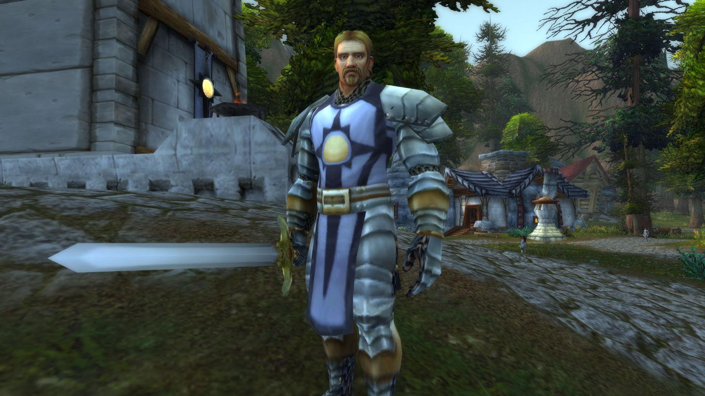

# 回家

2022年12月，作者：法瑞雅

前文：[宁神花](../people/zhi-re-zhi-xin-qi-shi-tuan-jiu-ri-qi-shi.md#ning-shen-hua)


[zhi-re-zhi-xin-qi-shi-tuan-jiu-ri-qi-shi.md](../people/zhi-re-zhi-xin-qi-shi-tuan-jiu-ri-qi-shi.md)


## 回家

是土地，还是土地上的人以为家？或是以一个圣骑士所坚信的一切？

她梦见了他们的死亡，一个接一个，死于感染亡灵瘟疫后战友们的剑下。死于所谓的冒险者之手。死于“宽容”的银色北伐军的圣光灌注。壁炉谷血色十字军首席审问者詹姆·韦沙斯的死，仍然缠绕法瑞的梦境。大团长法瑞雅·图尔加斯在炙热之心骑士团的暴风城驻地卧室里，辗转反侧，往昔入梦。

法瑞曾是审问者詹姆·韦沙斯的副手。你对韦沙斯尖叫，你把话对法瑞说，连地下室里的亡灵都知道。韦沙斯手上沾满了亡灵的鲜血，也可能因此不慎感染了瘟疫。壁炉谷里的血色十字军，不会容忍任何污染，他们会把他也关进地下室。虽然不会审问他，但恐怕那漫长的死亡和最终的变异，才是真正的折磨。所以韦沙斯恳求法瑞杀死他，他说：“杀了我，很快地杀了我。”

“我……”法瑞迟疑道。

“记得，壁炉谷永远是你的家，无论你以后会去哪……”韦沙斯虚弱地说，他仿佛已经是那死者，是那最后的末时，“我没有希望了，但你不是……我一直认为……你会做一些我们都做不到的事……你会不同，法瑞……杀了我，圣光啊。”

她杀死了他，短剑刺进心脏，干脆利落。虽然她犹豫过，虽然她浑身都在发抖。这是她对韦沙斯最后的记忆，他不会死而成为亡灵，他不会吃下血色十字军的苦果。那么她呢？仅仅是不用韦沙斯用过的房间和工具，仅仅是向圣光祈祷，就能得到圣光的怜悯，握住自己的命运吗。命运对任何一个洛丹伦人都残酷。

后来她仅仅是呕吐了，就误以为自己已经感染了亡灵瘟疫。韦沙斯已经不在，没有人会仁慈地杀死她。她想过用同样的短剑结束自己的生命，她不会死在她每天工作的地下室里。她知道血色十字军会对她做什么。死亡还是成为亡灵，不可能选择后者。她知道。

但她记得，记得韦沙斯说的话，你会不同，他说过。她逃出壁炉谷，爬上去南方的船，但她没有丢弃血色十字军的战袍。她永远不会忘记，自己曾经看着韦沙斯用宁神花浸泡热水的淡香，掩盖血腥味已经十五年了。

在大海中摇曳的船上，她吐得更甚，但法瑞只是头晕目眩，用斗篷紧紧地包裹住自己。在海上流浪，逐渐变成亡灵，不再是一个活人。她每一天都活在恐惧之中，直到她不再呕吐。直到她在暴风城港口下船，到了全然陌生的城市。又在闪金镇狮王之傲旅店那命定的一个下午，遇到了帕拉斯圣剑。一个新生的骑士团——炙热之心骑士团，那团烈火收留了她。

见到帕拉斯圣剑的那一刻，法瑞从梦中惊醒。她的卧室在骑士团驻地的顶楼，看那暴风城的昔日繁华。但她在夜半突然醒来，再也睡不着。她走到暴风城的街角花园，在星辰之下祈祷。

骑士团的叛徒——莉莉·丹玛斯死前曾控诉，说法瑞已经背弃了洛丹伦的荣耀。在南方与贵族们的交流，早已让她忘记洛丹伦大地彻夜的苦痛。虽然更新了的炙热之心骑士团吸纳了血色十字军成员像朱斯提尼阿诺，但骑士们胸前佩戴的不再是血色十字军的纹章。和平的南方国度，纵然联盟的远征不断，始终富饶安定。

然而没有一个北方人会忘了洛丹伦。

末日的传唱者，再一次出现在暴风城的街头，他们说将会有一个冬天，遮蔽艾泽拉斯的日光。英雄们会为此再次踏上远征，也包括法瑞，但这一次，她想回一次家。暴风城如今已经开通了去往壁炉谷的狮鹫航线，跨越整个大陆的旅程，不再只有漂泊的船只了。狮鹫飞翔只需要五天的时间。她想回家。

南方的一切政治纷争，于她而言，又算是什么？法瑞在炙热之心骑士团的驻地卸下她的审判铠甲，烈火纹章，锁好命运圣剑。或许有的英雄会想要荣归故里，但法瑞只想在壁炉谷再看到曾经熟悉的面孔们。或许在天灾乱世之中，仅仅是活下来，便是荣耀。曾经，他们都是血色十字军。

没有人知道银色北伐军“夺回”壁炉谷的时候，对其中的血色十字军做了什么。审判，杀死，放逐？又有什么区别。为洛丹伦活着战至最后一刻，还是最终死在自诩正义的银色北伐军手中。银色北伐军中甚至有亡灵，这也是朱斯提尼阿诺与他们永不和解的原因。法瑞出于政治目的，并没有公开反对银色北伐军，但在她内心深处，那抹血红永不退色。没有亡灵，没有救赎。

她知道联盟早在地图上都已经将壁炉谷重新画作银色北伐军大领主提里奥·弗丁的势力范围，但弗丁已逝。北方暗流再起。因此她选择抛弃自己一切圣骑士的装束，只是穿着长裙和紫色斗篷，就坐上去往壁炉谷的狮鹫。

<figure><figcaption></figcaption></figure>

五天后狮鹫降落在壁炉谷时，空气中的亡灵腐化大地的气息，甚至都已稀薄。林地里有鸟鸣，新生的声音，但没有了旧时的人。“我回来了，”法瑞对自己默念。血色十字军的旗帜早已被撕下，四处都是穿着银色盔甲的银色北伐军人，他们的战甲反射着阳光，耀着眼。

一时间法瑞只感到无所适从。

“包容”的银色北伐军中，不乏血精灵和兽人，但他们容不下血色十字军。场地里仍种着宁神花，但已经不是为了用作洗去双手上的血腥味。洛丹伦的命运，是不包容，是鲜血。明明她回家了，却只感到陌生。

好像有什么绝望之忆，被抹掉了。

没有人认得她，没有人在乎。城堡场地的正中央，是提里奥·弗丁手持灰烬使者的雕像，斯人已逝，圣光永存。无论他做了什么，他始终曾经是她的领主。法瑞在雕像前跪下祈祷，然而会这么做的人，不多了。洛丹伦正在忘却。

周围没有一个熟悉的面孔，法瑞只是走进了铁匠铺。她知道她会在那看到……她的双眼看进莫里斯·凡特的眼睛。莫里斯永远不会忘记法瑞的蓝眼睛，那双眼睛里有一切坚韧不灭决心。“你……”莫里斯支开学徒，关上铁匠铺的大门才说道，“还活着。”

“莫里斯，圣光啊，”法瑞几乎落泪，这是她在壁炉谷里见到的唯一一个她曾经认识的人。至于其他人……消逝在圣光的不顾一切之中，圣咏里不会留下名字，“你怎么样了，还在制作武器吗？”

“我以为你已经死了，自从你失踪以后……我去找过你，”莫里斯皱眉道，然而声音逐渐嘶哑，最终说，“你不应该回来。这里不是家。”

这里不是家。

“是他们吗，壁炉谷城破之后，银色北伐军做了什么？”法瑞黯然道。她看到莫里斯脸上的一道伤疤，但他如今佩戴的银色北伐军徽章上没有鲜血，只有炉里的灰烬。莫里斯不去看法瑞。

“血色……我们并没有很多抵抗，死战到底的人，都死去了……”莫里斯仍是说出了往事，他艰难地吞咽，“我还在，因为我的技能对他们有用。至于其他人，骑士杜尔根独自战斗，被乱箭杀死。猎人莱德雷和你一样，失踪了。保卫者洛瑞克带着剩余的人投降，但被审判，判决是流放。”

“以显示银色北伐军的仁慈……”法瑞愤然道，“在洛丹伦，流放等同于死刑。”

“所有人都要宣誓与血色十字军誓不两立，忏悔从前的罪过，跪在雪里，”莫里斯的话音里甚至微微发抖，不知是痛苦还是怒火，他说道，“我照做了，但是……”

“你不可能一个人对抗整支军队，”法瑞安抚旧友道。她甚至召唤圣光，为他祝福。人在圣光中，难道不是就没有了恐惧？圣光一点点流淌进莫里斯的身躯，温暖他的心脏，如果他有心。

“不，我没有‘对抗’过，”莫里斯急促道，拿起打铁的工具，又放下，“你不该回来，法瑞。你真的不该回来。我很抱歉。”

“什么？”法瑞试图伸手去够莫里斯的肩膀，但他走去打开了铁匠铺的门。

莫里斯对着门外巡逻的银色北伐军喊道：“这里有一个隐藏的血色十字军，就在我的铁匠铺里。处理她！”

“莫里斯……”法瑞最后说，便被两个银色北伐军押走。她虽然没有穿着盔甲，没有手握命运圣剑，但她可以选择用圣光战斗。她是一个强大的圣骑士，炙热之心骑士团的大团长。但她不能公然用圣光杀死银色北伐军，激怒整个联盟。她被押走时，身旁的血精灵和兽人也看着她。壁炉谷已经很久没有血色十字军出现了。

但仅仅是听见血色十字军这个名，就足以震慑人。那些为家园战斗到最后一刻的圣光武士，那些不息以鲜血染红大地的狂徒。和依旧猛烈跳动的心脏。

<figure><figcaption></figcaption></figure>

他们将她带到正在训练场旁监督新兵的代领主米纳尔前，扯掉斗篷，按跪在地。法瑞连呼吸都没有变得急促，她是一个强大的圣骑士。这些年的经历，练就了她的体魄和内心。跪在壁炉谷的场地上，她去看那熟悉的林地，玛登霍尔德城堡的城墙，阳光太刺眼。她不过是想回家，但壁炉谷不是家。

铁匠莫里斯·凡特没有多看法瑞一眼，或许是不愿。他只是低声和代领主米纳尔交接了几句，就离开了此地。米纳尔严厉道：“他告诉我，你曾经是壁炉谷的血色十字军首席审问者，你的双手沾满鲜血。血色十字军，你必须如实回答我的问题，因为你犯的罪，不可轻恕。你叫什么名字？”

“法瑞雅·图尔加斯，圣骑士，”法瑞抬头道，看进米纳尔的蓝眼睛，她的红发和她的眼神一样令人难忘，“壁炉谷人，从南方回到这里。”

米纳尔皱眉，他虽不是圣骑士，但也能感受到法瑞身上散发出的凛冽圣光气质。她很可能是一个常年使用惩戒之力的圣骑士。虽然她手无寸铁，但如果她足够疯狂，一如她从前为血色做的那些事，她可以杀死许多银色北伐军士兵。米纳尔警戒着把手放到剑柄上，如果法瑞有任何攻击性，他会不惜砍下她的头颅。

“既然是圣骑士，你一定有效忠的组织。告诉我，”米纳尔说。

“炙热之心骑士团……”法瑞轻声说，她迟疑了，但仍然说，“现任大团长。多年前我离开壁炉谷去了南方，被炙热之心骑士团团长收留，训练成圣骑士。我不会玷污骑士团的荣耀。但你们……又对血色十字军做了什么？”

“炙热之心，我听过这个名字，”米纳尔示意银色北伐军放开法瑞，让她站起来。他更不愿陷入南方各势力的争斗。一个人曾经是血色十字军，难道就一辈子都是血色十字军吗？他其实并不能体会，他本人是南方人。因此对炙热之心骑士团，也有耳闻，“我们驱逐了血色十字军，收留了愿意归顺我们的人。大团长，这里是你的家，我明白。想必你对壁炉谷有不死的热诚……”

“……但是血色十字军的时代过去了，看开吧，”米纳尔向法瑞伸出一只手，但法瑞没有去握，“放下过去，和我们一起净化洛丹伦。你和你们的骑士团，也曾经在这里战斗过。你们在南方虽然有根据地，但你们是北方的骑士。归于故土，还有什么比这更重要的？只是……”

法瑞安静地听着，没有打断，也没有肯定。

“只是银色北伐军的军令是，驱逐或者收编血色十字军，”米纳尔收回手，另一只手仍按着剑柄，“如果你发誓谴责血色十字军所做的一切，和你的过去彻底决裂。也就是说，忘了血色十字军。你就可以回家。”

是选择忘却自己曾经拼尽最后一口气守护的一切，还是选择回到早已忘却了的故土？她是一个洛丹伦人。为了失落的洛丹伦的荣耀，她才活在艾泽拉斯。那一刻法瑞甚至感觉到连圣光都黯淡了。这么多年来，她从来没有面临如此撕裂的选择。

“但你已经知道我的选择了，”法瑞说，“忘记就是背叛。”

“仅是因为你是大团长，我不会审判你。但是你的罪恶，圣光看在眼里，”米纳尔最终说，“你必须马上离开壁炉谷，并且再也不能回到这里。”

法瑞离开壁炉谷时没有回头。多年以来，她学会了隐忍痛苦，但永远不会忘记仇恨。鲜血染红了洛丹伦的旗帜，在夕阳的余晖中挣扎。她永远不会忘记，即使再也不可能回家。回家。
