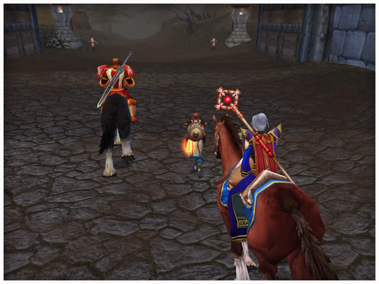

# 圣之殇

作者：艾卓拉司，2007年

这是个响亮的声音：“种族并不代表荣誉，我知道有些兽人，他们像高贵的骑士那样可敬，也知道有些人类，他们像最残忍的亡灵天灾一样邪恶。”

被流放的骑士，伤心的父亲提里奥·佛丁

## 一、相遇

西瘟疫之地。这里之所以被称呼为瘟疫之地，是因为五年前那场可怕的灾难。现在这片腐败的土地上，亡灵和僵尸泛滥成灾。看着这一切凄惨的情景，艾卓拉司心中一直隐约疼痛着。她的家也在五年前被亡灵瘟疫给摧毁了，如果不是圣光之愿兄弟会牧师的搭救，当时只有弱冠的她也许也成为了那些眼神空洞，浑身腐烂的亡灵军团中的一个。想到这些艾卓拉司的身体不禁有些颤抖。

“主教大人，您还好吗？”边上一位全副武装的女骑士将马驱策向前关切的问道。“我很好，也许现在是我被暗影力量捆绕后最好的日子，法瑞。”艾卓拉司笑着对她说。法瑞点点头，继续将马向前驱策。法瑞女士与艾卓拉司是同乡，并在她被暗影捆绕迷失的时间里给了艾卓拉司最大的帮助。此后法瑞提出来一起去寻找传说中的大英雄，被流放的骑士提里奥·佛丁，她希望从这位圣光英雄那里可以帮助自己的主教摆脱捆绕。

长久以来提里奥·佛丁的名字在所有丹洛伦人的耳朵中都是响亮的。但是在五年前兽人大规模叛逃的战役中，他却因为私自放走一个兽人囚犯而被议会放逐了。艾卓拉司很好奇，尽管在无数的官方文论中，这位提里奥·佛丁都被批得体无完肌，但还是有很多人在传诵他抗击兽人的伟大事迹。

“也许法瑞说的没错，我可以从他那里得到指点。”艾卓拉司暗暗想着。

“快看过了那条河，也许我们就可以找到提里奥·佛丁了。”法瑞指着一座旧丹洛伦风格的桥梁兴奋的说。作为一名炙热之心骑士团的成员法瑞一直喜欢追寻这些传说中英雄的踪迹，这次也不知道她又从何处得来的信息，掌握了提里奥·佛丁的隐居地点。

“也许法瑞黑暗之门打开的话，你会跑去寻找图拉杨吧。”艾卓拉司半开玩笑地说。

“为什么不，我真希望他们还活着，那样我就能见到他了。”法瑞自信地回应道。

说话间，他们已经过了河，在延河水南下了一段距离后，他们遇到一位身形伟岸的男子在攻击一只巨大的食腐蛆。因为亡灵天灾的缘故，这些蛆贪婪地吸收大地的营养而变成了怪物。

“法瑞我们去帮他。”艾卓拉司下马开始祈祷神圣的治疗力量，而法瑞则拿去斧子冲了上去。在三人合力的攻击下，很快食腐蛆倒下了。

那男人马上拿起小刀，在切割蛆的肉。法瑞则站在那里一声不响。

“你没事吧，战士，一人在这里很危险。”艾卓拉司走了上来，他看到一个留着山羊胡子的男人在将蛆肉放进背包，在男人身后则是一个大铁锤。

“您是，是提里奥·佛丁大人对吗？我看过您的画像。”法瑞突然激动地说。

那男人将头抬起来打量着法瑞和艾卓拉司。“我是提里奥，小姑娘，我只是个被流放的人不是什么大人了。”他淡淡的说道。

“您真是提里奥大人，您好我们是炙热之心骑士团的……”

“好了小姑娘，你来这里有什么事？也许你该明白我不再待在城堡里有人伺候饮食了，我需要更多的蛆肉来喂饱自己。”提里奥整理着行装一边牵来了一匹棕色的马。

“也许我们可以帮你，我们在这里有驻军，只要给我们点时间大人，我可以……”

“不 ，不，也许动起你的双手才是在瘟疫之地的生存之道。”提里奥继续打断着法瑞和艾卓拉司的话。

当他准备离开时，艾卓拉司拉住了他的缰绳。“也许我和法瑞女士可以帮您，我们愿意帮你收集蛆肉。”

提里奥微笑了一下，并行了个礼。“那么辛苦你们了小姐们，也许你们收集够了1个月份的，就可以在河岸最南边找到我的营地了。”他说罢驱马离去了。

“我觉得他不像提里奥大人，”艾卓拉司突然有些后悔答应这个男人的要求。

法瑞则坚定地上马“没错就是他，也许这些都是考验呢？”

艾卓拉司点点头，尽管她心里觉得这是他遇到过的最怪的骑士考验。“那么我们开始吧，我希望能早点和他谈谈。”

经过了一天的猎杀，在黄昏的时候法瑞和艾卓拉司终于凑够了1月份的蛆肉，并将它们带到了提里奥营地。

“我要谢谢你们，年轻人，你们能忍受一个傲慢的老头，那么这证明你们都是圣光的追随者。”此时的提里奥完全换了一个人，他目光坚定，并彬彬有礼地向法瑞和艾卓拉司行骑士礼。

“我很荣幸能见到您，也许您能帮助我解除一些困惑。”艾卓拉司恭敬地向提里奥请教起来，法瑞则开心地在傍边用营地的炉火展示她美妙的厨艺。

“你是说你被暗影的力量控制着？”提里奥问道。

艾卓拉司微微地点点头，“我害怕自己以后堕入邪恶。”

“你不会的，我从你的眼神中就看出来了。”提里奥擦拭着战锤语气坚定地说道。

“可是暗影的力量是……那些恶魔术士……”

“术士就一定是邪恶的吗？如果您能将这些力量控制好并像现在这样来打击邪恶，这并没有错。” 提里奥站起来严肃地对法瑞和艾卓拉司说：“种族并不代表荣誉，我知道有些兽人，他们像高贵的骑士那样可敬，也知道有些人类，他们像最残忍的亡灵天灾一样邪恶。同样的我们不能以出身和外表来判断一切。”

“那个兽人是指您放走的那个吗？”法瑞问道。提里奥笑笑说：“也许在享用完你的手艺之后我们再谈谈我的故事。”

在夕阳下，三个人围坐起来，很快夜幕就降临到了这片不幸的土地上。

## 二、家人

“是啊，催依格，那个崇高的兽人战士，我希望他现在比我过的强。”提里奥·佛丁仰望着星空向2位陌生的年轻小姐讲述着他以往的故事。

“我觉得这不公平。”艾卓拉司在听完故事后感觉自己苏醒时刻的自卑是多么的愚蠢，同时也为这位英雄的遭遇而唏嘘。

“没什么公平不公平，我现在只是看重当下的事情。说实话我也有没有完成的心愿。”提里奥微笑着说。

“是什么？是敲碎那些骷髅还是帮助恢复您的名誉，我们一定帮助你。”法瑞激动地站起来，仿佛马上要去战斗一样。

“你们今天已经够累了，还是早些休息吧，我的小房间里可以给你们使用，请让我像个骑士一样为女士站一站岗。”提里奥拿起战锤表情十分肃穆。

法瑞和艾卓拉司知道自己再坚持什么也没有用，只要走进房间。

“也许我们可以像仕女一样为我们的骑士大人打扫一下房间。”两人相视一笑。

清晨并没有为瘟疫之地带来清新的空气，因为这里习惯了腐败的滋味。艾卓拉司昨晚并没有怎么睡去，她一直在想提里奥的的心愿。

艾卓拉司没有惊动还在睡觉中的法瑞，而是悄悄走出门口。她看见佛里奥迎着河面，在低头看着一张纸条，不时仰面叹息。“大人，你还好吗？”提里奥的思绪显然被这个轻柔的声音给打断。

“我没什么，牧师小姐，只是有些想念家人，你知道这是人之常情。”提里奥爽朗的笑道。

“我也时常想念家人，这里就是我的家，只是家人已经不在了。”艾卓拉司黯然地说道。

“如果你的家人还在，你会怎么做？”提里奥问道。

“寻找他们，不管怎么样也要见到他们。”艾卓拉司突然感觉胸口一紧，一种悲伤的情绪在身体内翻滚。

“我，没有你这样的勇气。”提里奥的眼边还有残泪，但他依旧表情坚强。“我的儿子泰兰，我知道他还活着，可自从他成为白银之手骑士团的成员后，我再也没见过他，这是我以前给他写的信笺，我现在只能依靠这些来缓解我的思念之情。”

艾卓拉司现在明白了再传奇的人也有凡人的感情。“您可以去找他，我想，作为一位英雄的儿子是多么的荣誉。”

“你错了，我自愿放弃圣光之力，在他心中也许我只是个耻辱的存在吧。”

“大人我想没有儿子不想见父亲的，尽管我们是外人，但也许可以帮你穿针引线。”后面传来了法瑞的声音。“主教大人，你也不叫醒我，我想我们今天该有些事做了。”法瑞调皮地伸了个懒腰。

“你们真的愿意帮助我，我很高兴。我不是个固执的骑士老头了，我只希望能让我的孩子走回正确的道路，他迷茫地离开了白银之手骑士团，这是我最悲伤的。”提里奥严肃地说。

“那么我们该怎么做？”法瑞急切地擦拭着战斧。

“泰兰7岁的时候我送给他的。这个玩具是他最珍爱的礼物：一只小小的战锤，那是我的战锤的复制品。在我因叛国罪而被驱逐出去的时候，他妈妈告诉他我已经死了。他被带到了我的“坟墓”前，就在南边的墓室旁边，把那只小战锤和对我的记忆永远地埋在了那里。我想如果能找到这个玩具，也许可以唤回我和泰兰共同记忆。”

法瑞和艾卓拉司骑上马跑出提里奥的营地。看着提里奥挥手的背影，他们更加坚定了完成老人心愿的信心。

“这也许也是对我的一次救赎吧”艾卓拉司默默地想到。

## 三、旧画像

“大家轻点。”艾卓拉司耳边又一次响起了精灵的警告声音。斯坦所母。一座被天灾诅咒和噩梦缠绕的城市。自从踏入这里的第一步开始。艾卓就感受到了什么是真正的绝望。

“发什么呆，小妞。”突然一只手拍在了艾卓拉司肩膀上。艾卓回头一看一个戴着黑口巾的男人正对着她吹口哨。

“拇指先生，如果你在不停止你的行为，我会让你挨上几下的。”在不远地方蹲着的法瑞用急促地声音小身警告道。

“好吧。一群没趣味的小妞。”男人摆了摆手。前面的铁门慢慢被打开。一个精灵的声音再次响起：“大家小心点，要动手了！”

就在两天前法瑞和艾卓拉司出发帮助提里奥佛丁大人寻找他送给孩子的玩具。这个任务对于两位骑士团的小姐来说没什么难度，很快她们就拿到了那个木锤。期间，法瑞提出来去见见驻扎在东瘟疫之地的银色黎明，他觉得也许他们能够提供提里奥大人一些帮助。当他们来到圣光之愿大教堂时，银色黎明的卫兵拒绝了他们的请求。

“比起那个叛徒，我们有更多的事情要做，白银之手骑士团做不了 的，我们会完成。”卫兵毫不客气地说。原来在那里他们正在和血色十字军进行联合的谈判。

“和那群疯子谈判？该死的，难道他们已经丧失原则了吗？”艾卓有些激动。法瑞则低下头没有说话。艾卓拉司想起来，法瑞与血色十字军的渊源，感觉到自己刚才太过失礼了。

“无论如何，让我们来帮提里奥大人好了。”经过短暂的沉思，法瑞又变得精神抖擞。

“真是个意志坚定的女孩。”看着法瑞的样子，艾卓拉司时常感叹自己太过多愁善感。

随后在提里奥大人指引下，法瑞和艾卓又找到了泰兰丢失的战旗。看着这面白银之手的战旗。里提奥老泪纵横。

“我想最后就是缺少那张旧照片了。当泰兰还是孩子的时候，我们全家经常去凯尔达隆度假。我们最后一次去那里时，一位名叫瑞弗蕾的艺术家为我们画了一张在湖边漫步的画。这是最能让我回想起与泰兰和卡兰德拉在一起时的美好时光的东西。那个时候我牵着我的妻子和儿子，心中充满了无限的爱意。”提到这些佛里奥的眼神又明亮了起来。

“它在哪里？”法瑞急切的问道。“瑞弗蕾后来搬去了凯尔达隆，我不知道他是否活着。”

“嘿，你发什么呆，快用治疗魔法。”一声洪亮的声音把艾卓从回忆中拉了回来。只见前面法瑞正在招架2个血色卫兵的攻击。后面的精灵猎人也急忙用弓箭掩护着她。

而那位戴面罩的拇指则向艾卓高声吼叫。“圣光请为我们的勇士送去力量，恢复他们的健康。”

艾卓发动治疗祈祷。法瑞也越战越勇，最终将2个卫兵被击倒在地上，晕了过去。

“我希望越少伤亡越好。”法瑞无奈地说。他们一行终于走进在斯坦所母血色十字军的营地大门。

“大家休整一下，准备用隐型药水。”精灵猎人一边安抚着宠物，一边说道。他是啊卡斯炙热之心骑士团的王牌斥候，也是帕拉斯指挥官派来援助法瑞和艾卓的。

“小妞你别老走神好不好。”戴面罩的是个海盗叫拇指布来克，尽管他的言行在这个小队中格格不入，但艾卓不得不承认在攻击敌人方面他是个好手。

“我会集中注意力的，你也不用担心报酬。”艾卓冷峻地说。

“那最好了， 我去把大门关上，你也知道亡灵很喜欢偷袭。”拇指讪笑着向门口走去。

“斯坦所母，那画像在那里？”在凯尔达隆法瑞和艾卓从瑞弗蕾口中知道了画像的下落。但它所在的地点却让两人十分为难。

“那是被叛徒阿尔萨斯毁灭的城市，里面到处都是亡灵。法瑞我们2个绝对进不去的。”在马上艾卓很是担忧，“我们去寻找一些骑士团的援助吧，也许也可以在附近的旅店找些愿意为财宝去的冒险者。”

法瑞坚定地说，“嗯事情到了这一步，我们没理由退缩。”

３天后，帕拉斯大人派来了最好的斥候阿卡斯来到瘟疫之地进行援助。期间法瑞和艾卓还找到一个在西瘟疫之地游荡的退休海盗拇指布来克，他表示也愿意为了那沉沉的钱袋出点力气。

“我不太想伤害血色的人，”在冒险前的讨论中，法瑞反复强调了这一点．

“为什么？那些人据说还很有钱，”角落里拇指用很调侃的语气说道，

“我们不想因为细节问题而背叛原则，我们不是银色黎明那些家伙。”艾卓看了看法瑞的脸，感觉到了这个倔强女孩内心的激烈斗争。

“那么我有个主意，用这玩意。”阿卡斯拿出了一个绿色的瓶子。“隐形药水。”

拇指笑了笑。“看起来从打劫变成了小偷小摸了。”

“来之前，帕拉斯指挥也想到了避免和血色作战的问题，毕竟他以前就在里面服役。所以这是我们最好的办法。大家觉得怎么样？潜入进去寻找画像。”阿卡斯看来已经有了一个计划。

“就这么办吧，我们两天后再出发。“艾卓点点头，她也不想法瑞再陷入那种为难的挣扎之中，尽管这个计划更费时间也很有风险，但是却是目前他们唯一的选择。

“我很奇怪，这里的人都变成了亡灵，而这些没脑子的血色十字军，却一点事也没有。”在堡垒的最下层，拇指突然提出了这个问题。

法瑞厌恶地看了他一眼“那是圣光的力量，你不会明白的。”

“圣光？我7岁就不相信这玩意了，你们真是麻烦，用隐形药水我们进度慢了一大段。”

“安静点。我们只是不想对有共同目的力量造成什么伤害，毕竟大家都要抗击天灾”阿卡斯用低沉的声音说到。

“看那里”猎人用手指了指一个没有守卫的房间。“根据情报，那画像就在那里面。”

“那么我去吧，我怕牧师小姐又因为我走神。”拇指嘻皮笑脸地走上前。艾卓身体有些紧张，长时间蹲着走让她双脚发酸。但是任何剧烈点的动作都会让隐型药水失去效果，而在他们周围有不少血色卫兵在巡逻，所以她只能忍着。

“到手了，我们走吧。”不一会儿拇指回来了，并拍了拍他的小腰包。一行人开始向门口走去。

“大家抓紧只有10分钟的效果了。他们也快派巡逻队出门了。”阿卡斯提醒道。这时艾卓似乎松了口气，想到提里奥大人也许很快能看到这张旧画像，她忘记了酸痛又继续前行。

“这是你要的画像，还有给我我的报酬。”在圣光兄弟会的营地中，冲出斯坦索姆的一行人正在休息。而拇指则很快拿出了画像要求报酬。

“这是字据，你可以找帕拉斯指挥官要钱，我们骑士团一定信守诺言。”阿卡斯递给了他一张纸条。

“什么？忙活半天就他妈的就给我这个，没钱让那两个漂亮小妞陪我一晚也行。”拇指咆哮道。

“你再说我就割了你的舌头。”法瑞愤怒地亮出了斧子。营地里的人都很紧张地看了过来。

“好了拇指，我们不会欺骗你。阿卡斯可能要麻烦你一次和他一起去见帕拉斯大人了。”艾卓站起来阻止了冲突的到来。

“没问题，走吧海盗，两位女士真发火的话也许你会变成亡灵的。”啊卡斯笑着走出营地大门。

“谁在乎呢？我只要钱，再见了漂亮小妞们。“拇指将画放下耸了耸肩膀跟了出去。

“这就是年轻时的提里奥大人，真是个美满的家庭。”男人们走后，法瑞迫不及待地看起了画像。

“我们要保管好这张画像，也许里面珍藏着的是2个伟大骑士高贵的心。”艾卓闭上眼睛默默地为这个家庭的重新相聚而祈祷。

## 四、爱与恨

“对就是这张画像。”提里奥用手深情的抚摩着这张画着自己和家人过去幸福生活的画像，眼泪从他长满皱纹的脸上缓缓落下，落在画像上化成了点点墨斑。“我想见到，我真的很想见到他，泰兰我的儿子！我知道现在血色十字军已经变质，他们只是把泰兰作为工具而已，可惜这个孩子一直都不明白”提里奥遥望着远方的炉壁谷，双手紧握着锤子。

“大人我们也许还可以为你牵线的。”法瑞恭敬的和他说道。

“不可能的那些血色十字军已经蒙蔽了他的双眼，他如黑暗中的羔羊徘徊而不知道方向。”提里奥坚定的摇头。

“我以前也是他们中的一员，他们并不是全部都如您想的那么糟糕。”法瑞络了一下头发说道。“我们不能确定您是否真有勇气去见泰兰，因为您对自己的儿子的判断能力根本没有信心，我想没有孩子不会想念自己的双亲，除非他把灵魂卖给了恶魔，而泰兰我绝对不相信。”法瑞的话不但打动了提里奥也打动站在一旁许久的艾卓拉司。

还记得吗叔叔我在您的酒店里玩耍？还记得吗？妈妈您老是轻声呵斥调皮的我，还有爸爸你每次干活回来都给我带来那美丽的野花。不我的思念已经被亡灵天灾毁灭了，绝对不能让又一份亲情就这样断裂。

“大人我愿意和法瑞一起去帮您给您的儿子带消息！这不但是为了你，也是为这片痛苦土地上所有失去亲人的孩子！”艾卓拉司抓住提里奥的手，眼泪忍不住流了下来。“看起来是我触及了你们这些孩子的过去，好吧这之前我建议你们找找女巫麦兰达，他也许有好办法让你们混进炉壁谷。”

很快女巫麦兰达的一个魔法让法瑞和艾卓变成了血色十字军的摸样。

“听着别乱做剧烈运动不然你们的伪装就完蛋了，哈哈哈哈。”听着女巫尖锐的笑声，两人缓缓骑马向炉壁谷出发。

“口令！女士”

“为了圣光的荣耀。”在一个个岗哨，法瑞熟悉地报着口令，很快他们就深入到了炉壁谷的内部。

“法瑞说实话，你是不是很留恋血色十字军？”艾卓拉司轻声问道。法瑞一直是个热情的骑士但是一提到血色十字军的战斗她就有些犹豫。

“我在这里长大，如果可以我一定会再回到这里，只要血色十字军变回以前的摸样，其实我们在帮提里奥大人不如说是提里奥大人在帮我们，我们心中结还是要自己来解开。”

艾卓拉司点了点头。是啊心结，爸爸妈妈我曾经多么厌恶这块土地现在的样子，但是我明白无论它变成什么样这里都是我们永远的家。很快2人已经接近了大领主泰兰。

“什么事我的女士，据说有新的情报？”看着英俊的大领主谦和的笑容，艾卓拉司有些抬不起头。

“是的有一份新情报。”艾卓递上了提里奥的信笺和那个画像。

泰兰看着这些东西，手慢慢变得颤动。“原来都是骗子，我要见他，你们这些骗子。”

“带我去见他吧，还有你们都脱掉这些伪装不然我恐怕控制不了手里的武器！”看着泰兰周围倒在血泊中的血色十字军战士。法瑞和艾卓都惊呆了！

“大领主您是否考虑一下也许我们应该用更和平的方式……”没等法瑞把话讲完，泰兰要已经冲出了堡垒。

“只有战斗和血才能让这些迫害我父亲的骗子们明白亲情是不能被愚弄的。”

当狂怒的泰兰出现在自己夕日的手下面前，这些平时机敏的战士都吓呆了。泰兰很快就解决了几个，其余的战士也发疯了一样扑向了法瑞和艾卓，两人也被迫战斗自保。泰兰在战斗中已经完全没有刚开始的谦和与神圣，而是让人感觉到了恐怖。

“和我来没有人可以阻止我见我父亲，没有人！”高举着沾满鲜血的剑，泰兰冲出了军营。

“够了，泰兰，我给你最后的机会，悔改并忘记那个愚蠢的老头，这样你所有的地位都会保全！”大雨中一个威严的声音响起。一排红色铠甲的战士站在路中间堵住了泰兰一行人的路。

“别藏头露尾了，检查官，你那外表就算打扮的如天使一般，圣光也会绕道而行。”泰兰暗示法瑞和艾卓都准备好战斗。

“你这个小东西，也许我该让你早点去地狱陪那个老头。你放心就算你能找到他恐怕也只有尸体了，因为我派去了最精锐的红衣卫士。至于你哈哈哈。”伴随着笑声一个皮肤黝黑的牧师走上前来指着泰兰。“你将成为我伊森利恩的战利品还有你那2个可悲的同伴！你以为你真的是什么大领主吗？对我来说你不过是很好的工具如你以前发父亲一样！”

“你还是先搞清楚谁是猎物。大检查官！你手上的血还少吗？”法瑞下马亮出了自己的武器和血色十字军盾牌。

“你似乎也曾经是血色的人，很好也许是异端的残余，那么就把你们都干掉！”伊森利恩狂喉了一声，十多个血色卫兵将他们三人团团围住。

“保护好自己这不是你们的战斗，我去干掉伊森利恩。”这是泰兰冲进战阵前最后的话，也成了他一身也许最后的话。

“不……你还要见你父亲！”看着泰兰冲锋的背影，艾卓高喊到。

“我终会见到他的。”泰兰笑着说道。此刻他的脸又恢复了谦和无比的神圣。

我的眼睛越来越模糊了。艾卓拉司感觉到自己圣光保护的法力正伴随着这些红衣卫兵的攻击而减弱。

“你以为你能对抗我？我要抽干你的灵魂！”远处检查官员伊森利恩用强大的魔法将泰兰击倒。

“不！”法瑞刚要冲过去，但是纠缠她的红色卫兵又把她挡住了。

“你叫艾卓吧？该来的终究来了。”艾卓拉司模糊的视线里突然看到了泰兰空灵的躯体。

“我爱这片土地，我也不后悔自己的选择，我相信父亲终会和我见面，在我心中他一直是伟大的。你要好好的活下去！坚强的为了这片土地！”泰兰的躯体距离艾卓拉司越来越远，他的脸上一直挂着谦和的微笑。“我会的一定会的，用圣光保证。”

“艾卓！到我这来！”正当艾卓回过神来，法瑞已经砍倒了2个卫兵，但可以看出她已经很疲劳了。艾卓马上念动祈祷，一股圣光将2个围住他的士兵弹开。

“越来越有趣了哈哈2只挣扎的老鼠。”伊森利恩在一旁一边踏住泰兰的尸体一边准备看戏。

“把你的脚拿开！”艾卓拉司集中意念一道光冲破了伊森利恩保护魔法。

“该死把他们给我撕碎！”伊森利恩捂住左脸气急败坏。“我们会活着，我们有承诺，那是最神圣的承诺！”

“也许要被撕碎的该是你！”一个熟悉的声音这时候想起来了。

“提里奥大人！”

只见提里奥背着银色的大锤骑马而来。

“你！”伊森利恩身体马上抖动了一下，他周围的士兵也有些恐慌地看着他。

“可悲的泰兰，十年了我一直活在阴影和愚昧之中，为一些没发生或者以为将要发生的事情悲哀！现在我不会再这么做了”

“你是叛徒，你已经放弃了圣光！”伊森利恩气急败坏的喊道。

“那么来吧来面对你曾经信仰过的力量吧！”提里奥把银色的大锤重重的砸在了地上。有了这位传奇战士的帮忙，伊森利恩很快溃不成军。提里奥把银色的大锤和神圣的惩罚一起展示给伊森利恩时，一个罪恶的灵魂终于消失了。

“泰兰我的儿子，我重来没想过我们会以这样的方式见面！”提里奥蹲下抚摩着自己孩子的铠甲。法瑞则跪下为这位勇士祈祷。

“我要说大人，泰兰他告诉我他终会和你见面的，而且他走的时候是那么的神圣和光辉，他说您一直在他心中是最伟大的。”艾卓拉司把她看到的一切告诉了提里奥。

提里奥点了点头，“这些就如他亲口告诉我一般，我完全相信。我要重新回到白银之手骑士团，我相信我会以伟大父亲的身份和泰兰再见的。”

最后的结局

艾卓拉司的冒险并没有结束．带着对伟大骑士提里奥的无限敬意和伤感，艾卓拉司踏上了去外域的征途．在地狱火城堡艾卓拉司与骑士团的战士帮助荣耀堡勇敢战斗，多次抵挡住了兽人的袭击，并成功的破坏了大量邪兽人生产的研究基地。

随后艾卓拉司还和一小队冒险者深入过加赞沼泽，但是遗憾地说，艾卓拉司在盘牙水库的一次探索中被纳加袭击受了重伤．骑士团的骑士们将艾卓拉司送回荣耀堡养伤，在一个月后艾卓拉司已经能下地走路了，但是此后就再也没人在外域见到她。

艾卓拉司的想法是既然德莱尼人在如此的逆境下都可以如此的追求解放自己的故乡，那么她完全没有理由放弃自己的家乡提里法斯特林地。后来艾卓拉司继续在瘟疫之地和提里法斯特林地战斗，并一度建立了一支小规模的抵抗组织队伍。艾卓拉司经过长期的观察发现，要永远拯救丹洛伦，必须消灭掉巫妖王的爪牙，克尔苏德加。她曾经试图说服银色黎明帮助她进攻纳克萨玛斯，但是银色黎明认为风险过大，没有接受她的建议。她也想说服炙热之心骑士团帮助她的事业，但是炙热之心骑士团的大量力量被使用与外域的战斗短期内很难提供有生力量。

艾卓拉司只好独自开始带领自己的抵抗小队对纳克萨玛斯进行侦察性的攻击，但是在最近的一次突袭中，艾卓拉司直接遇到了克尔苏德加的化身和大量的亡灵军团，在敌我悬殊的情况下，艾卓拉司的抵抗小队遭到毁灭性打击，她本人也中了黑暗魔法而受到重伤。尽管最后她被抵抗组织的成员救出，但是沉重的伤势仍然无法挽回，而受黑魔法污染的身体很有可能将她的灵魂也腐蚀变成一个怪物，最后艾卓拉司冷静的选择了死去。她在圣光之愿大教堂离开了人士．按照她本人的遗愿，她被安葬在了提里奥大人久居的河边。

“我愿意把我的身体献给丹洛伦，愿圣光的力量继续指引我，用我的全部净化这饱受苦难的土地吧，”这是艾卓拉司的灵魂离开这个世界前最后的呐喊。

不过据一些谣言透露，炙热之心骑士团已经通过一种办法将她的灵魂灌注到某个纯洁的躯体内以便继续让她的意志保存在了这个世界，当然这又是另外一个冒险故事了。

