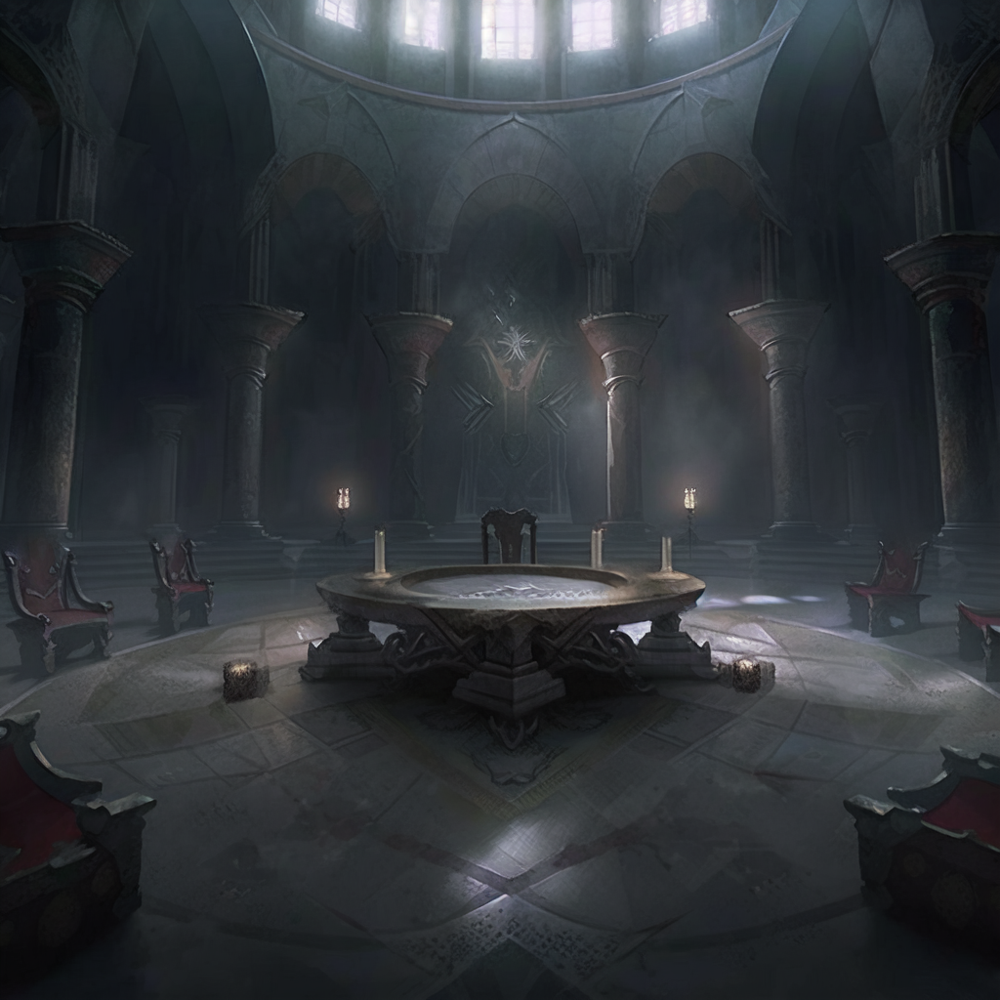
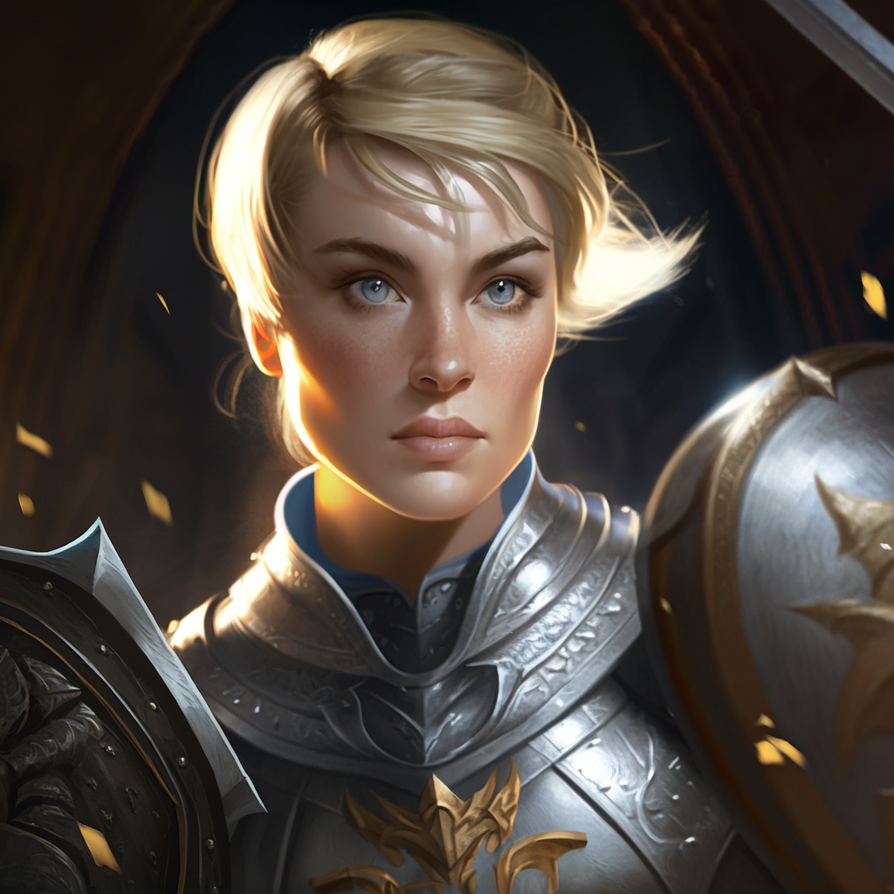
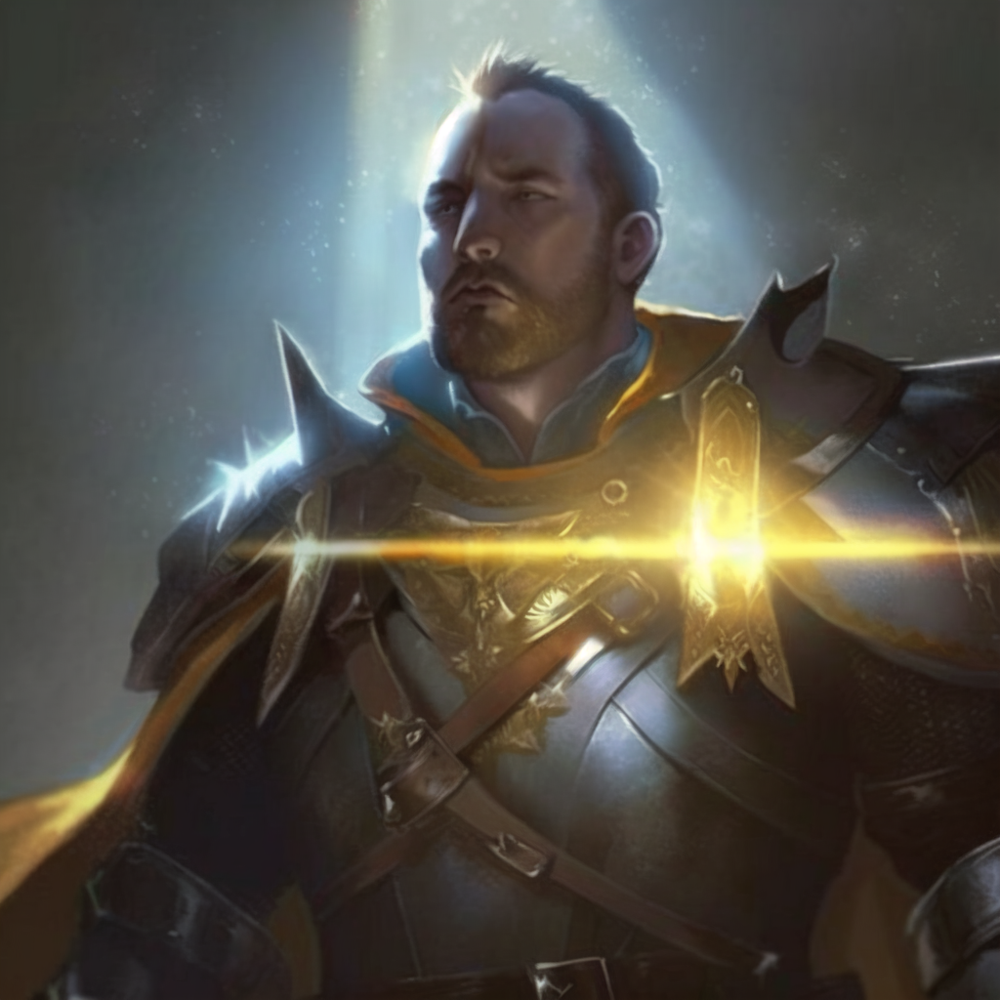
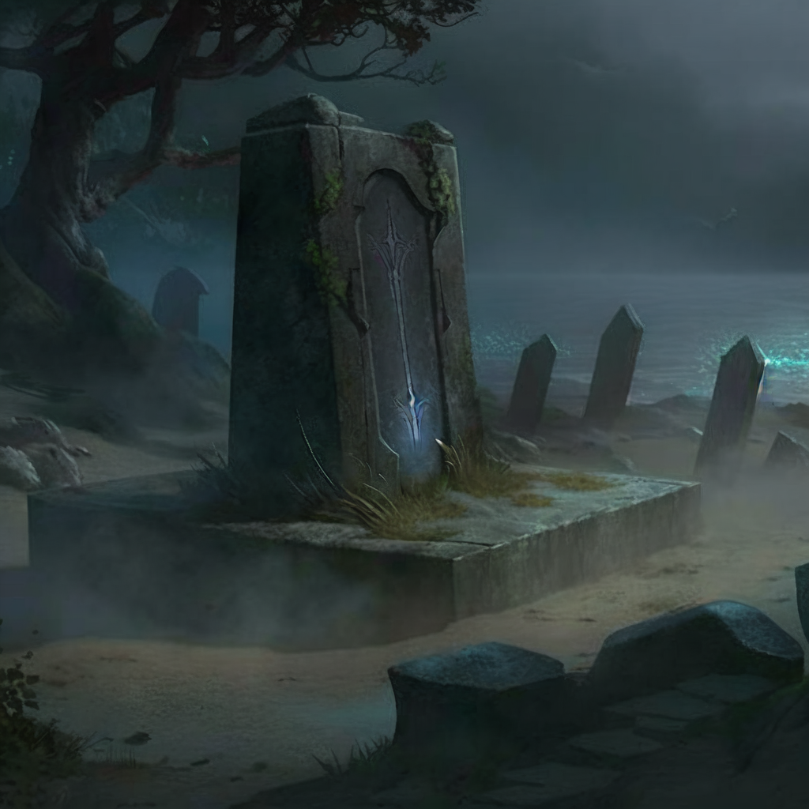
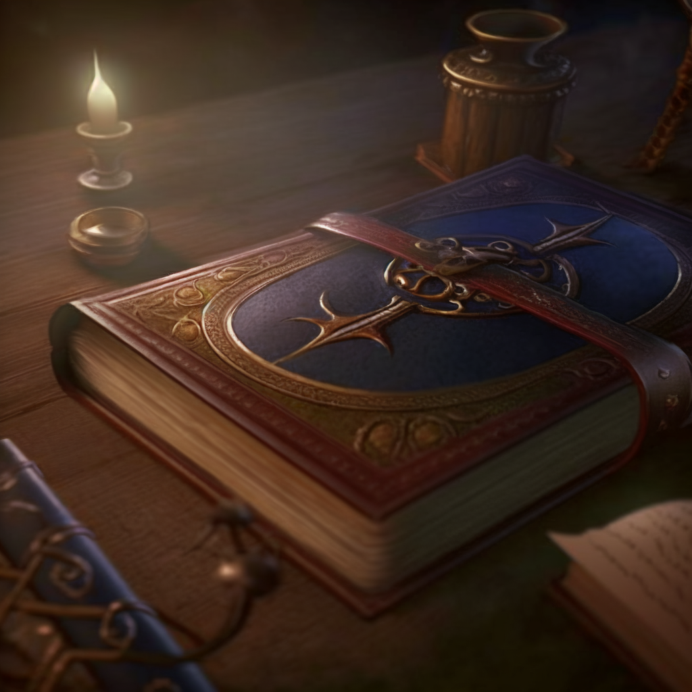
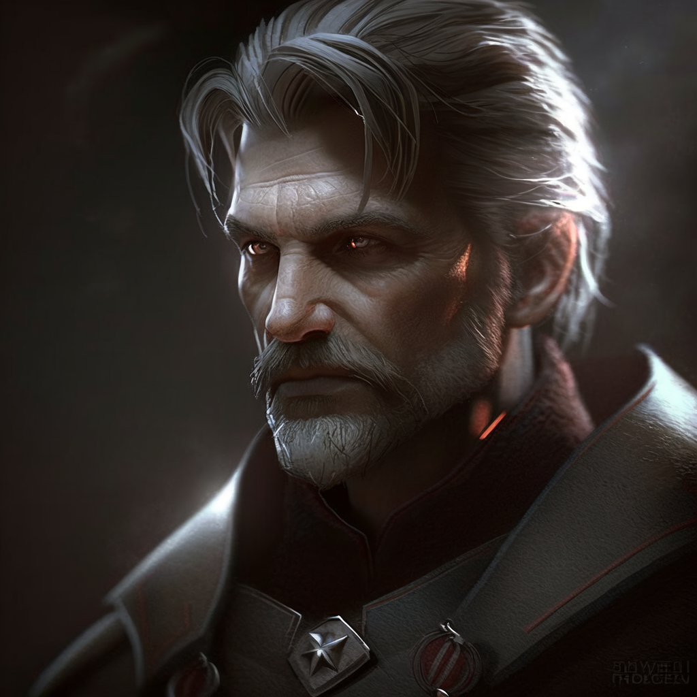

# 牺牲

<figure><figcaption>
骑士评议会
</figcaption></figure>

“圣光里有死亡吗？”年轻的圣骑士阿拉里斯·雪莉问道。

这是炙热之心骑士团的骑士评议会，在暴风城骑士团驻地的圆厅中举行，光从彩色玻璃中泄下，穿透房间中的丁达尔晨雾。法瑞坐在大团长的位置上，三个天威骑士，圣剑骑士以及主教的位置空缺。圆桌周围坐着骑士团各成员，阿拉里斯的问询，让所有沉默的骑士更为沉默。

“圣光能量灌注不但能杀死亡灵，也能让人类痛苦而死，”大团长法瑞雅·图尔加斯最终说，她穿着全副盔甲，圣光的感召让她自内而外散发力量，“圣光中不只有怜悯，更有毁灭。毁灭我们的敌人。”

阿拉里斯点头，她是一个年轻的圣骑士，盔甲擦得锃亮，却未经过战争的洗礼。她是骑士团的图书管理员之一。在这群经验更为老道的骑士之中，她显得青春气息逼人——她对圣光的掌握，停留在祈祷之中，但她有初生的热诚。她问道：“毁灭敌人当然，但圣光会毁灭使用它的人吗？”

暴风城的骑士夏尔曼·哈克尼，坐在阿拉里斯对面，正好回答这个问题，他自信道：“圣光不是邪能魔法，不会反噬使用者。”夏尔曼已经不年轻了，但未晋升至天威骑士之位，一直让他耿耿于怀。他穿着深灰色战甲，有墨绿色邪能般的双眼。

“骑士们，我听说一些圣骑士正在寻找一本叫做真理圣契的失落文书，”光明骑士，法师朱斯缇娅·温特提出今天的正题，她穿着白色法袍，烈火纹章。有一双紫色的双眸，闪烁着智慧之光，“这本已经失传的古代书籍里有一种强大的神术，这种神术可以让一个人在一段时间内被圣光保护，不会死亡。”

圣骑士血色检察官朱斯提尼阿诺听后坐在圆桌前，想要说什么，但依旧沉默。有他在，空气中就有一种冷酷。朱斯提尼阿诺在很多方面都显得无情，例如他的军队的机动性最快的原因是他把所有伤员丢在了大道上任他们自生自灭。罢了，就让夏尔曼继续装模作样吧。

“圣契，曾经每一个圣骑士都会佩戴，如今彻底失传，”圣骑士凯东·费尔康接过话，他是一个已经五十多岁的银色北伐军。朱斯提尼阿诺连回头去看他都不，虽然血色十字军的最后据点只剩血色修道院。但银色北伐军在第四次战争中失去了大量参与者，谁又知道，北方大地上不是暗潮涌动呢？

“炙热之心骑士团的文献，我已经和学者阿拉里斯一同整理，但仍有大量失传的手稿。真理圣契的重新发现，会为骑士团注入信心，而且……”法瑞说道，虽然骑士团内部也有血色十字军和银色北伐军之争，但寻找失落的圣物，是两者少有的不分歧，“而且，我并不认为真理圣契应该落入他人之手。”

“我们不知道这种传闻是否为真，但由于它已经是‘传闻’了，必定有更多圣骑士出发寻找，教会也可能是一个有力的竞争者。大团长，虽然你和教会现任主教格林威治有交情，但不要忘记，教会曾与我们争夺圣剑，”朱斯缇娅提醒道，她的紫眼睛坚定，“我们必须隐秘。”

“也就是说某些‘著名’骑士，最好不要下场，”夏尔曼半是严肃半是嘲弄道，如果这次是由他带回真理圣契，那争夺天威骑士之位，就又多一份筹码。夏尔曼看了空缺的天威骑士之座，内心觊觎，但圣剑骑士的位置，他则不愿坐上。圣剑骑士是炙热之心骑士团的忏悔者，象征公正之镜，沉默的守护者。他也听过“执圣剑者必死于剑下”这句箴言，千真万确。

“还算有道理，”朱斯提尼阿诺回敬道，他一说话，周围的空气就发冷，虽然圆厅中挂满烈火纹章。朱斯提尼阿诺轻声道，“法瑞你不能亲自出征，我也不能。北方的事务，又愈发复杂了。”

“北方又怎么了？”凯东作为银色北伐军的一员，能听出朱斯提尼阿诺话中的讽刺。他经历过诺森德的苦寒，与天灾战斗半生，而血色十字军，不过是一些玷污圣光之名的狂热者。他尊重法瑞，但并不代表……他认同血色十字军。

“银色军队对女妖作乱坐视不理，自食恶果的同时，漠视狼王将洛丹伦卖给被遗忘者。如果这都不算‘伪善’，那是什么？”朱斯提尼阿诺说完，虽然并没有起身离开骑士评议会，但与任何银色北伐军成员共处一室，都让他觉得是玷污。

“这并不意味着血色十字军可以重来，没有这种机会，”凯东冷冷地说，他不想继续争执，但争端由他而起。他只是效忠骑士团，甚至有时因为骑士团的事务，他都少有回家，不知道家里发生的一切。

“洛丹伦人类，统治洛丹伦的土地，”朱斯提尼阿诺同样冷酷地回应，他的观点一如既往地一针见血。血色十字军的检察官眼神坚定，灰白的两鬓和胡须，并不让他显得苍老，而是更为坚韧。

“你们知道我对此的观点。叛徒莉莉·丹玛斯虽已死亡，但她提到过，我们不是南方人。然而炙热之心骑士团处于中立，这一点没有变过，”法瑞严肃道，圣光的力量从她手中流出，点亮了大团长之座，“在炙热之心骑士团，我们都是为了失落的洛丹伦的荣耀。既然如此，真理圣契的事，就交由夏尔曼·哈克尼主理。”

“大团长，我请求同去，”年轻的阿拉里斯·雪莉提出，她补充道，“作为图书管理员，我对古籍的保存和寻找，有一定的见解。我能帮上忙。”

夏尔曼几乎对此翻白眼，他不想任何一个骑士来分享他的荣耀。法瑞八成会同意让他带上阿拉里斯这个书呆子圣骑士。一个圣骑士对书本比对巨剑有热诚，不是什么值得夸耀的事。该死。

果然，法瑞对阿拉里斯点头。随后骑士们再说了几句，就解散了今天的骑士评议会。朱斯提尼阿诺依旧不去看凯东，两人先后离开圆厅，没有交集。

<figure><figcaption>
阿拉里斯·雪莉
</figcaption></figure>

法瑞和阿拉里斯来到暴风城大教堂，见到正在工作的老圣骑士导师格雷森·沙东布瑞克公爵。沙东布瑞克正在翻阅和校对骑士团的战斗守则，每一行都仔细。档案室里的空气充满了书页的味道，令人安心。知识的味道。

“公爵，我们听说真理圣契又重新出现在艾泽拉斯，里面的神术能让人被圣光保护，一段时间内不会死亡。你以前有接触过这本圣契吗？”法瑞惺忪平常地问沙东布瑞克。沙东布瑞克不再上战场之后——他失去了右眼——一直和书籍生活在一起，但是更多的知识，记录在沙东布瑞克的脑海之中。他就是一座行走的图书馆。

“我也是第一次听说真理圣契，”活跃的阿拉里斯说道，她总是精力旺盛，拥有一股呼之欲出的求知欲，“但是公爵，你看过背诵过那么多本圣契。这一本真理圣契你应该亲手摸过吧？”

“法瑞……阿拉里斯……”沙东布瑞克叫了她们的名，但他看向彩窗玻璃，光芒从那透入。然后才回头看大团长和图书管理员。阿拉里斯是沙东布瑞克的学生，这个年轻的圣骑士虽然缺乏经验，但有一颗散发圣光暖意的心。老圣骑士这么多年来，教过许多学生，看人很准。

“我曾经看过真理圣契上的内容，在大教堂的墓穴里，”沙东布瑞克说起旧事，他皱眉，思考自己究竟应该说多少。他显然是知情者，“这本圣契虽然叫真理圣契，但它和真理相去甚远。它的失传是有原因的，这本书非常邪恶。”

“邪恶？”法瑞扬起一边眉毛，“何以这么说？”

“里面记载的不是神术，而是最邪恶的巫术，圣骑士的巫术，”沙东布瑞克用仅剩的左眼盯着法瑞和阿拉里斯，用最严厉的话音说，“它只会带来死亡和毁灭。我不知道为什么这样的巫术会被认为是一种神术。但它确实是由圣光灌注而成，也只有圣骑士能掌握这个法术。是的，真理圣契上记载的是一种圣骑士技能。”

“圣光里有死亡吗？”阿拉里斯·雪莉再次问道。

“年轻的圣骑士，圣光里恐怕确实有死亡。真理圣契杀死的人，远比它保护的人多，”沙东布瑞克叹气道，“我烧毁了暴风城大教堂里的最后一本真理圣契。也叫其他圣骑士销毁他们能找到的抄本，这种邪恶才被阻止。”

“什么？”阿拉里斯追问，她好奇，“但你有过目不忘的能力，你一定记得真理圣契上的话语。”

“我……记得，”沙东布瑞克公爵并没有选择说谎，他保守着圣骑士的荣誉，只是真理圣契不是正义……也不该在年轻的圣骑士之间流传，他所做的一切，都是为了保护圣骑士们。他会让更多圣骑士活下来，而不是……圣光之下的死亡。无论这听起来有多诡辩，圣光也会杀死圣骑士，“但我绝对不会说一个字，回去吧，阿拉里斯。”

“既然是圣骑士的古代典籍，那么该由炙热之心骑士团保管。我会判断它邪恶与否，但我不认为圣骑士知识是邪恶的，即使圣光之下，总有阴影。只要不是暗影牧师所使用的暗影法术之痛，我不认为……”法瑞对沙东布瑞克说道，后者径直摇头。

“痛不过是在敌人身上引发钻心的痛苦，而真理圣契，要人死于圣光。大团长，你难道没想过，这种书籍的存在，会动摇多少圣骑士的信仰？”沙东布瑞克指出。

“等等，真理圣契难道不是关于保护圣骑士一段时间，类似圣盾术和保护祝福吗？”阿拉里斯提出，她不死心，“只不过比圣盾术能维持的时间更长，保护程度更高，无法被驱散？”

“没有保护神术没有代价，你愿意付出怎样的代价呢？”沙东布瑞克就在说透的边沿，但他不会说更多了。为这本圣契起名的人，一定认为死亡才是真理，简直是谬论。圣骑士之中的叛徒。

“为了圣光的学识，我可以付出一切，”阿拉里斯述说着朝闻道的热诚。她还年轻，但她说的话，也成为了永恒。法瑞看着这位年轻的圣骑士，想起自己锻造圣锤之时，走遍整个艾泽拉斯，凭着的也是这一腔勇气。

“我不允许，我的职责是指导并保护圣骑士，”沙东布瑞克用左眼看向法瑞，他也曾教导过她。事实上，她的圣光闪现，便是他亲手教会的，“炙热之心骑士团必须远离真理圣契，在它杀死更多圣骑士之前。我不允许。”

“公爵，如果我们找到了真理圣契，你会要求我们销毁它？”法瑞明知故问，她已不打算说服沙东布瑞克。她知道老师的顽固，以及很可能——他真的见识过邪恶，那种摧毁一切的决然。沙东布瑞克的警告并非空穴来风。

“是的，既然它重新出现在世上，那么圣骑士们已经不再安全。恐怕你们对真理圣契的寻找，也是命定的，”沙东布瑞克自知自己也说服不了法瑞，他也知道法瑞的顽固，或者叫不灭决心。一个圣骑士或许就是靠这种信念，活到现在，成为大团长。没有什么是唾手可得的，“但是听我一句劝，找到了，就毁掉它。”

法瑞并没有给出肯定的答复。她和阿拉里斯离开暴风城大教堂后，法瑞才在街道上对阿拉里斯说道：“沙东布瑞克公爵很可能是对的，这次任务会危险。找到真理圣契，但不要在把它带回骑士评议会之前使用它。无论无敌到底是怎样的诱惑。我相信你能做到，圣骑士？”

“我并不追求无敌寂寞，我只是认为，无论是怎样的知识，都不该白白流失了。更何况是关于圣光守护的学识。虽然我不是朱斯缇娅那样的法师，但我对书本，总珍惜，”阿拉里斯在法瑞面前直抒胸臆，“我不会使用真理圣契，大团长。我永远也不会使用它。”

法瑞点头，看着阿拉里斯远去的背影。

<figure><figcaption>
夏尔曼·哈克尼
</figcaption></figure>

图书管理员圣骑士阿拉里斯·雪莉和暴风城的圣骑士夏尔曼·哈克尼，出发去寻找真理圣契。他们追踪传闻的源头，要找到丢失的文献，首先要知道它最后出现的时间。传闻中真理圣契是在大灾变时期消失的，因此这次重现，也可能与当时的势力重新抬头有关。最直接的信息，来自海加尔山的传说。

吟游诗人如是说，一个勇敢的圣骑士格林·赫胥黎带领一群勇士进攻海加尔山的火焰之地，只有一位牧师活了下来。牧师从此隐姓埋名，但在此之前，吟游诗人听说了，火焰之地的守门人贝尔洛克将赫胥黎的尸体挂在城墙上，象征着英雄的失落。他的尸体之上，就有一本圣契。这就是近来真理圣契重现艾泽拉斯的传说，阿拉里斯和夏尔曼可算打听到。

独自闯入火焰之地，后果可能和赫胥黎一样，因此两人决定乘狮鹫前往，飞到城墙上检查赫胥黎的尸体——如果它还挂在那。然后迅速离开，不惊动火焰之地的熔火军队。他们会趁着夜色，速去速回。

夏尔曼是一个经验老到的圣骑士，他甚至可能单人去往火焰之地，与熔火军队战上几回合，并且全身而退。但带着年轻的阿拉里斯，就是一个累赘。在关键时刻，他可不会顾及阿拉里斯的性命。他只希望这个书呆子圣骑士，不要挡他晋升的道。这是他一个人的荣誉，他一个人的。

阿拉里斯和夏尔曼乘坐同一个狮鹫，大量空余时间中，阿拉里斯问道：“夏尔曼骑士，你一直战斗在最前线，而我恐怕待在图书馆的时间较多。这还是我第一次离开暴风城如此遥远。前线，是怎样的？”

“许多死去的士兵，甚至圣骑士，”夏尔曼干巴巴地说，这触到了他的痛处。他并非只是一个有野心的圣骑士。在对抗燃烧军团的远征中，他亲眼看着自己的圣骑士兄长奥瑞留斯·哈克尼死在邪能腐朽之下，任何圣光都无法救赎他。他想过以自己的生命换哥哥的。但除了他跪在盲目的光芒中，圣光并没有回应他。

自从奥瑞留斯死后，他就活得如行尸走肉。成为天威骑士，不过是为了填补心中逐渐增长的黑洞。事实上，即使他成为了天威骑士，他也不会感到任何荣耀。因为他见过太多死亡。这是书呆子圣骑士永远不会理解的。前线？这就是前线的样子。

“死亡，不要让它侵蚀了你的内心，”阿拉里斯说着圣光的话语，不知为何，在夏尔曼身边，她总有一种担忧。但她不会说破。

“你没有见过真正的死亡，阿拉里斯，”夏尔曼耸肩道，他不负责教导年轻的圣骑士。有的事情，只有亲身经历过，才会懂。然而没有人会懂，夏尔曼疯狂祈求圣光救他哥哥，但圣光没有回应，给他留下的绝望疯狂。

当他们在城墙上找到赫胥黎的尸体时，尸体已经高度腐烂，没有了圣光的庇护。但死去的圣骑士，确实还戴着一本圣契。夏尔曼伸手去碰圣契时，圣契却腐烂化作灰烬。夏尔曼叹息，或许这种无敌神术，本就不该存在。

在远处巡逻的贝尔洛克居然发现了两人，嘴角泛起狞笑，贝尔洛克说道：“我杀不死那个牧师，难道还杀不死两个杂碎圣骑士？”他示意熔火军队去包围两人，一副势在必得的模样。

“快上狮鹫！”夏尔曼对阿拉里斯喊道，她首先上了狮鹫，然后拉他也上来。两人迅速消失在夜色之中，没有回头。心中却都装有不可名状的失落。他们离真理圣契近了，线索又断了。

两人只得再次搜寻真理圣契的蛛丝马迹，关于无敌光环的传说。圣骑士懂得虔诚光环、专注光环和惩戒光环——后者甚至有自私之嫌疑，如果光环影响范围下有队友死去，圣骑士可以召唤复仇之怒。至于这堪比圣盾的光环，难道毫无代价？不可能。

相处下来，夏尔曼并非铁板罐头一块，这点阿拉里斯看在眼里。她甚至变得有所崇拜这位比她年长的骑士。夏尔曼只是显得有点野心勃勃，但他身上背负的一切，太沉重。她永远不可能抚平他的伤痛。

在旅馆居住的时候，夏尔曼有时会召来狮鹫，飞到旅馆的屋顶上，坐在那，抚着狮鹫的羽毛，仰望艾泽拉斯的夜空。也不知道他在回想什么，只是显得落寞。阿拉里斯几次看见他这么做，也不去打扰，只是挑灯夜读。

<figure><figcaption>
丹瑞尔·斯威特的坟墓
</figcaption></figure>

多日的追寻终于又有了线索，他们从一份联盟的记录得知，一位名叫丹瑞尔·斯威特的圣骑士是伴随着他的圣契一同埋葬在滩头堡墓地里的。他死前曾死死握住这本圣契，被兽人的利刃刺破了胸膛。但是他的爱人，与他一同战斗的法蒂玛·克劳福德却活了下来。在兽人的猛烈围攻之中，她就是最后的圣光。

阿拉里斯和夏尔曼抵达了滩头堡，以寻求珍贵古籍的原因，要求人们挖掘圣骑士丹瑞尔的坟墓。惊扰死者，是为不祥之兆。尤其是一个在永眠之中的圣骑士，他应得安息。但滩头堡人还是答应了。

“阻止他们！”活下来的法蒂玛·克劳福德喊道，“阻止他们挖掘我的丹瑞尔的坟墓。他们只是为了盗取他的圣契而来，对他毫无尊重。我的丹瑞尔，他是为了保护我而死的，你们就不能让他安息吗？！阻止他们！”

但人们也对传说中的圣契好奇，都想看它重见天日。况且阿拉里斯和夏尔曼又是代表炙热之心骑士团而来，已经和滩头堡的领袖谈妥了。真理圣契，很可能是一件改变所有圣骑士的圣物。丹瑞尔确实是在保护法蒂玛的过程中死去的，但他死于兽人剑下，难道不是吗？

“阻止他们！我乞求你们，”法蒂玛再次说道，人们不去理会她，这确实很冷酷。为了学识，圣骑士们会做到什么程度？但就连法蒂玛也不知道真相，“我不想见到丹瑞尔腐烂的尸体，我不想他最后的圣物，也被夺走。我不想……”

又是一具高度腐烂的尸体，坟墓中赫然躺着，圣光并不照耀死者。他的双手还握着一本金色的圣契，圣契被保存了下来。在圣契的书脊上，刻着“Veritas”的字样，是为真理。阿拉里斯低声说道：“真理，什么是真理？”

正在阿拉里斯要靠近圣契的时候，夏尔曼一把将她推开，在她能站起之前，他已经将真理圣契取下拿在手上。他翻开圣契，飞快地阅读它的书页，圣光圣能涌动，却令人畏惧。仿佛它本身即是死亡。

“停下，夏尔曼！”阿拉里斯爬起来说道，但夏尔曼再次用圣光逼退她，她并没有真正的实战经验。战不过久经沙场的惩戒圣骑士夏尔曼·哈克尼。夏尔曼对她使用审判，光芒闪过，阿拉里斯跪倒在地。有生以来的第一次，她感受到了圣光引致的痛苦。圣光里有死亡吗？她不会再问。

阿拉里斯感到窒息，但她仍挣扎着说：“我们答应了大团长……不在……不在召开骑士评议会之前使用真理圣契。这很危险，你不知道……夏尔曼，停下……”另一道圣光劈下，那是灰烬觉醒的纯粹圣光能量，阿拉里斯吐出鲜血。她双眼发黑，原本救人的圣光，成为了凌冽的折磨。

周围看的人，都不敢上前阻止夏尔曼。

“以圣光之力，我将拥有无敌光环，”夏尔曼这才说道，他的声音仿佛来自遥远的彼岸，带着狠厉和疯狂，“再也没有圣骑士会像我的哥哥一样死去。再也没有。告诉大团长，我做到了。”

“这不是你想象的那样，不要读真理圣契……”阿拉里斯恳求道，吐出更多鲜血。她从未感到如此绝望，被自己崇拜的圣骑士亲手伤害。但更加撕碎她心脏的，是她无力阻止这一切。她读过太多书，却没有沾过血。她何以为一个圣骑士？无助和恐惧，浸透了她的心扉。

“In lucem，ut sint unum，”夏尔曼照着真理圣契，读出上面的真理。

夏尔曼感到全身都被圣光能量撕裂，圣光一点点扯断他的筋骨，血肉，内心，他极其惨烈地嚎叫，死在圣光之中，是剧烈的痛苦。没有荣誉，没有希望，没有光。只有无边的剧痛，只有死亡。

周围的人群看见这般惨状，有人尖叫，有人跪下，更多人匆忙散去。夏尔曼跪倒在地死去，圣光却笼罩了阿拉里斯。盲目的光芒带给她新生，她先前被震出鲜血的内脏，在光照暖意下复生，她的四肢，躯干和头颅中，都只有圣光的祝福。她成为了无敌之身，没有什么能伤害她。

“夏尔曼！”阿拉里斯叫到，却无法挽回。他已然死去，面容还因痛苦而扭曲着，死不瞑目。圣光之下的死亡，比暗影魔法更为残酷。这就是真理。

“夏尔曼……”阿拉里斯颤抖着说，纵然被圣光守护，她却感受不到暖意。无力感依旧侵蚀她，吞噬她。她救不了夏尔曼，她只是一个图书管理员，不是一个真正的圣骑士。她无法阻止这一切。这一刻，她理解了圣骑士导师沙东布瑞克公爵为何宁愿忘却真理圣契，这不是巫术，这是圣骑士最悲壮惨烈的牺牲，被扭曲了。

<figure><figcaption>
真理圣契
</figcaption></figure>

只有阿拉里斯一人带着真理圣契回到骑士评议会，面如死灰。她将这本圣契重重地丢向圆桌之中，没有再去碰它。但她忘不了其中的每一个字，她也有过目不忘的能力……她守护着书籍，却救不了一个人。

“他死了，而圣光保护了我，”阿拉里斯对骑士们说道，“我想这种神术，并不能让圣骑士变得无敌。它却能保护另一个人，一命换一命。但没有哪个圣骑士的生命，是无关重要的，保护那些所谓重要的人。何尝不是加诸在圣骑士身上的无奈？”

“你是说，他使用了圣光神术，而圣光杀死了他？”法师朱斯缇娅问道，她用奥术造出了食物放在阿拉里斯面前，阿拉里斯看起来有点苍白，“我们从来没听说过这样的神术，以杀死圣骑士为代价。”

“死在圣光之中……”大团长法瑞轻声道，思忖着，一时也无法回应。沙东布瑞克并非没有警告过他们，但她拿起真理圣契开始阅读上面的内容。法瑞并不惧怕任何学识，即使是圣光所招致的死亡。法瑞翻过一页又一页散发圣光的书页，看得入了迷。

“圣契里没有说明这是怎么回事，”朱斯缇娅走到法瑞身边，也俯身看书上的字，但她们都小心不读出上面的字。致命的圣光祷文，并非罕见，像审判、灰烬觉醒、十字军打击，但反噬自身，这就……“我也从来没有见过这样的神术。”

“我知道……这个神术，”沉默的朱斯提尼阿诺终于缓缓地说，“我甚至没有忘记。”

“如果你不愿意说，”法瑞看向朱斯提尼阿诺，“有的事，或许该永远是秘密。”

“这不是巫术，这是牺牲，这是……神圣干涉，”朱斯提尼阿诺叹了一口气，更为严肃道，他伸手召唤了圣光，光就落在真理圣契上。他很老了，尚能战斗，是血色十字军的检察官。

“神圣干涉？”阿拉里斯对此陌生。

“一个圣骑士最大牺牲，就是献出自己的生命，”朱斯提尼阿诺解释道，就连冷酷的朱斯提尼阿诺也懂什么是牺牲，每一个圣骑士懂得，“神圣干涉技能，会瞬间杀死使用它的圣骑士，同时保护一个特定的对象一段时间，那段时间之内，被保护者是无敌的。”

在场所有的圣骑士都倒吸一口冷气，神圣干涉，会是一个圣骑士所使用的最后一个技能。最大的牺牲，最后的祈祷。没有一个圣骑士应该轻率地使用它，夏尔曼死于无知和疯狂，但阿拉里斯不会忘记他死前的痛苦惨状。神圣干涉并不仁慈。

她记得夏尔曼死亡时如何被圣光撕碎得面目扭曲。一个圣骑士何以自愿牺牲自己，保护所爱之人？神圣干涉十分危险，甚至有可能有的圣骑士会被逼使用它去保护重要的人物，这就扭曲了一切牺牲的含义。被强迫读出神圣干涉祷文。再死在圣光之中绝望。

法瑞想起沙东布瑞克公爵对神圣干涉的指责，片刻后说：“真理圣契必须由炙热之心骑士团保管。至于如何使用，是否学习，可以再议。但不能流落他人之手。我会和沙东布瑞克公爵讨论怎么处置这项学识，之后再继续骑士评议会。”

法瑞走在前面，阿拉里斯手握真理圣契跟上，她们去到沙东布瑞克公爵在暴风城大教堂的办公室。石质建筑里透着寒气，圣光的气息稀薄。阿拉里斯抱紧了真理圣契，并没有将它交给沙东布瑞克。

“真理圣契必须被销毁，”沙东布瑞克说，他伸手想让阿拉里斯将圣契给他，阿拉里斯再次拒绝，“不能有更多圣骑士因此而死。法瑞，你不要为牺牲这个词的表面含义，而被冲昏了头。牺牲里没有荣誉。”

“圣骑士选择了如何活，也应该可以选择如何死去，”法瑞说出了她的选择。

“把真理圣契交给我，不然……”沙东布瑞克伸手召唤圣光，等着法瑞的最终回答。她不解地看着他，但并没有拔剑。然而法瑞早已坚定了意志，她认为圣骑士有选择权，即使是选择在圣光中死去。

一道审判击中法瑞，她是一个强大的圣骑士。但她对圣光的掌握，也不如圣骑士导师沙东布瑞克。她一个踉跄，差点摔倒，但她仍没有拔剑：“我不会与你为战，我不会……阿拉里斯，快走！”

“大团长！”阿拉里斯喊道，留在原地。

“你真的认为这值得你为之去死吗？”沙东布瑞克用他仅剩的眼睛看着法瑞，径直召唤裁决，更多圣光能量击中法瑞。她跪倒在地，咳出血。法瑞不愿对抗昔日的导师，但她召唤了圣盾术。

“你在杀死她！停下！”阿拉里斯想去阻止沙东布瑞克，但她也被神圣风暴击中，圣光充满了石室。法瑞依旧没有拿起武器，但她撑不了多久了。沙东布瑞克在杀死她，圣骑士拔出长剑，对准了她的后颈。他会很快地杀死法瑞，杀死任何知道神圣干涉的圣骑士，就让它失传吧，圣光。

法瑞艰难地抬头去看沙东布瑞克，她的蓝眼睛清澈，她说：“每个圣骑士……都懂得……牺牲。我们能承受……”

她们两个圣骑士都不是沙东布瑞克的对手，门已锁上。法瑞在圣光中快要死去，她撑不了多久。阿拉里斯根本无法接近沙东布瑞克，她渐而绝望。圣光并没有回应她，黯淡了。眼前黑暗。

“In lucem，”阿拉里斯翻开真理圣契，颤抖着读出上面的字，这是她说的最后一句话了，“ut sint unum。”

圣光灌注了阿拉里斯，神圣干涉保护了法瑞。阿拉里斯趴在地上，手抠着地面的石头，剧烈的痛苦占据了她。她紧紧闭上眼睛，等待死亡最终带走她。圣光并不怜悯年轻的骑士，她过了许久才最终死去。

“阿拉里斯……不……”法瑞听她读完祷言后最终拔剑，借着自己全身痊愈的无敌之力，用剑柄砸晕了沙东布瑞克公爵。但一切都太晚了，又一个圣骑士死于真理圣契。这是牺牲，是绝望。

法瑞抱起阿拉里斯已经僵硬的躯体，把她拥入怀中，紧紧地抱着。但这又有什么用呢，任何话语，任何祈祷都是苍白的。阿拉里斯还年轻，她原本有看不完的书，有年轻人的一切活力和好奇。她轻率吗，如果没有阿拉里斯的救援，法瑞很可能也已经死在圣光之中。圣光里有纷争和痛苦，还有……牺牲。

<figure><figcaption>
朱斯提尼阿诺
</figcaption></figure>

后来法瑞带着阿拉里斯的尸体回到了骑士团驻地，骑士团保守了真理圣契的秘密，法瑞甚至没有告诉格林威治主教。一个圣骑士至少需要训练十二年，主教会说，怎么可以随意牺牲？选择使用神圣干涉那一刻已经是没有选择的权力而死了。人永远没有心甘情愿去死的。法瑞不同意。

埋葬过阿拉里斯之后，法瑞和朱斯提尼阿诺走在暴风城的街道上，下着细雨。雨水打在战甲上发出丝丝敲打声。她对朱斯提尼阿诺说：“你知道神圣干涉，你会使用它吗，在你有生之年内？”

“这不是一两句话能说清的事，”朱斯提尼阿诺说，“到底什么情况是必须……是绝对必要……是只有向死而生。还有被保护的人，是否会真的活下去……”

“我值得吗，对阿拉里斯而言？”法瑞低头道。

“别害怕，”血色检察官也有细致的一面，他坦言道，“唯一的方式，是你也学会这个神术。当你拥有它之后，你自然会做出选择。每一个高阶圣骑士都应该懂得牺牲。每一个。至于新兵，不应该冒然接触。”

“我会记得真理圣契上的每一个字，”法瑞决然道，“这是由生命铺就的道路。圣光啊，死亡与你同行。”

“至于你问我的问题，问我是否会使用神圣干涉，”朱斯提尼阿诺最后说，“我会的。”
